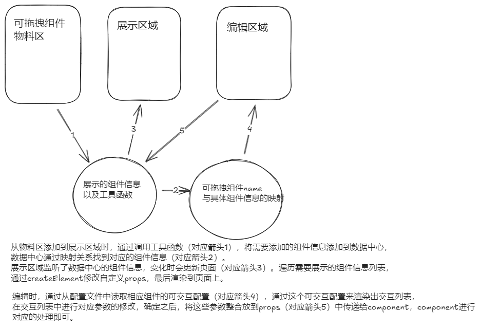

# 低代码编辑器

## 依赖

- tailwindcss：方便css样式

  ```bash
  pnpm add tailwindcss postcss autoprefixer -D
  # 生成tailwind和postcss的配置文件
  npx tailwindcss init -p
  ```
  > 注意是autoprefixer，不是autoprefix

  修改`tailwind.config.js`配置文件：

  ```js
    export default {
      content: [
        './index.html',
        './src/**/*.{js,jsx,ts,tsx}'
      ]
      // ...省略其他配置
    }
  ```
  这个配置项是用来指定提取css的路径，会根据该配置路径去提取className

  然后在`index.css`中添加`tailwindcss`的相关基础样式：

  ```css
  @tailwind base;
  @tailwind components;
  @tailwind utilities;
  ```
  > 如果编辑器有警告提示的话，需要安装`postcss-language-support`插件

- allotment: split-pane component 一个react可拖拽栏目的组件

- zustand：状态管理

- react-dnd：实现拖拽

  ```bash
  pnpm add react-dnd react-dnd-html5-backend
  ```

  安装完成之后在`main.tsx`中添加`Provider`,这是用来跨组件传递数据的:

  ```tsx{2-3,8,10}
  import { createRoot } from 'react-dom/client'
  import { HTML5Backend } from 'react-dnd-html5-backend'
  import { DndProvider } from 'react-dnd'
  import App from './App.tsx'
  import './index.css'
  
  createRoot(document.getElementById('root')!).render(
    <DndProvider backend={HTML5Backend}>
      <App />
    </DndProvider>
  )
  ```

  有两个hooks`useDrag\useDrop`，比如将B组件拖入A组件：

  ```tsx
  // 需要拖拽的组件，如上的B组件
  export default () => {
    const [_, dragRef] = useDrag({
      // 当前drag元素的标识,在drop时通过该值来判断是否接受
      type: 'b',
      item: {},
    })

    return (
      <div ref={dragRef}>bbbbb</div>
    )
  }
  ```
  ```tsx
  // 拖拽进入的父级组件,如上的A组件
  export default () => {
    const [{ canDrop }, dragRef] = useDrop({
      // 用来校验是否接受传入的元素的,如果drag时给的type不在这里,就不会被接受
      accept: ['b'],
      // drop时触发,一般做一些拖拽之后的提示
      drop() {},
      // 收集drop的状态,返回drop之后的状态
      collect(monitor) {
        return { canDrop: monitor.canDrop() }
      }
    })

    return (
      <div ref={dragRef}>aaaaa</div>
    )
  }
  ```
  

## 注意

- vite+ts的alias配置

1. vite.config.ts中添加配置

```js
export default defineConfig({
  resolve: {
    alias: {
      '@/editor': path.resolve(__dirname, './src/editor'),
      '@/editorStore': path.resolve(__dirname, './src/editor/stores'),
    }
  }
})
```

注意这里要用node的`path.resolve`解析路径，否则会报错。另外ts中引入path可能会报错，需要引入`@types/node`依赖

2. tsconfig.json中添加配置

要注意vite创建了三个tsconfig：
- `tsconfig.app.json`
- `tsconfig.node.json`
- `tsconfig.json`

在`tsconfig.json`中通过`references`字段指定不同的ts运行环境。
之所以会有两个不同的配置文件，因为`src`下的代码和`vite`本身运行在不同环境，
`src`下的代码运行在浏览器，`vite`本身运行在node，所以有两个配置文件来区分。

**我们添加的路径别名应该在`tsconfig.app.json`中**。

## 思路

将整个页面分为三个部分:
- material: 物料区,提供可拖拽的组件
- editarea: 编辑区,或者叫展示区。这里存放的是拖拽之后的组件页面
- setting：TODO

大概过程：
1. 首先要有一些事先准备好的组件，然后将组件和对应可拖拽的组件名称做个映射
2. 拖拽完成之后，根据这个映射，createElement一个元素出来

是通过zustand存储状态的，并且事先定义好一些工具函数，比如添加组件、删除组件、更新组件等方法。
在做 组件-可拖拽的组件名称映射 时，引入事先准备好的组件，然后做一层映射表。
在展示区域，获取添加到展示区域的组件列表信息，循环渲染，即根据列表信息去createElement


