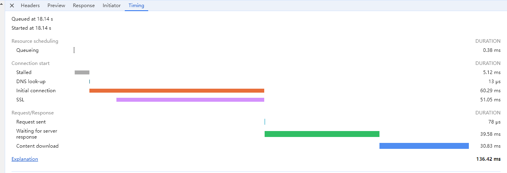
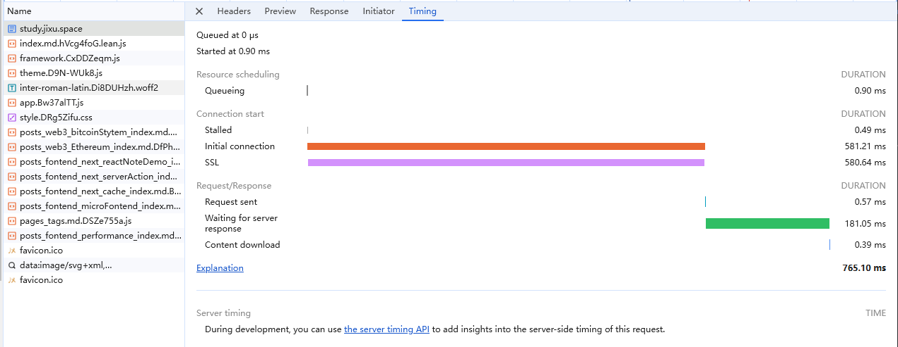

# Chrome DevTools-Network面板

> [!NOTE]
> 下面说的`发起请求/发出请求`都指的是开始建立TCP连接。

- `Queueing`：该请求等待发出的排队时间，导致请求不能立即发送的原因很多。

  - 资源的优先级：HTML/CSS/JS等是核心资源，优先级最高；图片、视频、音频等优先级就较低。低优先级的遇到高优先级的，需要排队等待。

  - 浏览器对同一个域名的TCP连接数量限制。达到限制之后，后面的请求就需要排队。

    - TCP建立连接需要端口号，但是端口号只有那么多，所以做了限制防止端口号被快速消耗。
    - 处理请求需要线程，防止并发数量太多导致的线程频繁切换，从而带来性能问题。
    - 避免超过服务端的并发限制，也避免了恶意攻击。

    > [!NOTE]
    > 总之限制都是为了性能更好。一般一个域名最多会有4-6个。
    >
    > 另外虽然HTTP1.1有持久连接，多个HTTP请求能复用TCP连接，但是请求和响应还是要按照顺序发送，响应还是要等到上一次请求响应之后才能发送，还是会有队头阻塞问题。
    >
    > HTTP2中引入了帧和流，以及多路复用，请求和响应不需要顺序发送，从而真正复用TCP连接。虽然可能引入了更多的问题。🤣

  - 请求在网络进程中发出，需要短暂的等待磁盘空间的分配。

- `Stalled`：排队之后，建立连接(发出请求)之前的时间。表示`停滞`的意思.

- `DNS look-up`：DNS寻址时间，时间一般不会很长。

- `Initial connection`：和服务器建立连接的时间，其中包括建立TCP连接的时间。

- `SSL`：即HTTPS协议时建立SSL连接的时间

> [!NOTE]
> 可以看到在http2中，由于多路服用，共用一个TCP，所以Initial connection只会在第一次请求中建立，后面直接复用

- `Request sent`：在和服务器建立连接之后，网络进程发送请求的时间。一般很短，因为只需要将浏览器缓冲区的数据发送出去就好了，并不会判断服务器是否接收。

- `Waiting for server response`：TTFB(第一字节时间)，从发出请求到接收到第一个字节数据所经历的时间。**该指标是反映服务端响应速度的重要指标。**

- `Content download`：从接收到第一个字节到全部响应数据接收完毕的时间。