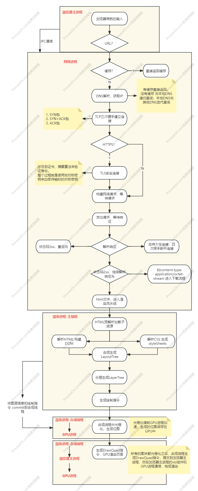
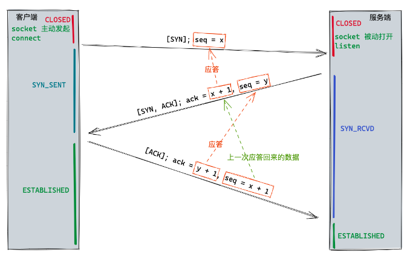
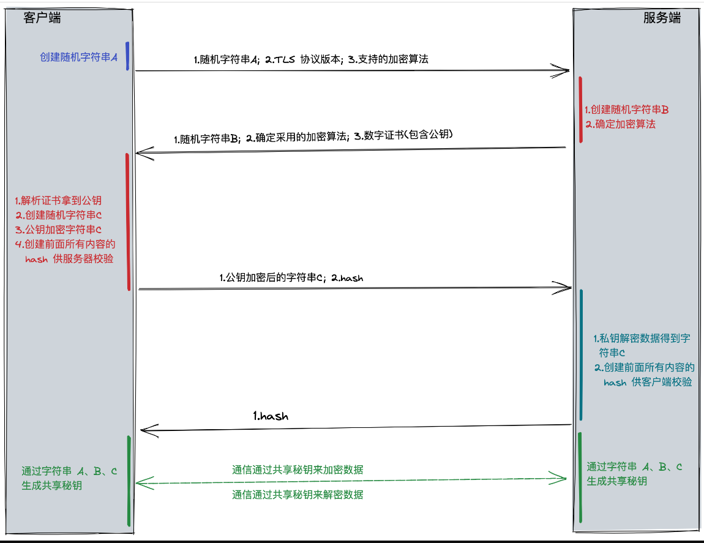

# 从输入URL到页面展示的过程

首先大致介绍一下整个过程：
1. 浏览器导航栏输入到按下enter，首先会判断**是不是一个URL**，如果是URL，会解析URL并对非法的字符进行转义。
2. 有了URL之后，通过IPC通信将**URL发送到网络进程**中处理。
3. 网络进程首先会查找本地是否有**缓存**，有的话直接返回给浏览器进程；没有缓存，就**进入网络请求流程**。
4. 网络请求流程的第一步就是**DNS解析，将域名解析为IP**
5. 有了IP之后，就开始**建立TCP连接**，三次握手之后完成连接
6. 如果是HTTPS，还会有**TLS连接**，确保通信的安全
7. 之后网络进程会**构建网络请求**，包括请求头、请求行、请求体等信息。
8. 浏览器端发出请求，等待服务端响应。服务端响应之后，网络进程开始**解析响应头内容**。**如果不是持久性连接，服务端响应之后会断开TCP，即四次挥手**。
9. 网络进程**根据响应头做不同的处理**：重定向、响应数据类型处理
10. 如果是HTML，就开始进入了浏览器的渲染过程。
12. 将响应的数据通过IPC通信从网络进程传输到浏览器主进程，之后再由浏览器主进程传给渲染进程
13. **渲染进程拿到响应数据之后，才会进入渲染阶段**，包括页面解析和子资源的加载
14. 进入渲染流程的第一步，**预解析加载子资源，然后解析HTML**
15. HTML解析为DOM，CSS解析为CSSOM 之后转为styleSheets
16. 将DOM和styleSheets进行结合，**合成生成LayoutTree**
17. 有了LayoutTree之后，进行**分层处理，生成LayerTree**
18. 然后就是**生成绘制指令**，在合成线程对不同的层进行合成处理
19. 将绘制指令以及树信息发送到合成线程中**光栅化处理，生成位图**
20. 最后由**GPU进行页面的渲染**。完成整个过程

## URL的判断和解析

完整的URL格式：

`http[s]://[username:password@]host[:port][/path][?query][#hash]`

包含这么几个部分：
- `协议 Scheme`：http、https
- 用户名、密码：是可选的，一般互联网上的URL都不会有这个
- `主机 Domain Name`：这个必须要有的，通过主机找到对应的服务器地址
- `端口 Port`：是可选的，默认端口是80、443(HTTPS)
- `路径 Path to the file`：是可选的，默认路径是/
- `查询参数 Parameters`：是可选的，一般用于传递参数。通过`&符号`分割，比如`?name=value&age=18`
- `锚点 Anchor`：是可选的，一般用于定位到页面的某个位置

URL的转义是指`://`后面的部分可能会包含一些特殊字符，如空格、/ 问号等，可能会导致URL产生歧义，所以需要对URL进行转义。另外URL是通过ASCII编码，非ASCII编码的字符也需要进行转义。

现代化Web工程中一般是不需要手动转义的，但也要了解是通过`encodeURIComponent()/encodeURI()`这两个方法来转义的。

## 缓存判断

URL解析完成之后，**浏览器主进程会将URL通过IPC通信发送给网络进程**。

网络进程会检查本地是否有缓存，如果有的话并且没失效，直接从缓存拿到使用。否则的话进入**网络请求流程，准备发送请求**

## DNS解析

> [!NOTE]
> 发生在网络进程

我们都知道TCP\IP协议模型中，应用层、传输层、网络层、链路层，是层层封装的。
应用层需要域名，**传输层需要端口号，网络层需要IP地址，链路层需要MAC地址**。

所以想要发起请求需要**端口号、IP和MAC**。端口号一般都是默认的，IP地址是通过DNS解析的，MAC地址如果是同一个子网的话通过ARP广播协议就能拿到；如果非同一个子网，首先需要ARP到网关，由网关去寻找MAC地址。

> [!NOTE]
> http的端口号默认是80，https的端口号默认是443。

一般每台计算机都有一个**本地DNS服务器(LDNS)**，当需要解析域名时，会先查询本地DNS服务器，如果本地DNS服务器没有，就会向根DNS服务器发送请求，根DNS服务器会返回一个顶级域名服务器的地址，然后本地DNS服务器会向顶级域名服务器发送请求，顶级域名服务器会返回一个权威域名服务器的地址，然后本地DNS服务器会向权威域名服务器发送请求，权威域名服务器会返回一个IP地址，然后本地DNS服务器会将IP地址返回给浏览器。

可以看到整个过程，是一个**递归查询+迭代查询**的过程。浏览器向本地DNS查询，是递归查询；本地DNS服务器向其他DNS查询，是迭代查询。

当然这是没有缓存的请求，如果**本地DNS服务器有缓存，就会直接返回**。

## TCP三次握手建立连接

当IP地址获取之后，就可以和服务器建立连接了。
一般是`TCP三次握手`建立起TCP连接。

### 大致过程

1. 客户端发送一个**SYN包**，其中包含了**客户端的初始序列号(ISN) x**。
2. 服务器收到SYN包之后，会发送一个**SYN+ACK包**，其中包含了**服务器的初始序列号(ISN)y和客户端的初始序列号+1 x+1**。
3. 客户端收到SYN+ACK包之后，会发送一个**ACK包**，其中包含了**服务器的初始序列号+1 y+1和客户端的初始序列号+1 x+1**。

**标志位 SYN ACK**

- SYN：表示发起一个新连接
- ACK：表示确认收到了对方的SYN包

**序列号和确认号**

- 序列号seq：用于标识数据包的顺序，保证数据包的正确性。简单理解为字节流的开始序号
- 确认号ack：用于确认收到了对方的数据包。只有在ACK包中才有效。简单理解为字节流的结束序号

所以解释一下上面的TCP过程：
1. 首先客户端处于CLOSED状态，这时需要建立TCP连接了，所以客户端发起了一个**SYN包(表示需要建立连接)**，其中包含了客户端的初始序列号x **seq=x(验证服务端接受数据是否正常)**。客户端发送SYN包之后进入SYN_SENT状态(连接发送状态)。

> [!NOTE]
> 此时客户端和服务端都不确定对方的接收和发送能力是否正常

2. 服务端也是处于CLOSED状态，收到这个SYN包之后，socket被打开，然后响应这个SYN包。向客户端发送了一个**SYN+ACK包(ACK收到了连接请求，并且SYN我也需要建立连接)**，其中包含了服务器的初始序列号y **seq=y(验证客户端接收能力是否正常)** 和客户端的初始序列号+1即x+1 **ack=x+1(表示能接收到数据 并正常响应)**。服务端响应了SYN+ACK包之后，进入SYN_RCVD状态。

> [!NOTE]
> 此时服务端已经确定了客户端的发送能力是正常的 以及自己的接收能力是正常的，但是客户端并不知道服务端的接收和发送能力是否正常。所以服务端发了一个ACK表示自己接收正常，和一个SYN去询问客户端的发送是否正常

3. 客户端接收到服务端的SYN+ACK包之后，会再次发送一个**ACK包(表示确认收到)**，其中包含了服务器的初始序列号+1即y+1 **ack=y+1(表示能接收到数据 并正常返回)** 和客户端的初始序列号+1即x+1 **seq=x+1(用来给服务端验证的 上一次服务端响应的数据)**。客户端发送ACK包之后，进入ESTABLISHED状态。

> [!NOTE]
> 客户端已经确定了服务端的接收和发送能力是正常的，也确定了自己的接收和发送，但是服务端并不知道客户端的接收是否正常。所以**还需要有一个ACK包来让服务端确定客户端的接收能力正常**。

4. 服务端收到ACK包之后，也进入ESTABLISHED状态。

> [!NOTE]
> 服务端能确定客户端是正常的，也确定自己是正常的

如图：

**为什么要三次？**

因为三次是最小理论值，为了防止已经失效的连接请求报文段突然又传到了服务端，从而产生错误。

考虑以下场景：
客户端发送了第一个SYN包，但是因为网络原因，没有到达服务端，但是并没有丢失。客户端的socket已经被释放了，但是服务端接收到这个SYN包，会认为是一个新的连接请求，会分配一个socket，然后发送SYN+ACK包，但是客户端已经释放了socket。

**如果是两次的话**，以上场景服务端发出了这个SYN+ACK包，但是客户端的socket已经超时关闭了，不会向服务端发数据，就导致服务端的这个socket一直被占用，直到超时。会浪费服务端的资源，比如端口、内存之类。

**如果是四次的话**，因为前三次连接已经让双端都确认了对方的发送和接受能力是正常的。如果服务端还发送第四次确认消息，这一次其实是浪费的。

**为什么第三次不需要发送SYN标志位的包？**

因为SYN标志位实际是让对方返回一个ACK标志位来响应，但是此时客户端已经确认了服务端的接受和发送能力是正常的，所以没有SYN标志位，只有一个ACK标志位。

## TLS连接

如果是HTTPS，还会有TLS连接，确保通信的安全。

大概过程呢是使用非对称密钥加密传输数据时用的对称密钥，期间还使用证书、摘要算法等验证身份。

## 构建网络请求

连接建立好之后，网络进程会开始构建网络请求，包括请求头、请求行、请求体等信息，并自动将该域名相关的Cookie、Header等信息添加到请求头中。构建好之后就等待发送。

> [!NOTE]
> HTTP2之前一个域名同一时间只能有4-6个**TCP连接**，这个限制导致了 请求可能需要排队。

> [!NOTE]
> 请求排队是浏览器的限制，出于以下几个原因：
> 1. 避免浏览器端的资源被占用：HTTP2之前一个请求可能就是一个TCP连接，这些都是需要内存和CPU的。另外端口也是有限的，如果不加以限制可能导致端口很快被消耗完。
> 2. 避免同时间很多请求发送到服务端，对服务端造成影响。
> 3. 同一时间发出多个请求，可能会导致网络拥塞。
>
> 另外该限制针对的是**同一域名下的TCP连接数量**。HTTP2的多路复用就不存在这个限制了。

## 发送请求 解析响应

请求发出之后，等待服务端响应。

服务端响应之后，网络进程开始解析响应头内容。另外**如果不是持久性连接，服务端响应之后会断开TCP连接，即四次挥手。**

### 重定向

首先是判断响应行中的状态码，是否是重定向(3xx)。如果是重定向，就会向新地址重新发起请求。否则的话处理响应数据。

如果响应行中的状态码是3xx，表示需要重定向到新的地址，所以浏览器会从响应头中的`Location`字段中读取新的地址，然后将这个地址发起新的请求。

如果响应行的状态码是200，表示浏览器可以继续处理该请求。

### 响应数据类型处理

响应状态是200，浏览器就会根据响应数据类型(`Content-Type`)进入不同的处理流程。

比如`Content-Type: application/octet-stream` 浏览器就会进入下载流程。

如果`Content-Type: text/html`，就会进入页面渲染阶段。

## 渲染流水线

渲染过程是发生在**渲染进程的主线程**中的，网络进程将响应通过IPC从网络进程传输到浏览器主进程，之后再由浏览器主进程传给渲染进程。

默认情况下，浏览器会为每一个tab都创建一个渲染进程，如果是同站会分到同一个渲染进程中。

> [!NOTE] 为什么要经过浏览器主进程？
> 通过浏览器主进程控制，可以让浏览器处理其他的一些交互，比如弹窗、下载、loading等。

等到**浏览器主进程将数据传输给渲染进程**之后，渲染进程会**正式开始渲染流水线的工作**。

### 解析HTML、加载子资源

在解析HTML之前有一个**预解析**的过程，预解析会解析HTML中的一些子资源，比如图片、css等。
然后解析HTML 构建DOM Tree

### 解析CSSOM

在解析HTML的同时会解析CSS 构建CSSOM，开始样式计算 生成styleSheets。

> [!IMPORTANT] 
> 样式计算的过程很复杂，是解析CSS的重要过程。这里简单知道这里概念即可

### 布局 生成Layout Tree

有了DOM和styleSheets之后，还需要知道DOM元素在屏幕上的几何位置信息。那么接下来就是**布局**，计算出DOM树中可见元素的几何位置。

#### 1. 创建布局树Layout Tree

对于那些不可见的元素，比如head元素、display:none的元素，不应该进入布局，所以创建一颗只有可见元素的布局树Layout Tree。

#### 2. 布局计算

有了布局树后，需要计算树节点对应在页面上的几何位置。

### 分层 生成Layer Tree

页面上会有一些复杂效果，如3D效果、页面滚动、z-index等。渲染进程会为这些特定节点生成专用的图层，并生成一颗对应的图层树Layer Tree。

满足以下要求的元素会被提升为一个单独的图层：

1. 拥有[层叠上下文](https://developer.mozilla.org/zh-CN/docs/Web/CSS/CSS_positioned_layout/Understanding_z-index/Stacking_context)属性的元素
2. 需要裁剪的地方会被提升为单独的图层，如滚动条，就会被提升到单独的图层

虽然分层可以提升渲染效率，因为可以对不同的图层单独进行光栅化处理，可以让单独的图层变化而不影响到其他层。
但是也会占用内存，如果分层太多可能也会导致性能问题。

### 生成绘制指令

生成Layer Tree之后，渲染进程会对每个图层进行绘制，首先会生成绘制指令。

### 进入合成线程 光栅化处理raster

上面的操作都是在渲染进程的主线程中进行的，生成绘制指令之后，将上面的图层信息以及绘制指令`commit`到**合成线程**中，进行光栅化处理。

合成线程会以**视口为界将网页切分成一个个的图块tile**，然后将视口附近的图块传输到栅格化线程中，转为位图。

光栅化的过程，会**使用GPU进程来加速生成**，所以也叫GPU光栅化，**生成的位图保留在GPU内存中**。

> [!NOTE]
> commit和光栅化是交叉并行的，光栅化的同时可能还在不断commit新的layer图层数据。

**光栅化的目的就是将图块转为位图**

### GPU 渲染

所有的图块都被光栅化之后，**合成线程生成DrawQuads指令**来绘制这些位图，这个指令会**提交给浏览器主进程**。这个指令中包含了需要绘制位图的信息，然后**浏览器主进程的viz组件会和GPU进程通信，完成最后的渲染。**

然后GPU进程调用对应的渲染器来进行绘制，就完成了渲染工作。

> 来自[这里](https://aerotwist.com/blog/the-anatomy-of-a-frame/)
从该图可以看出，浏览器一帧做了很多工作，如果某个步骤耗时过长，就会导致该帧执行时间过长，丢帧。

## 总结

从输入URL到页面展示的过程，是一个比较复杂的过程。其中涉及到了很多的知识，比如DNS解析、TCP三次握手、TLS连接、渲染流水线等。
