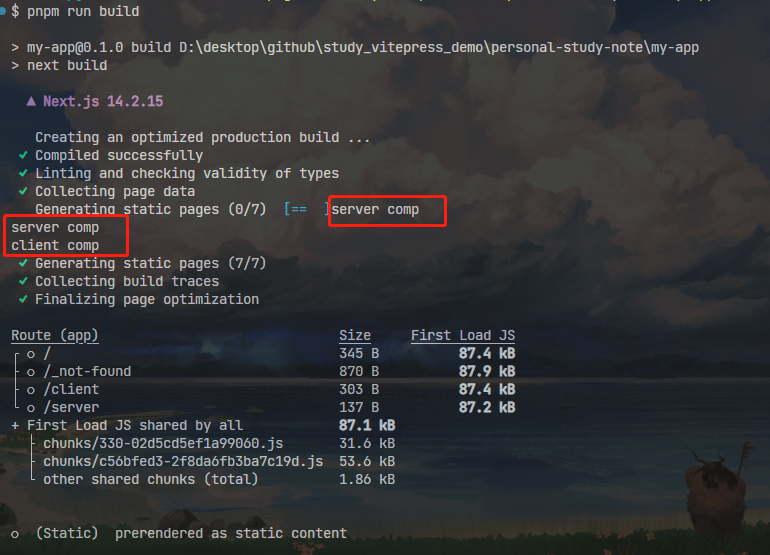
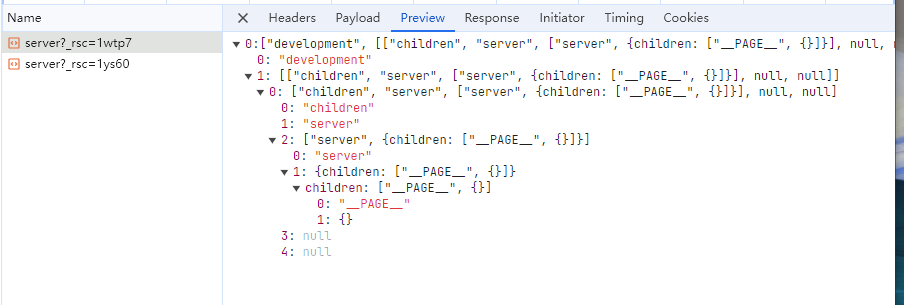
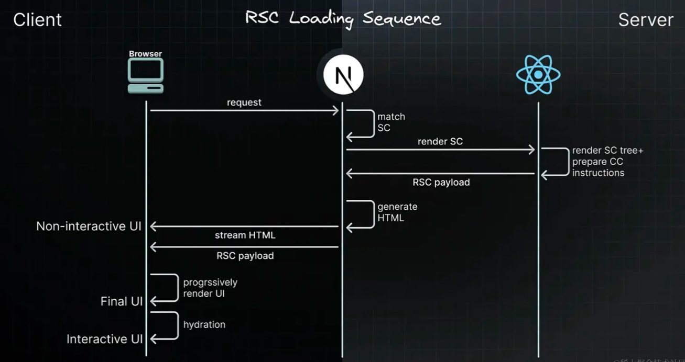
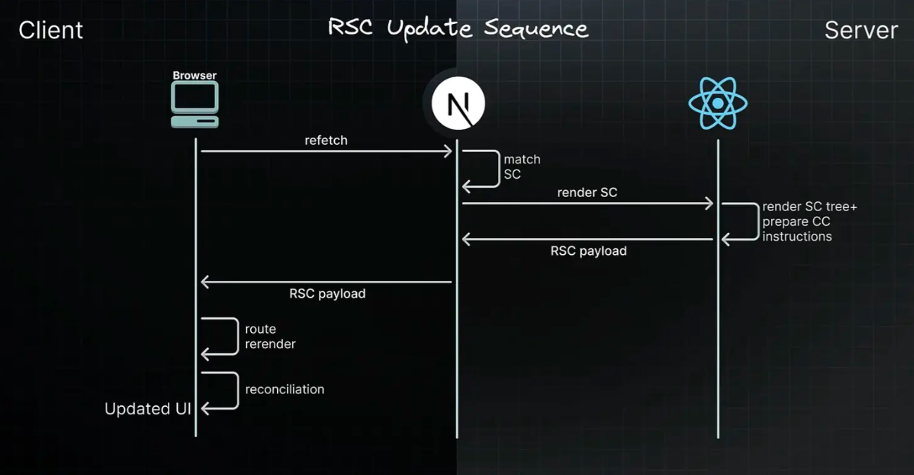

# 服务端组件和客户端组件

Next中有两个非常重要的概念，服务端组件和客户端组件。但并不是简单的服务端组件在服务端渲染，客户端组件在客户端渲染。

## 服务端组件

在`Next`的`app router`下默认都是服务端组件

```tsx
// app/server/page.tsx
export default () => {
  return (
    <>Server Component</>
  )
}
```

这就是一个服务端组件，由于是运行在服务端的，所以`console`也是在服务端打印的。

所以服务端组件的优势都是因为在服务端运行的：
1. 离数据源更近，所以服务端组件在服务端运行时会更快。能减少客户端向服务端的请求
2. 运行在服务端，所以一些私密的信息比如`token`等信息不会被暴露，更安全
3. 运行在服务端，依赖都在服务端，前端打包后的包体积会更小，加载更快
4. 初始化加载更快，能直接展示出数据，快速展示出页面来
5. 流式传输`Transfer-Encoding: chunked`，就不用等待整个渲染完毕，可以更早的看到部分内容

但是因为运行在服务端，自然客户端的一些API用不了，比如操作DOM、useState等hook。

## 客户端组件

在`Next`的`app router`中想要使用`客户端组件`，需要手动声明`use client`。

```tsx
'use client'

export default () => {
  return (
    <>Client Component</>
  )
}
```

>[!NOTE]
> 需要注意，一旦声明了`'use client'`，那么所有的子组件，都会被视为客户端组件。即客户端组件中是不能直接引用服务端组件的。

如果想要在客户端组件中使用服务端组件，可以通过`chilren props`的形式。

```tsx
'use client'
export default ({ children }) => {
  return (
    <>
      Client Component
      <div>Server Component Props: { children }</div>
    </>
  )
}
```

相比于服务端组件的一大堆优势，客户端组件的优势可能就是能使用到客户端的API，比如操作DOM、useState等hook。

## 比较

经过上面的介绍，在开发过程中应该能知道大概需要使用什么组件了。

一句话总结一下就是：如果需要使用客户端的API或者是维持状态，那就用客户端组件；否则就是用服务端组件。可能这也是为什么Next默认是服务端组件的原因。

### 怎么渲染的

上面介绍了，服务端组件会运行在服务端，客户端组件运行在客户端。

但是经过`build`打包发现，**客户端组件会先在构建时运行一次，然后在客户端访问时再运行**。

一个客户端组件，其中`console.log('clinent comp')`；一个服务端组件，其中`console.log('server comp')`，运行`build`命令结果如下：


为什么要客户端组件在构建时运行一次呢，就是为了**首次加载能更快的展示出内容**。

> [!NOTE]
> 客户端组件在构建时的预渲染，是在服务端的，所以在客户端组件中直接使用window/document等对象打包会报错，因为服务端没有这些对象。
> 解决方案：可以在`useEffect`中使用，因为服务端不会执行useEffect内的东西。

所以说客户端组件和服务端组件并不对应实际的客户端和服务端。
客户端组件会在构建时运行、服务端运行(上面说的预渲染)、客户端运行；
服务端组件会在构建时运行、服务端运行。
> [!NOTE]
> 这里的构建时 就是服务端环境

#### 渲染原理

Next的渲染分为两个部分，分别是客户端的渲染和服务端的渲染。

##### 服务端的渲染

在服务端渲染时，Next会使用React API进行渲染，渲染工作根据路由和`Suspense`拆分成多个小块来渲染，每个块分两步：

1. React将服务端组件转成一个特殊的格式：`React Server Component Payload(RSC Payload)`
2. Next根据`RSC Payload`和预渲染的客户端组件，在服务端生成HTML

RSC Payload的格式如下图：

包含这些信息：

1. 服务端组件的渲染结果
2. 客户端组件的占位符和引用文件
3. 从服务端组件传给客户端组件的数据

##### 客户端的渲染

1. 客户端根据服务端生成出来的HTML，快速展示一个不可交互的界面(Non-Interactive UI)
2. 根据`RSC Payload`来协调客户端和服务端的组件树
3. 和JS代码进行水合(Hydration)，让页面可交互。

大概过程如下图：



初次加载完成之后，客户端组件就完全在客户端进行渲染，对于服务端组件React就使用RSC Payload来协调客户端和服务端，更新DOM。



## 实际使用

Next的客户端组件中，为了安全，会将私有环境变量替换为空字符串，所以如果用到这些需要在服务端组件中使用。但是这种校验是没有提示的，可以借助`server-only`这个第三方库。

```bash
pnpm i server-only
```

使用如下：
```tsx
import 'server-only'

export async function getData() {
  const res = await fetch('URL_ADDRESS', {
    headers: {
      'PRIVATE-TOKEN': process.env.PRIVATE_TOKEN
    }
  })
  return res.json()
}
```

另外，如果在服务端组件中获取的数据，需要传递给客户端组件，这个数据会被**序列化**。
所以如果这个数据，序列化有影响，那就需要在客户端组件中手动获取该数据。
