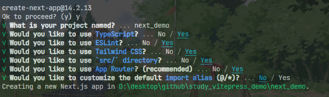

# Next入门篇

[Next官方文档](https://nextjs.org/)
<br />
[Next中文文档](https://www.nextjs.cn/)

## Next是什么？

是基于React的应用层框架，提供了很多内置功能，能快速的构建Web应用程序。
包括的功能有：
- 内置路由
- 静态和服务端渲染
- TS
- 完善的打包配置

## 简单使用

官方提供了一个`create-next-app`脚手架工具来使用，可以快速创建一个Next项目。

### 自动创建项目

> [!IMPORTANT]
> node版本要求：18.17以上

```bash
npx create-next-app@latest
```
其他各种包管理工具都提供了模板：
```bash
yarn create next-app
```
```bash
pnpm create next-app
```

然后按照提示进行选择，就可以创建一个Next项目。


另外还有很多的实例模板，可以在[github仓库](https://github.com/vercel/next.js/tree/canary/examples)中看到。通过这些实例模板，可以学习Next如何在各种环境中使用的。

可以通过`--example`参数直接使用这些模板。
```bash
npx create-next-app --example [example-name] [project-name]
```

### 手动创建项目

通过手动创建一个Next项目，可以更好的学习Next，以及它到底依赖了哪些东西。

1. 创建项目文件夹
```bash
mkdir next-demo
```

2. 进入文件夹安装相关依赖
```bash
pnpm i next@latest react@latest react-dom@latest
```
3. 修改`package.json`
```json
"scripts": {
  "dev": "next dev",
  "build": "next build",
  "start": "next start",
  "lint": "next lint"
},
```

4. 添加文件

`app/page.js`以及`app/layout.js`
> 在新的Next版本中，已经从page路由转成了app路由，所以需要有一个app文件夹

- layout.js：提供布局文件，容器
- page.js：提供页面文件

> 还有一些其他的文件，在后面路由章节会介绍

比如上面的访问`/`路径时，会先进入`layout.js`渲染，然后再渲染`page.js`


### Next CLI常见命令

- `dev`：启动一个本地服务，就可以看到页面了
- `build`：打包服务，不过在`next: 14.2.4`版本发现，该命令和`dev命令`好像有冲突，需要停掉`dev命令`
- `start`：查看打包后的文件
- `lint`：执行lint

## 路由介绍(App Router)

从一开始`page router`到现在的`app router`。在`next`中路由并没有单独的配置文件，而是通过文件路径来配置路由的，另外也可以通过文件来处理常见的页面状态。

> [!NOTE]
> 从 v13.4 之后，`App Router`成了默认的路由方案。
> 当然，`Page Router`也是兼容的，`App Router`的优先级要高一些，并且如果两者路由一致，会有冲突，导致构建错误。

```md{2}
. src
├─ app
│	├─ page.js
│	├─ layout.js
│	├─ demo
│	│	├─ about
│	│	│	├─ page.js
│	│	├─ page.js
│	│	├─ loading.js
│	│	├─ error.js
│	│	├─ layout.js
│	│	├─ template.js
```

首先介绍一下这几个有着特殊名称的文件作用：

- `layout.xx`：布局作用，相当于一个**容器**，会自动将同级的`page.xx`作为`children`传入。**顶级的`layout`是必须要有的，而且必须要有`html以及body`标签**。
- `page.xx`：页面主体，类比`index.xx`的作用，作为**页面的主体内容**。
- `template.xx`：**和`layout.xx`相同的作用**，也会将同级`page.xx`作为`children`传入。但是路由切换时并**不会保留页面状态**，同时**顶级不是必须**的。
- `loading.xx`：提供loading状态，**配合`Suspense`实现的**，一般是`page.xx`中导出的是`async`函数，而不是普通的函数。
- `error.xx`：提供错误状态，配合`ErrorBoundary`实现的，但是测试时好像开发环境还是会抛出错误。顶级的话是`global-error.xx`，报错会替换掉`layout`，所以顶级的error也需要有`html/body`
- `not-found.xx`：404的页面，有一个默认的。

> [!NOTE]
> 如果文件夹内没有`page.xx`的话，该文件夹不作为路由，而是用来存放**其他文件**。

如果全都有的话，编译之后就是：

```jsx
export default () => {
  return (
    <Layout>
      <Template>
        <ErrorBoundary fallback={<Error />}>
          <Suspense fallback={<Loading />}>// [!code warning]
            <ErrorBoundary fallback={<NotFound />}> // [!code warning]
              <Page />
            </ErrorBoundary>
          </Suspense>
        </ErrorBoundary>
      </Template>
    </Layout>
  )
}
```

这里**路由的层级就是文件的层级**：访问`/`就是`src/app/page.js`；访问`/demo`就是`src/app/demo/page.js`；访问`/demo/about`就是`src/app/demo/about/page.js`；

### Layout的使用

起到一个容器作用，需要注意如果在根目录的话，该文件是必须要有的，并且必须要要包含html、body标签。
`page.xx`文件会作为`children`传入到该文件中。

### Template的使用

也是起到一个容器作用，但是路由切换时状态会重置，以下例子：

`layout.xx`中有一些路由跳转的链接，跳转到子集路由，`template.xx`中有自己的状态，可以发现路由切换后，`template`的状态重置了，而`layout.xx`中的状态没有重置。**每次路由变化时，template都会重新创建**，所以一般用在某些**和路由切换相关联**的场景，比如切换路由时来执行一些上报记录之类的操作。

```tsx
// layout.tsx
'use client'
import Link from 'next/link'
import { FC, PropsWithChildren, memo, useState } from 'react'

const Layout: FC<PropsWithChildren> = ({ children }) => {
  const [count, setCount] = useState(0)
  return (
    <div className='w-[200px] border-[1px] border-[#ccc] rounded-[4px]'>
      <div>
        <Link href='/about' className="w-[80px] h-[30px] p-[4px] border-[1px] border-[#ccc]">about</Link>
        <br />
        <Link href='/about/detail' className="w-[80px] h-[30px] p-[4px] border-[1px] border-[#ccc]">detail</Link>
      </div>
      {children}
      <div>layout count: {count}</div>
      <button className='border-[1px] border-[red] p-[4px]' onClick={() => setCount(d => d += 1)}>layout count + 1</button>
    </div>
  )
}

export default memo(Layout)
```
```tsx
// template.tsx
'use client'
import { FC, PropsWithChildren, memo, useState } from 'react'

const Template: FC<PropsWithChildren> = ({ children }) => {
  const [count, setCount] = useState(0)
  return (
    <>
      {children}
      <div>tempalte count: {count}</div>
      <button className='border-[1px] border-[red] p-[4px]' onClick={() => setCount(d => d += 1)}>template count + 1</button>
    </>
  )
}

export default memo(Template)
```

> 具体的代码看该[仓库](https://github.com/Jippp/personal-study-note)的`next/demo1`分支

### 其他状态页面的使用

这个状态页面包括`loading.xx`、`error.xx`、`not-found.xx`，这几个都是向上查找的，本级没有就用父级的。

#### Loading的使用

是使用`Suspence`组件包裹的，所以`page.xx`需要是异步函数，如下代码：
```tsx{9}
import { FC, memo } from 'react'

const getData: () => Promise<string> = async() => {
  return await new Promise((resolve) => setTimeout(() => {
    resolve('ji')
  }, 3000))
}

const User: FC = async () => {
  const userName = await getData()
  return (
    <>
      <h1>User page.</h1>
      <div className=' font-bold'>userName: {userName}</div>
    </>
  )
}

export default memo(User)
```
当访问该路由时，就会从本路由中找`loading.xx`作为`Suspence`的`fallback`，如果没有就会用父级的`loading.xx`。

#### Error的使用

是使用`ErrorBoundary`组件包裹的，这里的是在`Layout以及Template`之下的，所以本级的`error.xx`是无法捕获到`layout.xx以及template.xx`中的错误，需要在父级路由的`error.xx`中捕获。

> [!NOTE]
> 这里个ErrorBoundary组件并不是React内置的，应该是Next内置的，具体源码没有看。

所以还提供了一个`global-error.xx`文件，用来捕获根路由的`layou.xx以及template.xx`错误，这里作为`根layout`的fallback，所以也必须要有`html以及body`标签。

#### NotFound的使用

`not-found.xx`文件有一个默认的，触发时机如下：
- 执行内置的`notFound`函数
- 没有找到对应的路由

所以开发时可以通过手动执行`notFound`函数来触发`not-found.xx`。如下代码：
```tsx{1,12}
import { notFound } from 'next/navigation'
import { FC, memo } from 'react'

const getData: () => Promise<string> = async() => {
  return await new Promise((resolve) => setTimeout(() => {
    resolve(Math.random() > 0.5 ? 'ji' : '')
  }, 1000))
}

const User: FC = async () => {
  const userName = await getData()
  if(!userName) notFound()
  return (
    <>
      <h1>User page.</h1>
      <div className='font-bold'>userName: {userName}</div>
      <div className='h-[30px] p-[4px] border-[1px] border-[#ccc] rounded-[6px]'>refresh userName</div>
    </>
  )
}

export default memo(User)
```

## 路由切换

即`SPA`中的跳转到页面其他地方的链接，不会渲染整个页面，只加载需要的部分。`Next`中有4种方式来导航：

1. 提供的`<Link>`组件
2. 客户端组件中的`useRouter`hook
3. 服务端组件中的`redirect`函数
4. 浏览器原生的`History API`

### Link组件

基本用法如下：

```jsx
import Link from 'next/link'

export default () => <Link href='/test'>跳转到test</Link>
```

其中的`href`是**支持动态**的。

还可以通过`usePathname`获取当前的pathname：

```jsx
'use client'
import Link from 'next/link'
import { usePathname } from 'next/navigation'

export default () => {
  const pathname = usePathname()
  return (
  	<>
    	<h1>当前页面的pathname：{pathname}</h1>
    	<Link href='/test'>跳转到test</Link>
    </>
  )
}
```

另外**路由跳转**有一些滚动条位置问题，默认是**滚动到顶部**的，可以通过配置`scroll`来解决：

```jsx
// 滚动条不会改变，即保持当前页面的滚动位置
<Link href="/dashboard" scroll={false}>
  Dashboard
</Link>
```

### useRouter hook

客户端组件`use client`中使用

```jsx{1}
'use client'
import { useRoute } from 'next/navigation'
export default () => {
  const route = useRoute()
  
  return <div onClick={() => route.push('/test')}>
  	跳转
  </div>
}
```

### redirect函数

服务端组件中使用

### 原生的History API

即`history.pushState/replaceState`

## 路由文件的写法

### 动态路由Dynamic Route

因为`next`中采用的是文件名称来进行路由配置的，动态路由需要使用`[xxx]`将文件名称包裹起来，包裹起来的部分会作为`params`参数传递给`layout.xx/page.xx`文件。

> [!IMPORTANT]
> 注意文件名不要是特殊的名称，比如react、route等
>
> 同级下多个动态路由，只会有一个生效，一般是先创建的那个。

#### [folderName]

这种写法只能访问下一级

比如文件目录：

```bash
app
- route
	- page.js
	- [id]
		- page.js
```

访问`/route/123`会进入到`[id]/page.js`中，但是访问`/route/123/abc`就会`404`

传入组件(对应的`page.js`文件内容)的`params.id`是字符串

#### [...folderName]

访问多级路由

以下文件目录：

```bash
app
- route
	- page.js
	- [...id]
	  - page.js
```

访问`/route/123`会进入到`[...id]/page.js`中

访问`/route/123/abc`也会进入到`[...id]/page.js`中

此时组件中的`params.id`是字符串数组

#### [[...folderName]]

会匹配所有的子级路由，**包括自己**。

```bash
app
- route
	- [[...id]]
	  - page.js
```

**和`[...folderName]`的区别在于，访问`/route`时也会进入`[[...id]]/page.js`中。**

> [!IMPORTANT]
> 特别注意这种写法，**不能有默认的page.js**，否则会404

### 路由组Route Groups  `(folderName)`

在`Next`中一般的文件名称都会被映射到URL中，可以通过`路由组`阻止这种行为。

一般用这个**按照逻辑对文件分组**。

使用时只需要用`(folderName)`即可。

比如以下文件：

```bash
- app
	- (group1)
		- layout.js
		- detail
			- page.js # /detail
    - detail1
    	- page.js # /detail1
  - (group2)
  	- layout.js
  	- about
  		- page.js # /about
```

访问`/detail和/about`即可，进行了逻辑上的划分。

路由组只是阻止了将文件名映射到URL，其他的如`layout.xx/error.xx/loading.xx`还是可以用的，比如上面的`/detail`和`/detail1`用的都是`layout.js`。

> 需要注意的时，如果替代的是根布局，那么就需要包括html和body元素。

- 路由分组仅在逻辑上对文件内容划分，没有实际意义。
- 不要有相同的路径，比如`(group1)/about/page.js`和`(group2)/about/page.js`，会报错。
- **跨`layout`的导航会导致页面重新加载**，上述文件中的`/about`跳转到`/detail`会让页面重新加载

### 平行路由Parallel Route  `@folderName`

从名称中可以知道这个是用来干嘛的，即**同一个`layout`中渲染多个页面**的。

如下文件：

```bash
- app
 - route
  - page.js
  - layout.js
  - @some1
    - page.js
  - @some2
  	- page.js
```

会自动将`@some1/page.js`和`@some2/page.js`作为参数传递到`route/layout.js`中:

```jsx
export default ({ children, fontend, backend }) => {
  return (
    <>
      route平行路由测试
      {children}
      {fontend}
      {backend}
    </>
  )
}
```

> 需要注意的是，要有一个page.js，否则会404。page.js相当于是`@children/page.js`。

可以用于条件渲染，比如根据某个条件才显示出`some1`，否则显示`some2`。

这样写也**能单独使用`loading.xx`等**，让**每一个路由都有自己的状态**，这样就更像是子模块而非路由了。

平行路由让复杂页面拆分的更加简单了，将这些**平行路由当做`子模块`来理解**可能会更好。

#### default.js

平行路由虽然使用子路由使得复杂页面更加的方便拆分，但是也带来了一些问题。

1. 热更新可能会卡死，需要重启服务
2. 如果平行路由有子路由，直接访问子路由可能会导致404

```bash
- app
 - route
  - page.js
  - layout.js
  - @fontend
  	- show
  		- page.js
    - page.js
  - @backend
  	- page.js
```

上面的文件，直接访问`/route`可以看到页面，如果在`layout`中有个`Link`，跳转到`/route/show`，直接点击跳转`fontend`区域会显示出`show/page.js`的内容。但是如果直接在导航栏输入`/route/show`进行跳转，就会`404`。

这是因为`Next`中导航的跳转(**软导航**)和直接刷新的跳转(**硬导航**)行为是不太一样的，`Link`导航时，执行部分渲染，如果其他的没有匹配上，就不会变化。但直接输入URL进行跳转，就无法确定其他部分和当前URL不匹配的该如何渲染，所以就渲染了`404`。

实际上，直接输入URL跳转，比如`/route/show`，会去查找`app/route/show/page.js`、`app/route/@fontend/show/page.js`、`app/route/@backend/show/page.js`。

为此，`Next`提供了`default.js`，当出现上述的无法匹配问题，就会渲染`default.js`，如果没有`default.js`，就会渲染`404`。

将上述文件目录改为：

```bash{4,11}
- app
 - route
  - page.js
  - default.js
  - layout.js
  - @fontend
  	- show
  		- page.js
    - page.js
  - @backend
    - default.js
  	- page.js
```

在`app/route`和`app/route/@backend`下新增了个`default.js`，这样直接通过URL访问`/route/show`时，就会渲染出对应的`default.js`内容。

### 拦截路由Intercepting Route  `(.)`

即通过`Link`跳转时，可以进行拦截，展示A页面。如果是直接通过URL来访问，则展示B页面。

> [!NOTE]
> 参考交互[https://dribbble.com/](https://dribbble.com/) 
>
> 直接点击图片是一个弹窗，但是此时导航栏的URL发生了变化。如果此时刷新，发现进入了具体的页面。

拦截路由可以让用户即预览了详情内容，又没有打断用户的浏览体验 留在了当前页面。

#### 使用

使用拦截路由时，需要文件夹以`(..)`开头：

- `(.)`同级
- `(..)`上一级
- `(..)(..)`上上一级
- `(...)`根目录

> [!IMPORTANT]
> 匹配的是路由的层级 而非文件夹层级，比如那些路由组/平行路由 就不会匹配。

如以下文件：

```bash
- app
  - stop
    - @modal
      - (.)photo
        - page.js
    - photo
      - page.js
    - page.js
    - layout.js
```

在`app/stop/page.js`中通过`Link`跳转到`/stop/photo`，会先进入`app/stop/@modal/(.)photo/page.js`页面，刷新之后才展示`app/stop/photo/page.js`

### 路由写法总结

上述有好几种路由的方式，这里总结一下：

- 通过`[]`包裹的文件夹名称，作为动态路由
- 通过`()`包裹的文件夹名称，作为路由组，仅作逻辑上的划分
- 通过`@`前缀的文件夹名称，作为平行路由，也不会被映射到URL上
- 通过`(.)`等前缀的文件夹名称，作为拦截路由，是以路由层级而非文件层级。
