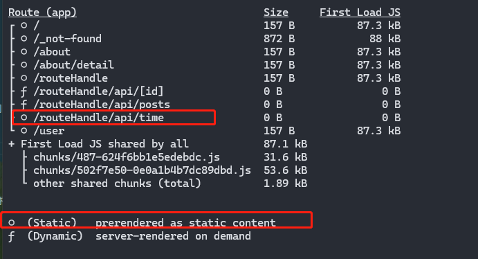

# Next入门篇---服务端接口处理

前一节说过，Next是一个全栈框架，所以能编写接口相关代码。

## 路由处理程序

正常情况中，客户端和服务端之间的**API接口**，在Next中称为<strong>`路由处理程序`</strong>。

> [!IMPORTANT]
> 这一节的代码看[github仓库](https://github.com/Jippp/personal-study-note)的`next/demo1`分支，具体文件夹在`app/routeHandle`下。

### 如何使用

在`Next`中，路由相关都是通过文件名来配置的。所以这里需要使用`路由处理程序`的，需要添加一个`route.xx`。

需要注意的是，该文件必须在`app`之内，其次**不能和`page.xx`同级**，因为会有冲突。

> [!NOTE]
> 不管`route.xx`还是`page.xx`都是对路由的响应，不过`page.xx`是负责渲染UI，`route.xx`是用来处理请求的。所以两个不能同级

比如以下文件：

```bash
- app
-- api
--- route.js
-- page.js
# 省略其他
```

```js
// app/api/route.js
import { NextResponse } from "next/server";

export async function GET() {
  const res = await new Promise(resolve => {
    setTimeout(() => {
      resolve('111')
    }, 1000);
  })

  return NextResponse.json(res)
}
```

当直接在浏览器中访问`/api`时，会将`route.xx`中定义的请求发送出去。

> [!NOTE]
> `route.xx`中的函数名称需要和`HTTP MEHTOD`名称一致。
>
> GET、POST、PUT、PATCH、DELETE、HEAD、OPTIONS(有一个默认的 不写也可以)
>
> 如果不支持，会返回405 Method Not Allowed

通过这里例子，可以知道，路由处理程序，实际就是开发中常说的接口。

#### 参数定义

接口是支持传入参数的，这里自然也是支持的。

```js
function GET(request, context) {}
```

定义函数时是有两个**可选参数**：`request`以及`context`

##### request

该对象是`NextRequest`对象(从`next/server`中可以引入该类型定义)，该对象是基于[Web Request API](https://developer.mozilla.org/zh-CN/docs/Web/API/Request)拓展出来的，可以通过该对象可以读取`cookies`以及处理URL。

```ts
// app/routeHandle/api/posts/route.js
import { NextResponse, NextRequest } from "next/server";

export async function GET(request: NextRequest) {
  const res = await new Promise(resolve => {
    setTimeout(() => {
      resolve(request.nextUrl)
      // "http://localhost:3000/routeHandle/api/posts"
    }, 1000);
  })

  return NextResponse.json(res)
}
```

##### context

该对象是一个包含**当前动态路由参数params**的对象，类型定义如下，需要根据需求自己来定义：

```typescript
{ params?: Object }
```

举例说明：
```ts
// app/routeHandle/[id]/route.ts
import { NextRequest, NextResponse } from "next/server";

export async function GET(request: NextRequest, context: { params: { id: string } }) {
  const res = await new Promise(resolve => {
    setTimeout(() => {
      resolve(context)
    }, 1000);
  })
  return NextResponse.json(res)
}
```

使用postman测试结果如下：
```json
{
  "params": {
    "id": "1"
  }
}
```

### 缓存

默认情况下，使用`NextResponse`(`Response`也是一样的)包裹的GET请求是会被缓存的，如下测试文件：

```ts
// app/routeHandle/api/time/route.js
import { NextResponse } from "next/server";

export async function GET() {
  return NextResponse.json({
    date: new Date().toLocaleTimeString(),
  })
}
```

在开发环境下访问，每次`date`都是不一样的。但是打包之后在生产环境访问，每次都是一样的。
说明在打包时被缓存了下来，缓存的时间就是打包时的时间。


#### 如何退出缓存

实际上默认缓存只是在打包时处理的，将这些静态的请求缓存下来, 并且只有`GET请求`能缓存。
<br />
想要退出缓存可以通过以下方法：

- 代码中使用`request`对象
- 使用其他`HTTP Mehtod`
- 在代码中手动声明为动态渲染，即[路由配置项](https://nextjs.net.cn/docs/app/building-your-application/routing/route-handlers#segment-config-options)
  ```ts{2}
  // app/routeHandle/api/time/route.js
  export const dynamic = 'force-dynamic'
  // ...省略代码
  ```

#### 缓存时效

在路由配置项中有个`revalidate`配置，是用来做一些缓存控制的，中文翻译过来是`重新验证`。看下面的例子：

```ts
export const revalidate = 10
// ...省略代码
```

该配置的单位是秒，以第一次访问的时间为起点，在10s之内重复请求数据，是不会变的，都是之前缓存的，10s之后的第一次请求还是静态的 但是会触发服务器更新，再次请求才会返回更新后的值。

> [!WARNING]
> Next v15之后 fetch默认不会缓存了

还是有一种是在`fetch`的配置中使用`{next: {revalidate: 10}}`来实现上面的效果。
因为`Next`拓展了`fetch`的功能，默认也是有缓存的。如下：
```ts
export async function GET() {
  const res = await fetch('URL', {
    next: { revalidate: 10 }
  })
  return NextResponse.json(res)
}
```

### 其他常见的接口处理

内容很多，可以在用到的时候去查，这里不过多介绍。

#### 获取路径参数

`request.nextUrl`

#### 处理cookie

- `request.cookies`上提供的一些方法来操作cookies
- `next/headers`包里提供的`cookies`方法来操作

#### 处理Headers

- `request.headers`
- `next/headers`包提供的`headers`方法

#### 重定向

使用`next/navigation`包中的`redirect`方法

#### CORS

在返回的响应头中添加对应头部字段：
```ts
export function GET() {
  return new Reponse("111", {
    status: 200,
    headers: {
      'Access-Control-Allow-Origin': '*',
      'Access-Control-Allow-Methods': 'GET, POST, PUT, DELETE, OPTIONS',
      'Access-Control-Allow-Headers': 'Content-Type, Authorization',
    }
  })
}
```

## 中间件

做后端开发，少不了的中间件，通过中间件，可以拦截并控制应用中的所有请求和响应。比如重定向、重写、修改请求或响应头等等。

`Next`中通过`middleware.js`来做中间件，需要和`app`同级。

基本使用如下：

```bash
- app
- middleware.js
```

```js
// middleware.js
import { NextResponse } from 'next/server'

// 中间件处理函数
export function middleware(request) {
  return NextResponse.redirect(new URL('/', request.url))
}

// 匹配路径
export const config = {
  matcher: '/about/:path*'
}
```

上面的`middleware`的作用就是将`/about`所有的路径都重定向到`/`

### 匹配路径

有两种方式来匹配路径：

#### config.matcher配置项

通过`config.matcher`配置项来匹配路径。

是一个字符串或者数组，数组时就是匹配多个路径：

```js
export const config = {
  matcher: ['/about/:path*', '/dashboard/:path*']
}
```

> :path*是基于[path-to-regexp](https://github.com/pillarjs/path-to-regexp)
>
> 作用就是将上面的路径字符串转为正则表达式。

#### 条件语句

上面的写法还是有一定门槛的，需要了解匹配规则才能写出来，对我来说和正则没什么区别，属于永远学不会的东西。
所以可以通过条件语句来判断，在逻辑语句中进行特定的处理。

```js
import { NextResponse } from 'next/server'

// 中间件处理函数
export function middleware(request) {
  if(request.nextUrl.pathname.startsWith('about')) {
    // 具体逻辑
    return NextResponse.rewrite(new URL('/about-2', request.url))
  }
  if(request.nextUrl.pathname.startsWith('xxx')) {
    // 具体逻辑
    return NextResponse.rewrite(new URL('/xxx', request.url))
  }
}
```

### 具体的中间件逻辑

具体的逻辑和路由处理的写法差不多，都是借助`NextResponse\NextRequest`对象来完成的。

> [!IMPORTANT]
> 中间件middlare是在浏览器环境下运行的，不支持Node环境，所以如果使用了一些Node环境相关的API 是会报错的。

### 执行顺序

在Next程序中，很多地方都可以处理路由的响应，比如`next.config.js`、`中间件`、以及`路由处理程序`，所以一定要注意他们的执行顺序。
很明显，是先从`next.config.js`开始执行，然后是`中间件`，最后是`路由处理程序`。

