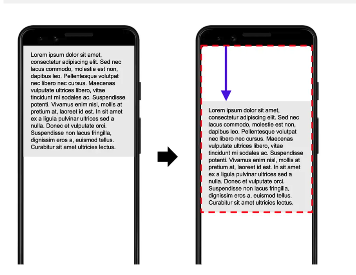

# PerformanceOptimization 性能优化

谈到性能优化，首先需要有统一的指标作为标准，不然何谈优化呢。

而性能指标，遵循“首次原则”和“持续性原则”。
- 首次原则：用户首次打开网站或应用时，需要以足够快的速度打开页面。
- 持续性原则：用户在后续使用网站或应用时，需要流畅的响应。

## 性能指标

### FCP First Contentful Paint 首次内容绘制

该指标从页面的请求响应之后到页面上**第一个文字或图片**等绘制完成的时间。

该指标可以反映打开页面的响应速度

> [!NOTE]
> 该指标衡量的内容是浏览器渲染该页面的第一段DOM，文字、图片、非白色Canvas、SVG等都包括。但是不包括iframe中的内容。

指标的得分范围：
- 0-1.8  绿色的
- 1.8-3  黄色的 
- 3+     红色的

### LCP Largest Contentful Paint 最大内容绘制

从FCP的起点到页面绘制结束，最大内容所花费的绘制时间。
这个最大内容，并不是一成不变的，而是在变化的，只有页面趋于稳定，才能确定这个最大内容。

该指标从另一个角度衡量了页面的响应速度。

### FID First Input Delay 首次输入延迟

从用户开始和页面交互，到页面响应用户的交互，这中间花费的时间。
比如页面还没有渲染完成，或者正在执行一段长任务，用户开始交互，浏览器执行完长任务到开始响应用户交互，这中间的时间就是FID。

该指标关注的是离散操作的输入事件，如单击、输入等。滚动和缩放这些连续的交互动作会被忽略。

该指标衡量的是应用的交互性。

### TTI Time To Interactive 达到可稳定交互的时间

不做任何交互的打开页面，并且保持5s的静默状态(页面不再有变化)，这5s之前的一个长任务结束时间 就是TTI。

也就是说TTI从 FCP的起点，到保持5s静默状态的前最后一个长任务结束时间。

该指标衡量的是应用的稳定性。

### TBT Total Blocking Time 总阻塞时间

整个TTI时间内，长任务的执行时间(超出50ms的部分)总和。

该指标是一个统计意义的指标。

### CLS Cumulative Layout Shift 累计布局偏移

该指标是一个比值，是通过一个计算公式得出的。
在页面加载过程中，可见元素发生偏移，会通过以下公式来计算出CLS的值。

`CLS = 前后两帧的元素偏移之和占视口的比重 * 偏移量占视口的比重`

上图这个例子中，两帧间元素发生了偏移，该元素占视口的50%，向下偏移了视口的25%。所以前后两帧元素偏移之后占视口比重就是75%。偏移量占视口比重就是25%。
所以`CLS = 0.75 * 0.25 = 0.1875`

通过该指标可以衡量页面的稳定性。

### FPS Frame Per Second 每秒帧数即帧率

每秒刷新的帧数。浏览器会根据应用的变化按照一定的刷新频率来刷新页面。
需要知道的是浏览器的帧率和显示器的帧率 是两个东西。

显示器的帧率是固定的。但是浏览器的帧率可能被长任务阻塞，造成掉帧。

前面的指标都是按照“首次原则”建立的，但是该指标是按照“持续性原则”建立的。

## 性能监控

往往开发时能通过浏览器的devtools面板看到这些性能指标，但是在用户的电脑上我们可看不到，所以需要添加额外的代码来监控性能指标，以性能监控的目的。

前端收集性能数据的方式有很多：

- performance API
- PerformanceObserver
- 第三方库 如web-vitals

当监控到这些性能指标数据后 需要上报到服务器存到数据库中，然后进行分析处理，以达到性能监控的目的。

性能监控往往是在生产环境应用的，开发环境中还是需要手动查看性能指标，以便在开发环境进行性能优化。

### 开发环境的性能诊断

#### Chrome DevTools工具

- Performance面板
- LightHouse面板

#### Performance API 埋点

通过手动添加测量性能的代码来检查性能。

#### 注入诊断

在一些页面由于死循环、内存泄漏等原因导致页面卡死时，上面的方式就不生效了，这时可以通过注入诊断的方式来检查性能。

通过babel等工具在构建代码时，往代码块(while函数体、for循环、递归等)中注入标记代码，记录次数，如果大于一定次数，直接throw，防止页面死循环无响应。

## 优化方法

### 代码构建时的优化

- 打包和分包

- 按需加载

### 资源优化

- 代码压缩
- 图片的优化

### 网络优化

从发出请求到接收到服务端响应，先后有DNS解析、TCP连接、https的TSL安全连接、数据请求。

- DNS缓存
- HTTP缓存
- CDN分发
- HTTP2

### 应用分发优化

- PWA
- ServiceWorker
  - Workbox
- 微前端：前端代码架构的处理，可以提高巨型项目的响应速度

### 浏览器渲染相关优化

理解重排Reflow 重绘Repaint，是怎么影响渲染流水线的。

- 重排Reflow：从layout阶段开始重新走，会重新遍历完整的Layout树计算元素位置和大小。非常耗时。一个元素的位置变动，都需要遍历一整个树。
- 重绘Repaint：从生成绘制指令开始，重新光栅化、绘制页面。相比来说成本要低一些。

一般而言位置变动都会导致重排，但是translate不会重排，因为是单独的图层，有自己的单独的layer层，走GPU独立渲染。

- 防抖节流：减少执行次数

- 虚拟视口：通常长列表或长表格中，具体就是虚拟列表和虚拟表格。只渲染视口及附近的元素，避免全量渲染。

- 时间切片：requestIdleCallback。比如日志的上报等 最好不要影响主线程，所以可以放在空闲时间来执行上报。
> requestAnimationFrame也是的，执行后就会清掉

### 多线程(Worker线程)

- webWorker：dedicatedWorker 通过`new Worker()`创建实例
- 其他类型的worker
  - SharedWorker：多个浏览器窗口之间共享的脚本。通过`new SharedWorker()`创建实例
  - ServiceWorker：类似代理服务器，是PWA的关键部分。通过`navigator.serviceWorker.register()`注册worker。

- WebAssembly：把其他语言编译成webAssembly程序，放到浏览器中执行，通过给JS程序提供API来调用，避免JS引擎的短板。

### V8介绍

- JIT即时编译：解释器和JIT编译器(两部分：一个转成字节码 一个转成机器码)
- GC垃圾回收：内存分为两部分，分开用两个垃圾回收器来管理，判断垃圾都是用的可访问性算法，新生代(Scavenge算法 分成两个空间 等执行GC时复制、清除、互换位置)、老生代(分为两个空间 标记出垃圾 然后GC，非垃圾移动到一端 清空另一端)
- 其他的一些V8优化：隐藏类、缓存、对象属性存储等。

### JS特性

为什么堆要慢？
- 想要读取对象属性，首先要在栈中取到堆的引用地址，然后去堆中遍历找到该地址对应的内存，再去该内存中取到属性，如果是嵌套的对象，还要继续遍历，直到找到属性。

## 总结

可以看到，前端的性能优化就这个几个大方向：加载、渲染、内存占用、网络、架构设计等。

从TCP/IP四层模型的方向来总结一下性能优化的方向：
- 应用层主要的优化方向：是前端主要的优化途径 
  - 浏览器的加载：主要是和资源优化，比如减少资源体积，减少不必要的资源，利用CDN加快资源到达速度等
  - 浏览器的渲染：通过分析一帧的流程，减少流程的时间 让一帧足够流畅。比如React的时间切片；虚拟表格；避免重排重绘；合成层等等
  - 开发体验的优化：升级构建工具，提高构建打包的速度；
  - HTTP2的头部压缩
  - HTTP缓存：强缓存、协商缓存
- 传输层的优化方向
  - TCP连接的优化：1.1的长链接 2的多路复用 3的QUIC协议
- 网络层的优化方向
  - 因为需要IP，所以只有DNS相关的优化前端能控制，比如dns-prefetch。但是DNS的发起是在应用层的，所以是属于应用层的优化。
- 链路层的优化方向
  - 升级硬件

网络层和链路层 前端基本没有什么优化空间，依赖于基础设施的优化。
