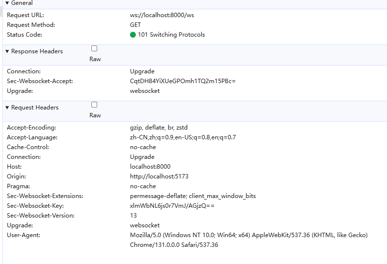

# 背景

在工作中遇到了相关长连接的需求。一说到长连接，自然就会想到`webSocket`，但是`webSocket`是基于TCP的，每多一个同源的浏览器上下文，就会新建一个连接，如果用户开了很多标签页，就会导致资源浪费和占用。可以使用`sharedWorker`进行优化，共享一个`webSocket`连接即可。

> [!NOTE]
> 所有代码都在[`该分支`](https://github.com/Jippp/personal-study-note/tree/review/sharedWorker%2Bws)

## sharedWorker和ws的简单使用

在介绍之前具体的实现之前，先看一下这两个东西是怎么使用的。

### sharedWorker

根据MDN的文档可以知道，`sharedWorker`在多个同源浏览器上下文中是可以共享`worker`的。`worker`是一个独立的线程，不会影响主线程的工作。因为是一个独立的线程，所以通常worker的工作都是一些比较耗时的计算任务。

> [!NOTE]
> 关于worker的相关知识，可以看[MDN的介绍](https://developer.mozilla.org/en-US/docs/Web/API/Worker)

如下vite创建的react项目中：

```tsx{9-10,20}
// src/App.tsx
import { FC, memo, useEffect, useRef } from 'react'
import { MySharedWorker } from './sharedWorker'

const App: FC = () => {
  const workerRef = useRef<MySharedWorker>()

  useEffect(() => {
    const worker = new MySharedWorker()
    worker.start()
    workerRef.current = worker
    // 监听worker发送过来的信息
    worker.onMessage((e) => {
      console.log('%c 接受到的信息', 'color: red; font-size: 20px', e.data);
    })
  }, [])

  const send = () => {
    if (workerRef.current) {
      workerRef.current.postMessage(`发送信息${Date.now()}`)
    }
  }

  return (
    <>
      <button onClick={send}>发送信息</button>
    </>
  )
}

export default memo(App)
```

sharedWorker文件的代码如下，这里只是简单封装了一下：
```ts{17-18,33,38}
export class MySharedWorker {

  workerInstance: SharedWorker | undefined
  port: MessagePort | undefined

  constructor() {
    this.workerInstance = undefined
    this.port = undefined

    this.init()
  }

  init() {
    // 单例
    if(!this.workerInstance) {
      try {
        this.workerInstance = new SharedWorker(new URL('./worker.js', import.meta.url), {
          name: 'testWorker'
        })
        this.port = this.workerInstance.port
  
        this.workerInstance.onerror = (e) => {
          console.error('SharedWorker 错误：', e)
        }
      } catch (error) {
        console.error('创建 SharedWorker 失败：', error)
      }
    }
  }

  start() {
    if(!this.port) return
    this.port.start()
  }

  postMessage(msg: any) {
    if(!this.port) return
    this.port.postMessage(msg)
  }

  onMessage(callback: (e: MessageEvent) => void) {
    if(!this.port) return
    this.port.onmessage = function(e) {
      callback(e)
    }
  }

}
```

worker文件代码如下：
```js{4,10,15}
const ports = []

// 在sharedWorker中，要有一个onconnect函数，sharedWorker启动时会自动执行，然后在其中通过start方法来启动端口，通过message事件来监听其他端口发来的消息
onconnect = function (e) {
  const port = e.ports[0]

  ports.push(port)

  // 在worker中接收到信息 然后通过port再发送回去
  port.addEventListener('message', function (e) {
    console.log('%c worker中接收到信息', 'color: red; font-size: 20px', e);

    // 广播给所有端口都发送信息
    ports.forEach(portItem => {
      portItem.postMessage(e.data)
    })
  })

  port.start()
}
```

启动项目后同一个地址打开两个浏览器tab，然后点击按钮，可以看到两个控制台都能收到worker发送过来的信息。然后通过`chrome://inspect/#workers`可以打开对应`sharedWorker`的调试页面，在调试页面也能看到接收到的信息。

#### 注意点

1. 只有同源的浏览器上下文，才能共享`worker`。
2. `new SharedWorker`需要读取文件，所以是需要启动服务才行的，否则会报错。
3. `new SharedWorker`时接收的第一个参数，是worker文件的地址，是相对于根目录的，所以想要生效有两种方案：
    - 将worker文件放到`public`文件夹下，然后`new SharedWorker(/xxxWorker.js)`
    - 使用`new SharedWorker(new URL('./xxxWorker.js', import.meta.url))`传入一个URL对象
4. 在`worker.js`中，`onconnect`函数是`sharedWorker`启动时自动执行的，然后通过`start`方法来启动端口，`message`事件来监听端口的消息
5. 独立的`worker`线程，是不能操作DOM的，通常是用来做一些耗时的计算任务的。

### webSocket

也是先来看看MDN的[相关介绍](https://developer.mozilla.org/en-US/docs/Web/API/WebSockets_API)。另外关于WebSocket服务端的也可以看看[MDN的介绍](https://developer.mozilla.org/zh-CN/docs/Web/API/WebSockets_API/Writing_WebSocket_servers)

ws中有四个基础的事件：
- `open`：连接成功
- `message`：接收到消息
- `close`：连接关闭
- `error`：连接错误

一个简单的ws服务端:
```js
import express from 'express';
import http from 'node:http'
import { WebSocketServer } from 'ws'
import cors from 'cors'

const app = express()
app.use(cors())

const server = http.createServer(app)
const wss = new WebSocketServer({ server, path: '/ws' })

const users = new Set([])
wss.on('connection', (ws) => {
  console.log('ws connection')

  users.add(ws)

  ws.on('message', (message) => {
    try {
      const data = JSON.parse(message);
      console.log('ws服务端收到消息:', data);
      
      // 广播消息给所有客户端
      users.forEach((client) => {
        
        client.send(JSON.stringify(data));
      });
    } catch (error) {
      console.error('消息处理错误:', error);
    }
  })

  // 省略 error close等事件
})

server.listen(8000, () => {
  console.log(`Server is running http://localhost:8000`)
})
```

使用到了`express`用来启动服务，`ws`来实现webSocket，`cors`用来跨域。

node端是没有webSocket对象的，所以借助`ws`库来实现。

然后是客户端的代码：

```js
const ws = new WebSocket('ws://localhost:8000/ws')

ws.onopen = () => {
  console.log('ws open')
};

ws.onmessage = (e) => {
  console.log('ws接收到消息', e.data);
};

ws.onclose = (e) => {
  console.log('ws close', e);
}

ws.onerror = (e) => {
  console.log('ws error', e); 
}
```

观察network面板中的请求头，如下


可以看到这些特殊的请求头：
- `Connection`字段是`Upgrade`，说明是升级为webSocket协议的
- `Upgrade`字段是`websocket`，说明是webSocket协议的
- `Sec-WebSocket-Key`字段是浏览器随机生成的安全密钥，用来验证的
- `Sec-WebSocket-Version`字段是`13`，说明是webSocket协议的版本

#### 数据传输

WebSocket通信是有数据片段组成的，可以从任意一方发送，类型有：
- text文本
- binary二进制数据
- ping/pong 用于检查服务状态的，浏览器会自动响应
- close 关闭连接

浏览器端只能通过`socket.send`来发送文本或二进制数据。

如果需要发送的数据太多，网络速度不够的话，会将数据放到缓冲区等待网络发送。避免数据丢失可以在发送前通过`socket.bufferedAmount`来判断缓冲区是否还有数据，如果有数据的话，就需要等待网络发送完再发送。

#### 连接状态

通过`socket.readyState`属性可以获取当前ws的连接状态
- `0 CONNECTING` 正在连接
- `1 OPEN` 已经连接
- `2 CLOSING` 正在关闭
- `3 CLOSED` 已经关闭

## sharedWorker结合ws实现长连接

对`sharedWorker`和`webSocket`都有了简单的了解后，再来看这个问题，为什么需要使用`sharedWorker`和`webSocket`结合起来使用呢？

因为`webSocket`是基于TCP，所以每次多一个同源的浏览器上下文，就会新建连接，为了减少`WebSocket`连接数量，可以使用`sharedWorker`来共享连接。

> [!NOTE]
> ```bash
> netstat -an | findstr 你的WebSocket端口号
> ```
>
> windows通过这个命令可以查看当前的链接数(看`ESTABLISHED`的链接数)

### 核心思路

目的是借助`sharedWorker`来共享`WebSocket`连接的，所以需要将`WebSocket`连接的创建和管理放在`sharedWorker`中。监听`WebSocket`的message事件，利用sharedWorker的postMessage将ws接收到的消息发出去；然后监听sharedWorker的message事件，将接收到的消息通过`socket.send`发送出去。这样就能共享一个ws连接了。

### 实现

服务端的代码和上面一样，这里就直接省略了。

重点看一下客户端中worker的代码
```js{5,12-15,40}
let ws = null;
const ports = new Set();

// 创建 WebSocket 连接
function createWebSocket() {
  ws = new WebSocket('ws://localhost:8000/ws');

  ws.onopen = () => {
    broadcast({ type: 'connection', status: 'connected' });
  };

  ws.onmessage = (event) => {
    // 广播消息给所有连接的标签页
    broadcast(event.data);
  };

  ws.onclose = () => {
    broadcast({ type: 'connection', status: 'disconnected' });
    setTimeout(createWebSocket, 3000);
  };

  ws.onerror = (error) => {
    broadcast({ type: 'error', error: 'WebSocket error' });
  };
}

// 处理新的标签页连接
onconnect = function (e) {
  const port = e.ports[0];
  ports.add(port);

  // 如果是第一个连接，创建 WebSocket
  if (!ws || ws.readyState === WebSocket.CLOSED) {
    createWebSocket();
  }

  port.onmessage = function (e) {
    if (ws && ws.readyState === WebSocket.OPEN) {
      if(e.data && e.data.eventType === 'message') {
        ws.send(JSON.stringify(e.data));
      }else {
        console.log('sharedWorker 收到消息', e.data)
      }
    }
  };

  port.start();
};

// 广播消息给所有标签页
function broadcast(data) {
  ports.forEach(port => {
    port.postMessage(data);
  });
}
```
