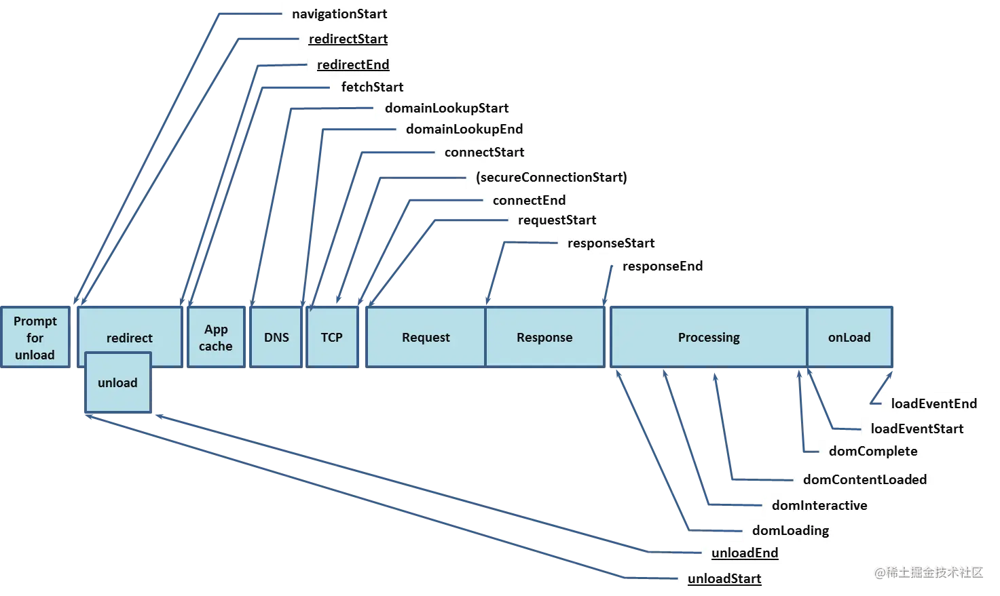

# 监控平台

什么是监控平台呢？“监控平台” 是一个用于实时监控和管理系统、应用程序或网络的工具或系统。它可以帮助开发者和运维人员及时发现和解决问题，从而确保系统的稳定性和性能。

在 JavaScript 和 npm 项目中，监控平台通常用于跟踪应用程序的**性能指标**、**错误日志**、**用户行为**等。通过集成监控平台，开发者可以获得关于应用程序运行状态的详细数据，并根据这些数据进行**优化和改进**。

所以监控平台的主要作用如下：
- 采集性能指标：帮助开发者了解应用程序的性能状况，及时发现性能问题。
- 捕获错误日志：及时解决线上问题，保证系统稳定性。
- 监听用户行为：通过用户数据支持来优化产品和服务。

## 监控平台的流程

一个前端监控平台，大致的流程如下：
1. 前端对数据进行收集
2. 前端上报数据
3. 服务端接收到数据后分析处理

## 监控的目的

通过监控平台收集到的数据，能做到事前预警、事后分析、性能优化、提供优化决策

- 事前预警：可以监控数据是否异常，及时发现问题
- 事后分析：如果出现了问题，通过捕获错误日志，及时定位和解决问题
- 性能优化：采集性能指标，能帮助开发者更好的进行性能优化
- 提供优化决策：通过监听用户行为PV(Page View) UV(Unique Visitor)等，了解用户的使用情况，为产品优化提供数据支持

## 监控平台在前端的体现

> [!NOTE]
> 不同业务对监控平台的要求不同，有的业务对性能要求高，有的业务对稳定性要求高，有的业务需要监控用户行为。所以监控平台的搭建需要根据业务需求来定制。

### 捕获错误日志

#### 前端的错误分类

- JS代码运行时的错误，也就是常见的Error类型，比如ReferenceError、TypeError等
- 异步错误
- 资源加载错误
- 和服务端的通信错误

#### 错误捕获

- `window.onerror`

能捕获到Error类型的错误、异步错误，但是对于**资源加载以及语法的错误是无法捕获**的。

```js
/**
 * @param { string } message 错误信息
 * @param { string } source 错误的脚本URL
 * @param { string } lineno 错误的行号
 * @param { string } colno 错误的列号
 * @param { string } error Error对象
 */
window.onerror = function(message, source, lineno, colno, error) {
  console.log('捕获到错误：', message, source, lineno, colno, error)
}
```

- `window.addEventListener('error')`

和`window.onerror`类似，但是`window.addEventListener('error')`可以捕获到资源加载时的错误

- `try/catch`

捕获常规的**同步代码**中的错误，**语法错误和异步错误是无法捕获**的，但是能捕获到`async/await`的错误

- `Promise的错误`

`Promise`的错误是无法被`window.onerror`、`try/catch`、`error`事件捕获到的，需要通过`Promise`的`catch`方法或者`unhandledrejection`事件来捕获

```js{4}
try {
  new Promise((resolve, reject) => {
    // 无效的JSON字符串，产生错误
    JSON.parse('');
    resolve();
  })
} catch (error) {
  // 无法捕获到Promise内部的错误 ❌
  console.log('try/catch捕获到错误：', error)
}

// 可以捕获到Promise内部的错误 ✅
window.addEventListener('unhandledrejection', function (event) {
  console.log('unhandlerejection捕获到错误：', event.reason)
})

// 无法捕获到Promise内部的错误 ❌
window.addEventListener('error', function (event) {
  console.log('error事件捕获到错误：', event.error)
})

// 无法捕获到Promise内部的错误 ❌
window.onerror = function (message, source, lineno, colno, error) {
  console.log('window.onerror捕获到错误：', message, source, lineno, colno, error)
}
```

- `Vue的错误`

在`Vue`中，通过`Vue.config.errorHandler`来捕获错误

```js
Vue.config.errorHandler = function (err, vm, info) {
  console.log('Vue捕获到错误：', err, vm, info)
}
```

这个配置内部实际是通过`try/catch`来捕获错误的，所以说也只能捕获到**同步代码的部分错误**。

- `React的错误`

在`React`中，通过`componentDidCatch`生命周期函数来捕获错误。并且还有`ErrorBoundary`的概念，即错误边界，在该边界中将错误捕获并进行相应的处理。

内部也是通过`try/catch`捕获错误的，还需要注意`throw Promise`是不会被捕获的，因为React提供的`Suspense`功能是通过捕获`Promise`来实现的。

```jsx
class ErrorBoundary extends React.Component {
  constructor(props) {
    super(props);
    this.state = { hasError: false };
  }

  /** React提供的生命周期钩子，返回值会触发下一次重渲染 */
  static getDerivedStateFromError(error) {
    // 渲染备用UI
    return { hasError: true };
  }
  /** 生命周期钩子，可以捕获到子组件中render函数的错误 */
  componentDidCatch(error, errorInfo) {
    console.log('React捕获到错误：', error, errorInfo)
    // 可以在这里上报错误
  }

  render() {
    if (this.state.hasError) {
      return <h1>Something went wrong.</h1>;
    }

    return this.props.children;
  }
}
```

> [!NOTE]
> React内部还做了一些特殊处理，生产环境下，被`componentDidCatch`捕获的错误不会在往上走了，即不会触发外面的`error`事件了。

- `跨域问题`

在当前页面引入了其他域名的JS资源，如果这个JS资源内报错，当前页面通过`error`事件只能监听到`Script error`，具体的错误信息是看不到的。是浏览器基于`安全`考虑的，防止敏感信息被第三方脚本获取到。

解决方法：前端加载`script`脚本时，添加`crossorigin`属性，然后在服务端设置`Access-Control-Allow-Origin`头部，允许跨域请求。

- `和服务端的通信错误`

常指的是接口报错，浏览器内置的`XMLHttpRequest`和`fetch`，通常采用AOP重写方法，已实现自定义的接口拦截。当然也可以对这些请求方式再包裹一层，对结果进行判断，添加自定义逻辑，之后再返回出去即可完成拦截。

当然现在的请求库一般都提供了`拦截器`的功能，可以直接使用。一些古老的项目可能需要自己实现。

### 采集性能指标

说到性能指标，就离不开记载过程模型图：


> 图片来源：https://juejin.cn/post/7172072612430872584?searchId=2024122413500668D8491FDCEC2220407F#heading-6

前端可以通过[`PerformanceObserver`](https://developer.mozilla.org/zh-CN/docs/Web/API/PerformanceObserver)接口来获取性能指标

### 监听用户行为

用户行为包括：页面滚动和跳转、用户点击、资源加载、接口请求等行为。

这个埋点方式很多，这里不展开了。对于可监听的事件一般都是通过事件委托来处理；对于其他的可以通过监听一些api来实现。

### 上报数据

需要注意上报的时机：如果在当前页面，一般是浏览器空闲时上报；另外离开页面也需要立即上报。

通过`sendBeacon`、`XMLHttpRequest`、`fetch`等方式来上传数据。


