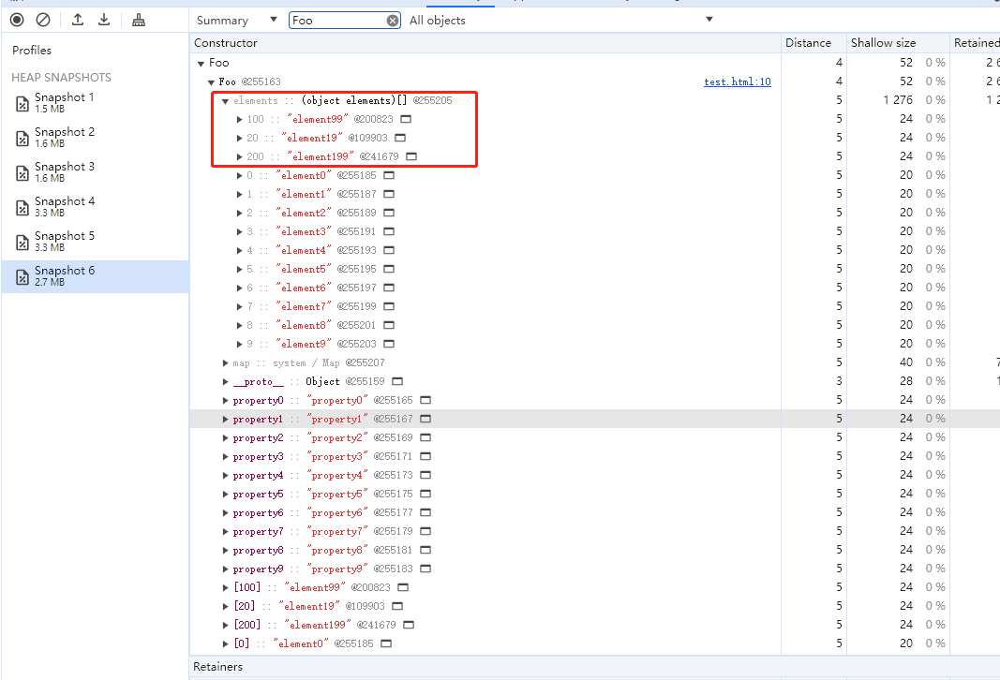
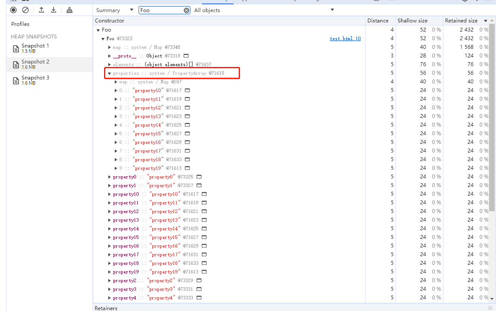
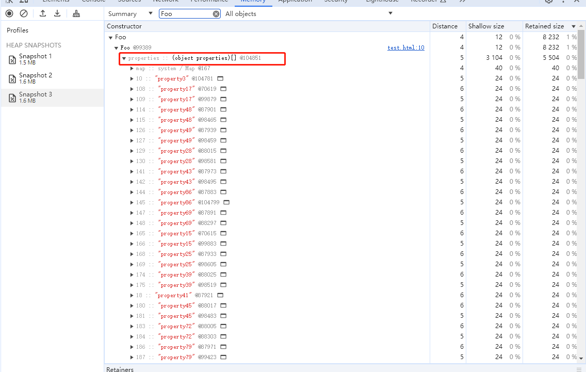

## 对象属性

`JS`中的对象是属性和值的集合。字符串/数字作为属性，任意值作为值。

`V8`在实现对象存储时，基于性能考虑即为了提升存储和查找的效率，实现了一套复杂的存储方式。

### 常规属性/索引属性

`JS`的对象的属性是有一定顺序的，数字(包括字符串数字)是按照升序排列的，其他字符串按照创建时的顺序排列的。

其中数字属性叫做`索引属性elements`，字符串熟悉叫做`常规属性properties`。

并且将这两个属性分开存储的，`索引属性`存在内部的`elements`对象中，`索引属性`存储在内部的`properties`对象中。然后读取时，先遍历`elements`对象，然后遍历`properties`对象。这也是说有一定顺序的原因。

### 快属性和慢属性

因为`properties`是存储在线性表(对象)中的，所以读取的时候要跨两层来读取，为了能快速读取，使用了`对象内属性`，即将一些`常规属性`直接放到对象中，而不是存到`properties`对象里，一般是`前10个`。

将这些存到线性表里的属性称为`快属性`，`快属性`在读取时很快，但是删除和添加时效率就较低，特别是大量属性同时删除或添加。所以在属性过多时，会采用`慢属性`的方式来存储，即`非线性表(树)`。

### 特别注意

上述的`索引属性`在内存中并不一定是升序的，比如稀松数组，内存中的排序就并不是顺序的，虽然`for-of`循环跑出来还是顺序的，可能是自己的处理。



还有就是`delete`操作可能会让`快属性`变成`慢属性`，如果是按照声明属性的顺序来删除的，就不会(测试好像也会，不知道是不是因为隐藏类的原因，能找到另一个相同的内存就不会退化?)。

```js
foo.a = '123'
foo.b = '234'
// 待测试
delete foo.b
```

#### 特殊属性map隐藏类

这个待介绍。

### Chrome tools查看属性存储

在`Memory`标签中通过添加内存快照可以看到属性的存储。

`索引属性`的内存：


`常规属性/快属性`的内存：



`常规属性/慢属性`的内存：



### 总结

`V8`对对象的存储是有一套复杂的策略的：数字键升序被放到`element`对象中。字符串键前10个直接放到对象中，称为对象内属性；后面的放到properties对象中，称为快属性；如果属性很多，会将properties对象改为树形结构，称为慢属性。

能通过`chrome的memory`工具来验证所说。

测试代码：
```js
function Foo(propertyNum, elementNum) {
  for(let i = 0; i < propertyNum; i++) {
    this[`property${i}`] = `property${i}`
  }
  for(let i = 0; i < elementNum; i++) {
    this[i] = `element${i}`
  }
}
// 索引属性 常规属性 对象内属性
// const foo = new Foo(10, 10)
// 索引属性 常规属性 快属性 
// const foo = new Foo(20, 10)
// 索引属性 常规属性 慢属性
// const foo = new Foo(100, 10)
// 稀松数组导致的内存中的索引属性混乱
// const foo = new Foo(10, 10)
// foo[200] = 'element199'
// foo[20] = 'element19'
// foo[100] = 'element99'

// delete操作的影响
const foo = new Foo(20, 10)
// delete foo.property1
foo.test = '123'
delete foo.test
```
