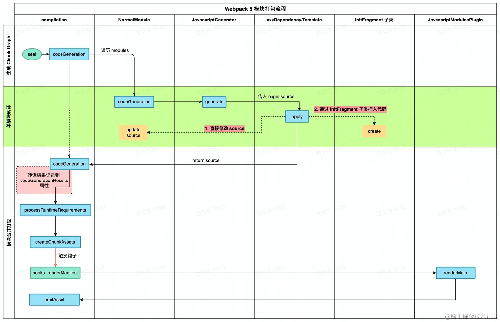

# 背景

虽然现在构建工具日新月异，Vite、Rspack、Turbopack...，但还是有大量的旧项目使用了Wepback，并且面试大概率还是会问Wepback相关的东西，所以这里还是总结一些Webpack相关知识点吧。

## Webpack流程概述


> 该图来自范文杰老师的[系列文章](https://mp.weixin.qq.com/s?__biz=Mzg3OTYwMjcxMA==&mid=2247484642&idx=1&sn=42da9e7f84514bbe52f0307d65c27d2b&scene=19#wechat_redirect)。具体哪一篇不记得了，这里随便贴了个链接。

### 总体介绍

首先要知道的是`Webpack`的**核心功能**：可以将各种资源包括图片/css/js等打包成标准的浏览器可以识别的文件。

从功能上可以将`Webpack`的工作分为三个阶段：

1. 初始化阶段
   - 初始化参数：会从配置文件、 配置对象、Shell参数中读取参数，然后和默认参数**合并得到最终的参数配置**。
   - 初始化编译环境：用上一步的参数创建`Compiler`对象，然后注入内置插件、注册各种`module`工厂函数、初始化`RullSet`集合、加载配置的插件`Plugins`等。
   - 确定入口：编译环境确定好之后，会执行`Compiler.run`方法，进入编译阶段。然后从配置参数的`entry`中找到入口文件，调用`compilition.addEntry`将入口文件转为`dependence`对象。
2. 构建阶段
   - 编译模块<strong>(make)</strong>：根据上面的`dependence`对象创建`module`对象，然后调用`loader`将模块转译成标准的`JS`内容，然后调用`JS解释器`将内容转为`AST`对象，进一步分析出其依赖的模块，然后`递归`直到所有的依赖都被处理。
    > [!NOTE]
    > Webpack5之前只能识别符合JavaScript规范的文本，Webpack5之后添加了其他parser
   - 完成模块编译：所有的依赖都处理完成之后，就得到了每个**模块转译之后的内容**以及`依赖关系图`
3. 生成阶段
   - 输出<strong>(seal)</strong>：根据入口和模块之间的依赖关系，就可以组装成一个个包含多个模块`module`的`Chunk`，然后再将`Chunk`转换成单独文件加入到输出列表。这里是最后修改输入文件的时机。
   - 写入文件系统<strong>(emitAsstes)</strong>：输出内容确定之后，就可以根据配置的输出参数`output配置`，将文件内容写入文件系统。

> [!NOTE]
> 单次构建是从上而下顺序执行的，如果开启了watch，构建完成后不会退出Webpack进程，而是监听文件内容，如果文件变化，重新**回到构建阶段重新构建**

每个阶段的侧重点都不同，所做的事情也不同，**初始化**的目的是**根据用户配置创建好构建环境**；**构建阶段**主要是**解析文件以及依赖的关系**；最后的**生成阶段**重点在**按照规则组装、包装模块输出可直接运行的产物包**。

对涉及到的对象做一下介绍：

- `Compiler`：编译容器，包含一些编译环境，起到一个管理编译的作用。该对象一直存在，直到退出。
- `Compilation`：单次编译过程的管理器。如`watch = true`时，运行过程只有一个`Compiler`对象，但是每次重新编译，都会创建一个新的`Compilation`对象。
- `Dependence`：依赖对象，记录着模块间的依赖关系。比如a文件中引入了b文件，在单次编译过程中，b文件会先暂时以`dependence`对象的形式存在。
- `Module`：`Webpack`内所有资源都以`Module`对象的形式存在，所有关于资源的操作都是以其为基本单位的。
- `Chunk`：编译完成准备输出时，会将`Module`按照依赖关系组装成`Chunk`。

### 详细介绍

#### 初始化阶段Init

首先是**配置参数的合并**：从配置文件、Shell中拿到用户指定的配置参数，之后会校验配置，之后和默认配置合并，这就得到了所有的配置参数。

然后是**编译环境的初始化**：在全部的配置参数完毕之后，会调用`new Compiler`创建`Compiler`对象。然后遍历用户指定的插件，执行插件的`apply`方法；之后加载内置插件。

> [!NOTE]
> 内置插件是根据**配置内容动态注入**的，比如：
>
> - `EntryOptionPlugin`插件用来处理`entry`配置
>
> - 根据`devtool`的值选择插件来处理`sourceMap`：`EvalSourceMapDevToolPlugin/SourceMapDevToolPlugin/EvalDevToolModuelPlugin`
>
> - 注入`RuntimePlugin`，根据代码内容动态注入`Webpack runtime代码`

经过上述处理，就创建出了`compiler`实例，并且编译环境也初始化完成了，之后就会调用`compiler.compile`函数开始构建。

在`compiler.compile`函数中，会先创建当前的`compilation`对象，然后经过一系列函数链路之后，执行`compilation.addEntry`函数，将**入口文件转为`dependence`对象**，最后会执行`handleModuleCreate`，**开始构建内容**。

> [!NOTE]
> 每次重新构建都会执行一次`compile`函数，所以每次构建都是新的`compilation`对象

在`compiler.compile`函数中并没有什么实质的功能，但是却搭建起了后续构建的流程。

```js
compile(callback) {
	const params = this.newCompilationParams();
	// 执行beforeCompile compile两个hook
	this.hooks.beforeCompile.callAsync(params, err => {
		this.hooks.compile.call(params)
		// 创建compilation对象，每次重新构建都会执行，所以compilation会被重复创建
		const compilation = this.newCompilation(params);
		// 执行make hook 初始化完成 进入构建阶段
		this.hooks.make.callAsync(compilation, err => {	
			// 执行finishMake hook 构建结束
			this.hooks.finishMake.callAsync(compilation, err => {
				process.nextTick(() => {
					compilation.finish(err => {
						// 执行seal hook 进入生成阶段
						compilation.seal(err => {
							// 执行afterCompile hook
							this.hooks.afterCompile.callAsync(compilation, err => {
								return callback(null, compilation);
							});
						});
					});
				});
			});
		});
	});
}
```
可以看到，通过触发各种重要的hook，完成了后续流程：
- beforeComile`(Asynchook)`
- compile`(Synchook)`
- make`(Asynchook)`：初始化完成，进入构建阶段
- finishMake`(Asynchook)`
- seal`(Synchook)`：构建完成，进入生成阶段
- afterCompile`(Asynchook)`

#### 构建阶段Make

**该阶段的目的就是从入口文件开始，通过递归对所有涉及到的资源进行解析处理。**

在`compile`函数中，通过执行`make`这个hook进入的构建阶段，**[`EntryPlugin`](https://webpack.js.cn/plugins/internal-plugins/#entryplugin)会监听该hook从而开始构建工作的**。

```js
// EntryPlugin.js 主要逻辑
class EntryPlugin {
  apply(compiler) {
    const { entry, options, context } = this;
		// 将入口文件加入dependency 依赖对象 中
		const dep = EntryPlugin.createDependency(entry, options);

		// 监听make hook，调用addEntry方法
		compiler.hooks.make.tapAsync(
			"EntryPlugin", 
			(compilation, callback) => {
				compilation.addEntry(context, dep, options, err => {
					callback(err);
				});
		});
  }
}
```

所以构建阶段是通过`addEntry`触发的，大致过程如下：

1. 找到入口文件，从入口文件开始，`handleModuleCreate`根据文件类型，**调用对应的工厂函数创建出`module`子类**。
2. 然后调用`loader-runner`中的`runLoaders`将不同类型的`module`**转译成`js格式`**。
3. 接着调用`acorn js解释器`通过词法分析、语法分析、语义分析**转成`AST`**。
4. 之后**遍历`AST`**，分析其对应的依赖(import)，调用`module.addDependency`将依赖对象放到`当前module`的依赖列表中。在遍历`AST`时，会触发各种hook：
   - 遇到`import语句`时，触发`exportImportSpecifier`hook
   - 还会触发`HarmonyExportDependencyParserPlugin`，将依赖的资源添加为`Dependency`对象
5. `AST`遍历之后，调用`module.handleParseResult`**处理模块依赖**，即将AST再转回代码。
6. 对于**新增的依赖**，调用`handleModuleCreate`，回到第一步，**开始递归构建子依赖**。
7. 所有的依赖都构建完成之后，就可以**得到依赖关系图**。

在这个过程中，要先通过`loader`将各种资源转成`js`，然后通过`acorn`来解析`js`转成`AST`，然后分析`AST`，进行`递归构建`。构建之后，所有的依赖都转为了`Module`，并且能获得`Module`之间的`dependence依赖关系`。

#### 生成阶段Seal

**该阶段主要目的就是将`Module`按照一定规则组装成`Chunk`，并且将`Chunk`转成适合在目标环境运行的产物形态。**

在`compile`函数中，通过执行`seal`hook进入的该阶段。

构建完成之后，已经有了**处理后的文件(`Module`)以及依赖之间的关系**，然后就会执行`compilation.seal`**生成最终的资源**。

该阶段主要的工作，就是将文件从`Module`按规则组装成`Chunk`，默认规则就是：

1. `entry`以及依赖组合成一个`Chunk`
2. `动态引入`的组合成一个`Chunk`

但是默认的规则有些简单，通常是需要添加额外配置的，比如一些公共库、第三方库等是需要单独成`Chunk`的。

和plugin相关的钩子有：

- `seal`进入生成阶段触发  
- `optimizeChunks`处理chunks触发，即上述的额外配置，可以通过该hook添加一些chunk的组合规则。

生成`chunk`之后，遍历`chunks`转为`assets`，最后将`assets`写入文件系统。

**入口的entry和Chunk是一一对应的，Chunk和最终的产物也是一一对应的。**

#### 小结

整个流程**资源形态转化**是这样的：

- 编译阶段`compilation.make`：将入口文件加入`dependency`依赖列表，然后根据文件类型调用工厂函数创建`module对象`，然后调用`loader`对内容进行处理，直到最后所有依赖都转成`module`
- 生成阶段`compilation.seal`：该阶段按照一些规则(默认 + 自定义)将`module`组合成`Chunk`，然后将`Chunk`转成`assets资源集合`的形式
- 输入资源阶段`compilation.emitAssets`：该阶段将`assets资源`转为`文件`。

到这里，大致过程就描述的差不多了。不过在每个阶段都会触发一些`hook`钩子，用来触发`Plugins`，这也是`Webpack`的插件架构。

### Plugin插件简介

`Webpack`的插件机制是基于`tapable`的，所以可以先看一下`tapable`的[描述](https://github.com/webpack/tapable)。

简单描述`插件机制`就是`webpack`的构建过程中会触发一些hook的回调，并且提供了一些上下文信息，所以插件可以通过定义这些hook的回调来做一些操作，进而达到影响构建的目的。

一个简单的插件如下：

```js
class SimplePlugin {
  apply(compiler) {
    compiler.hooks.thisCompilation.tap('SimplePlugin', (compilation) => {
      compilation.hooks.optimizeChunkAssets.tapAsync('SimplePlugin', () => {
        // 触发的回调
      })
    })
  }
}
```


