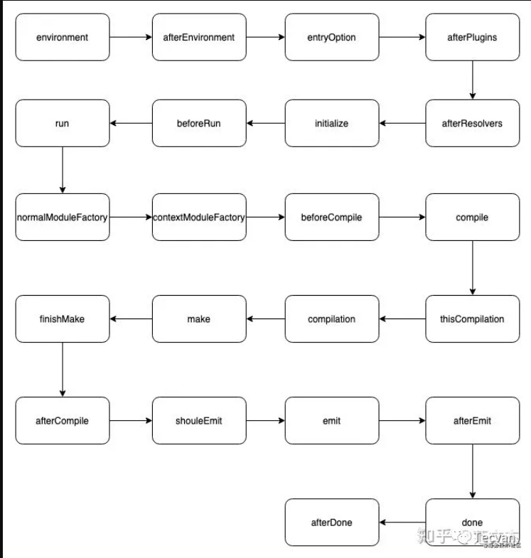
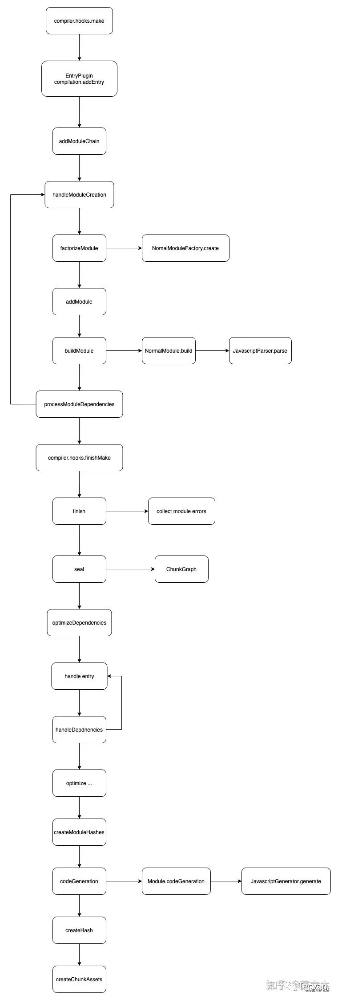

## Webpack Plugins

`Webpack Plugins`是基于`tapable`实现的，`Plugin`机制也是`Webpack`流程中最核心的机制，通过Plugin可以直接参与和影响Webpack流程。

简单来介绍`Plugin`机制的话：`Webpack`在编译阶段会为各个编译对象初始化不同的`Hook`，并且**传入了相关的上下文信息**，所以开发者通过这些Hook，就可以在编译阶段注入逻辑，影响到整个编译流程，从而实现某些自定义行为。

### Plugin结构

#### 常用对象

之前说`Webpack`在编译阶段为各个编译对象初始化了很多`Hook`，那么具体是哪些对象呢。大致有以下几种：

- compiler
- compilation
- ContextModuleFactory
- JavascriptParser
- NormalModuleFactory

##### compiler对象

该对象在整个Webpack流程中是**唯一的**，在首次启动`Webpack`时被创建。

该对象中保存着**完整的Webpack配置**(用户以及默认)，所以可以在该对象上访问一些配置信息，比如`loader`、`plugin`等配置信息。

另外该对象是一个Class类，所以不仅有属性，还有方法。

> [!NOTE]
> 幸运的是，通过TS可以在使用时再去查找其上到底有哪些东西

常用属性、方法：

- `compiler.options`：访问完整的webpack配置

- `compiler.inputFileSystem\outputFileSystem`：是两个对象，其中分别挂载了获取文件相关的API、输出文件相关的API。可以简单理解为Node中fs模块的拓展。
  > [!NOTE]
  > 通过这两个对象，可以保证输入输出行为和webpack同步。

- `compiler.hooks` 该对象上挂载了大量的Hook，使用这些Hook可以在compiler阶段注入不同的逻辑。
  > [!NOTE]
  > 完整的hook列表看[官网文档](https://webpack.js.org/api/compiler-hooks/)

##### compilation对象

该对象在每一次`webpack`构建时都会创建，可以通过该对象访问所有模板及其依赖信息。

在`compilation`中对构建依赖图中的所有模块进行编译，即**编译阶段**。大致有这几个过程：**load -> seal -> optimize -> chunk -> hash -> restore**。

在该对象上可以操作本次编译时的模块、编译后的资源、变化的文件等等。

常用属性/方法：

- `modules`：通过loader转化之后的文件模块，包含文件的所有信息

- `chunks`：多个module组合成一个chunk。

- `assets`：该对象上保存本次打包生产所有文件的结果

- `hooks`：在compilation编译阶段挂载的一些Hook

> [!NOTE]
> 完整的hook列表看[官方文档](https://webpack.js.org/api/compilation-hooks/)
>
> webpack5中操作modules、chunks、assets需要通过其上的方法来，[具体链接](https://webpack.js.org/api/compilation-object)

##### ContextModuleFactory

该对象在编译阶段被创建，为了处理`require.context`解析文件目录的。并不常用。

具体可以看[官网文档](https://webpack.js.org/api/contextmodulefactory-hooks/)

##### NormalModuleFactory

该对象在编译阶段被创建，`compiler`对象中通过该对象来`生成各类模块module`。简单来说就是**模块工厂**，通过该工厂可以创建出各种module。

该对象上的hook可以**控制webpack对各模块的解析处理**。

具体可以看[官网文档](https://webpack.js.org/api/normalmodulefactory-hooks/)

##### JavascriptParser

从名字可以看出，该对象是解析module时被创建的。通过该对象上的hook可以**控制解析生成AST节点的相关流程**

具体可以看[官网文档](https://webpack.js.org/api/parser/)

#### 基本结构

`Webpack`中`Plugin`是基于`tapable`的，所以基本结构如下：

```js
class DemoPlugin {
  apply(compiler) {
    compiler.hooks.done.tap('Demo Plugin', () => {
      console.log('just a demo')
    })
  }
}
module.exports = DemoPlugin
```

- 是一个**构造函数，或者是class**
- 原型对象上必须有一个**apply**方法。这是webpack规定的，在创建compiler对象时会调用插件实例的apply方法，并且传入compiler对象作为参数。
- 通过指定一个绑定在compiler对象上的**hook**，比如上面的`compiler.hooks.done`

- 通过`tap\tapAsync\tapPromise`来注册具体的回调，在回调中是自己的逻辑。

### 一个简单的Plugin

如果认真看完就知道，整个Webpack流程中的Hook是非常之多的。想要写出一个Plugin，最起码需要对Webpack的流程有一个大概了解。

比如我想写一个Plugin，目标是在每个JS文件开头注入一些注释，用来识别作者身份，那么需要怎么做。

因为只需要操作编译后的文件，所以时机应该在assets资源被写入磁盘之前操作。然后查询官方文档可知，相关Hook如下：

- `compiler.hooks.compilation`：进入编译阶段触发
- `compilation.hooks.processAssets`：处理assets资源时触发
  - assets格式：`{ [pathname: string]: Record<string, Source> }`
  - source上有一个source方法，调用该方法可以拿到对应的文件资源(即文件内容)。

> [!NOTE]
> 现在AI时代，可以使用AI结合官网来开发，会减少很多步骤和认知负担。

```js
// AddOwnerCommentPlugin.js
const { Compilation, sources } = require('webpack')

class AddOwnerCommentPlugin {  
  constructor({ author }) {
    this.author = author
  }

  apply(compiler) {
    compiler.hooks.compilation.tap('AddOwnerCommentPlugin', (compilation) => {
      compilation.hooks.processAssets.tap({
        name: 'AddOwnerCommentPlugin',
        stage: Compilation.PROCESS_ASSETS_STAGE_ADDITIONS,
      },
      (assets) => {
        Object.entries(assets).forEach(([pathname, source]) => {
          if(!pathname.includes('node_modules') && pathname.endsWith('.js')) {
            const comment = `/* \n Author: ${this.author}\n Date: ${new Date()} */\n`;
            const newContent = comment + source.source();
            compilation.updateAsset(
              pathname,
              new sources.RawSource(newContent)
            );
          }
        })
      })
    })
  }
}

module.exports = AddOwnerCommentPlugin
```

然后在webpack配置中添加该plugin：

```js
// webpack.config.js
{
  // ...ignore other config
  plugins: [
    new AddOwnerCommentPlugin({ author: 'xx' })
  ]
}
```

然后执行打包命令开始打包，编译后的文件，开头就会加上信息注释。

#### 注意

编写自定义插件最重要的就是要搞清楚在webpack什么时机执行。

hook的触发如下：

来自这位老师的[博客](https://mp.weixin.qq.com/s?__biz=Mzg3OTYwMjcxMA==&mid=2247483744&idx=1&sn=d7128a76eed20746cd8c5100f0899138&scene=19#wechat_redirect)

`compiler`中的hook执行顺序如下：



`compilation`的执行顺序如下：

