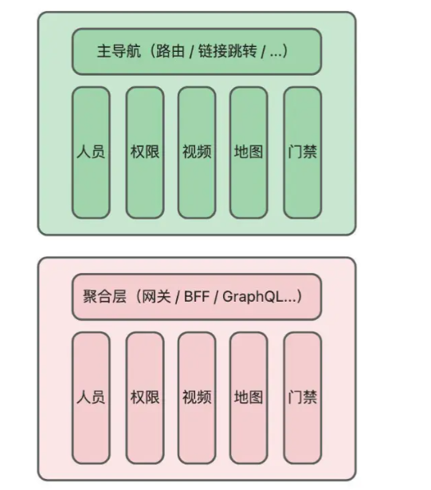

# 微前端

## 背景介绍

一些前端项目，随着业务的扩张，慢慢的变成了巨石项目，延伸出了很多问题：构建缓慢；模块与模块之间互不影响，开发时会占据很多无用资源；项目维护困难等等。

这时候需要对整个项目的架构进行调整以适应逐渐复杂的业务。

## 解决了什么问题

微前端是一种**类似于微服务**的**前端架构模式**，将前端应用程序拆分成多个独立小型应用，以此提高开发的效率。

在该架构下，通过主应用的导航来管理子应用，子应用之间相关独立，子应用可以独立开发、独立部署、独立运行。

所以微前端的特性如下：

- **没有技术栈的限制**
- **应用可以独立开发、独立部署和运行**
- **多个子应用可以整合到一起**

优点：

- 更好的代码维护：将大应用拆分成小应用，降低了应用复杂度，更好的维护
- 降低了开发成本：可以将不同应用分给不同的团队，可以使用不同的技术栈来开发，降低了复杂度
- 更好的复用和扩展：不同的应用是独立的并且复用，还可以独立升级子应用
- 更好的安全性：模块之间的影响和冲突会变少，提高了安全性

缺点：

- 整体项目复杂度提高了，跨团队的沟通协调等问题
- 存在技术风险：因为需要额外的网络层和路由层来解决跨域问题
- 项目整体运行效率会变慢，因为不同子应用之间需要通信，有时间成本

## 方案介绍

微前端架构下，主应用称为**容器应用**，通过设计**导航**将拆分的各个子应用组合在一起，可以根据导航进行子应用的切换。

> [!NOTE]怎么理解导航
> 可以将导航理解为提供了切换子应用能力的一种中间层，通过导航就可以完成子应用的切换。

主应用的导航可以是前端框架的路由(vue-router react-router)，也可以是后端服务路由，还可以是前端自定义的切换逻辑。

SPA的前端项目，微前端的可行方案如下：

- 基于NPM包的：将子应用单独打包成NPM包，然后在主应用中安装使用。
- 基于代码分割的：主应用中使用懒加载技术，在运行时动态加载不同的微应用。
- 基于Web Components的：将子应用封装成自定义组件，在主应用中使用。
- 基于Module Federation的：借助Webpack5提出的Module Federation实现运行时动态加载子应用。
- 基于动态Script标签的：主应用中动态切换子应用的script脚本来实现的。
- 基于iframe的：主应用中使用ifame标签来加载不同的子应用。
- 基于微前端框架的：通过`single-spa`、`qiankun`、`wujie`等通用微前端框架。

一些方案是没有运行时的动态化能力(主应用具备线上动态新增、删除、修改子应用的能力)，如NPM包的方式、代码分割的方式、Web Components方式、借助微前端框架的方式。

剩下的是能够做到动态化的。

> [!NOTE]运行时的动态化能力
> 指的是项目在线上运行时，能否通过主应用来动态增删改子应用。

