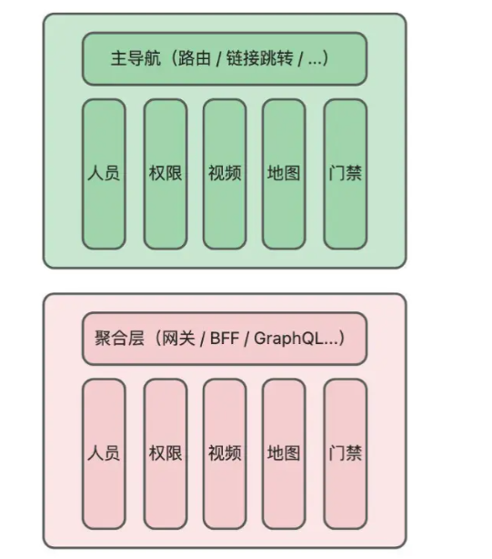

# 微前端

## 背景介绍

一些前端项目，随着业务的扩张，慢慢的变成了巨石项目，延伸出了很多问题：构建缓慢；模块与模块之间互不影响，开发时会占据很多无用资源；项目维护困难等等。

这时候需要对整个项目的架构进行调整以适应逐渐复杂的业务。

## 解决了什么问题

微前端是一种**类似于微服务**的**前端架构模式**，将前端应用程序拆分成多个独立小型应用，以此提高开发的效率。



在该架构下，通过主应用的导航来管理子应用，子应用之间相关独立，子应用可以独立开发、独立部署、独立运行。

所以微前端的特性如下：

- **没有技术栈的限制**
- **应用可以独立开发、独立部署和运行**
- **多个子应用可以整合到一起**

优点：

- 更好的代码维护：将大应用拆分成小应用，降低了应用复杂度，更好的维护
- 降低了开发成本：可以将不同应用分给不同的团队，可以使用不同的技术栈来开发，降低了复杂度
- 更好的复用和扩展：不同的应用是独立的并且复用，还可以独立升级子应用
- 更好的安全性：模块之间的影响和冲突会变少，提高了安全性

缺点：

- 整体项目复杂度提高了，跨团队的沟通协调等问题
- 存在技术风险：因为需要额外的网络层和路由层来解决跨域问题
- 项目整体运行效率会变慢，因为不同子应用之间需要通信，有时间成本

## 方案介绍

微前端架构下，主应用称为**容器应用**，通过设计**导航**将拆分的各个子应用组合在一起，可以根据导航进行子应用的切换。

> [!NOTE]怎么理解导航
> 可以将导航理解为提供了切换子应用能力的一种中间层，通过导航就可以完成子应用的切换。

主应用的导航可以是前端框架的路由(vue-router react-router)，也可以是后端服务路由，还可以是前端自定义的切换逻辑。

SPA的前端项目，微前端的可行方案如下：

- 基于NPM包的：将子应用单独打包成NPM包，然后在主应用中安装使用。
- 基于代码分割的：主应用中使用懒加载技术，在运行时动态加载不同的微应用。
- 基于Web Components的：将子应用封装成自定义组件，在主应用中使用。
- 基于Module Federation的：借助Webpack5提出的Module Federation实现运行时动态加载子应用。
- 基于动态Script标签的：主应用中动态切换子应用的script脚本来实现的。
- 基于iframe的：主应用中使用ifame标签来加载不同的子应用。
- 基于微前端框架的：通过`single-spa`、`qiankun`、`wujie`等通用微前端框架。

一些方案是没有运行时的动态化能力(主应用具备线上动态新增、删除、修改子应用的能力)，如NPM包的方式、代码分割的方式、Web Components方式、借助微前端框架的方式。

剩下的是能够做到动态化的。

> [!NOTE]运行时的动态化能力
> 指的是项目在线上运行时，能否通过主应用来动态增删改子应用。

## 原理

### MPA下的微前端

MAP下天然就能做到子应用的拆分，主应用要做的就是如何根据导航来跳转子应用。

因为MPA下子应用属于不同的Renderer进程，浏览器根据进程进行了沙箱隔离，所以天然支持微前端。

### SPA下的微前端

SPA下子应用是处于同一Renderer进程中的，浏览器的沙箱隔离失效，所以主应用需要模拟“沙箱”的功能，起到隔离作用。
所以需要额外处理：
- 状态：微应用的加载、卸载、渲染等都需要控制和处理；
- 隔离：因为处于同一浏览器上下文，所以需要对DOM和JS隔离；
- 性能：微应用的加载、缓存、资源共享等性能问题；
- 通信：多个微应用之间的通信问题；

所以为了模拟“沙箱”功能，需要有一个框架，通过这个框架能帮助**主应用快速管理子应用**。

一般是在主应用中引入微前端的框架，并且添加导航和内容设计相关的代码，以此来接入和管理子应用：
- 通过微前端框架来管理子应用的加载、卸载、监控等；
- 通过导航设计来根据导航引入不同的子应用；
- 通过内容设计让页面更完整；

### 隔离

JS隔离和DOM(CSS)隔离

为什么要隔离：因为多个子应用可能共存，又由于处于同一个浏览器上下文，所以JS的变量、CSS的样式都可能冲突，所以需要有隔离策略。

MPA应用，子应用是不同浏览器tab，所以依靠浏览器可以做到隔离；
但是SPA应用，子应用处于同一浏览器tab，是在同一个Renderer进程中的，浏览器的隔离又是以进程为单位的。所以SPA应用的隔离需要依靠微前端框架来做。

Chrome浏览器是通过内嵌的V8来解释执行JS代码的，**V8中通过执行上下文(Context)来隔离不同的JS应用**，并且这些JS应用可以处于同一个V8的Isolate实例中。

为什么V8中要有执行上下文的概念？如果不同的JS应用同时修改了某个全局变量或属性(比如原型链覆盖方法)，通过创建不同的全局执行上下文，就能避免这个问题。

#### 微前端中的JS隔离

嵌套的iframe可以创建不同的全局执行上下文，所以通过iframe方案可以使用V8的隔离。

npm方案、动态Script方案以及Web Components方案，本质都是在同一Renderer进程、同一全局执行上下文中的，所以无法通过浏览器默认能力实现隔离。

V8的隔离包括了Isolate隔离以及Context隔离：
- Isolate隔离可以防止跨站攻击，有自己的堆内存和垃圾回收器等资源。不同的Isolate之间无法共享数据和资源
- Context隔离是在同一个Isolate实例中，这个Context有自己的全局变量、函数和对象等，默认不同Context之间不能互相访问。

目前浏览器没有提供API来直接创建新的Isolate或者Context隔离，可以通过一些额外功能来实现隔离：
- 使用WebAssembly，WebAssembly会被限制运行在一个安全的沙箱环境中
- 使用Web Worker，Worker有自己独立的Isolate实例
- 创建iframe进行Isolate或者Context隔离(同一个Renderer进行)

但是通过浏览器的功能来实现JS的隔离，会受到浏览器功能的限制，比如：
- WebAssembly中无法直接调用WebAPI
- Web Worker中只能调用部分WebAPI

微前端中子应用一般运行在同一个Renderer进程的同一Isolate实例中的，这些限制就会带来一些不必要的问题。

所以通常是借助iframe来进行JS的隔离。

#### iframe隔离

iframe实现的是Isolate隔离，但一般是独立的Context，所有需要解决Context隔离问题。一般用在SPA应用中。

1. 加载空白的iframe应用，生成新的子应用执行环境
  - 需要解决全局执行上下文隔离问题
  - 需要解决加载iframe时白屏的问题
2. 加载同源的iframe应用，返回空的内容，生成新的子应用执行环境
  - 需要解决Context隔离问题
  - 需要解决加载iframe时白屏的问题
  - 需要解决数据状态同步问题
  - 需要解决导航时前进后退问题

##### 空白的iframe

通过创建空白的iframe来为子应用提供执行环境

1. 主应用中通过请求获取子应用列表，动态创建导航
2. 根据导航切换子应用，切换时跨域请求子应用的JS文本内容并缓存
3. 子应用的JS在iframe中通过script标签进行隔离执行

`src="about:blank"`会让当前iframe继承父级上下文的源，即遵守同源策略

```js
window.document.domain = window.parent.document.domain // true
```

但是`about:blank`会让子应用中无法使用`history`
```js
window.history.pushState({ key: "hello" }, "", "/test");
```
子应用中运行使用`history`API会抛出异常：


```bash
VM1356:1 Uncaught SecurityError: Failed to execute 'pushState' on 'History': A history state object with URL 'http://localhost:5172/test' cannot be created in a document with origin 'http://localhost:5172' and URL 'about:blank'.
    at <anonymous>:1:16
```

因为使用histroyAPI必须让新的URL和当前URL同源，否则会报错。

##### 同源iframe

在创建iframe时将src地址设为一个和主应用服务器同源的空白页面，保持iframe和主应用同源，就能避免子应用中`history`报错的问题。

这种方案会增加一次额外的同源页面请求，可能会有一些性能上的问题。

##### proxy代理

`about:blank`方案中可以在子应用中通过代理拦截从而使用主应用的history、document等对象：
1. 可以解决history报错的问题
2. 可以让主子应用URL同步，但需要考虑路由冲突问题
3. 可以解决样式问题，但是会突破DOM隔离，需要处理

比如子应用的`iframe.contentWindow`通过proxy代理到`window`

##### 小结

待解决的问题：
- 主应用刷新，子应用的iframe无法保持自身URL状态
- 主应用和子应用的iframe处于不同的执行上下文，会导致一些样式上的问题
- 主子应用的通信问题以及持久化数据的隔离
- 加载主应用同源的空白页面时性能需要优化

#### 快照隔离

iframe隔离依赖了浏览器内部Context的隔离，隔离是比较彻底的，某些场景可能不是很合适，所以可以通过纯JS来隔离。

JS的隔离主要解决的问题，就是变量冲突，在这种方案下，所有的子应用都处于同一个执行上下文。

可以通过对子应用中`window`对象进行隔离，从而达到隔离的目的。

想要阻止变量冲突，IIFE立即执行函数：
  - 可以解决let或const声明变量的隔离
  - 非严格模式下this指向window全局对象，可能造成全局属性的污染
  - 非严格模式下不使用标识符，会创建全局变量，如`a = 1`，非严格模式下会创建一个全局变量a
  虽然使用立即执行函数，能提到隔离的作用，但是子应用必须要封装到该IIFE中执行，就导致丢失了一些特性(相比直接在全局作用域中执行)；且对于全局属性、变量的污染问题并没有解决。

想要手动执行一段JS代码，有以下几种方法：
1. `script`标签加载内嵌的JS代码字符串
```js
const scriptElm = document.createElement('script')
// 将要执行的JS字符串放到script标签中，然后再插入这个script标签。浏览器就会自动执行
scriptElm.textContent = scriptText
document.head.appendChild(scriptElm)
```
2. `eval`执行
```js
eval("let a = 1, b = 2; console.log(a + b)")
```
3. `Function`执行
```js
// 前面的是函数的入参，最后一个是函数体
const fn = new Function("a", "b", "return a + b;")
console.log(fn(1,2))
```
使用`Function`来执行一段JS，作用域是全局作用域，`eval`中是函数作用域内的。并且`eval`还有一些其他的问题。

所以一般通过`Function`来手动执行一段JS代码。

> [!NOTE]
> 在执行一段JS字符串时需要注意，如果变量被构建工具压缩了，也可能会导致意料之外的问题。

快照隔离的本质：添加一个中间快照层，初始化子应用时记录主应用的window快照，运行子应用时是在这个window快照上的，等失活时，记录本次运行操作的内容(变量、属性等)，然后将window恢复。等下一次激活时，从缓存中拿到值来恢复状态。

可以看到这种方案**只能满足同一时刻运行一个子应用**。

大致过程如下：
1. 通过请求获取到子应用列表信息，动态创建导航
2. 根据导航切换子应用，获取到子应用的JS文本并缓存
3. 激活某个子应用时，其他的子应用要失活，保证同一时间只有一个子应用在激活状态
4. 运行子应用前，从缓存中找到该子应用上一次运行记录的信息，和主应用的window进行合并，以此来恢复子应用的状态
5. 失活时将当前的window和主应用window对比，找到本次运行有变动的内容并记录。之后恢复主应用的window，防止干扰其他子应用的运行。

#### 微前端中的CSS隔离

CSS隔离本质就是防止CSS的样式冲突，有以下方案：

1. 子应用中的CSS样式和对应元素添加标记，保证唯一值，类似Vue中的`Scoped CSS`
2. 子应用中添加特殊前缀，保证样式的影响范围
3. 使用`Shadow DOM`，不仅能做到样式隔离，还能做到事件隔离：Shadow Host之外的无法感知内部触发的事件。

第一种需要子应用内部处理，从而解决样式冲突的问题；
第二种可以在获取子应用样式时特殊处理，比如给子应用容器添加前缀，限制范围；
第三种是利用浏览器的`Shadow DOM`来实现CSS样式隔离。

CSS隔离是指主应用和子应用之间的隔离、子应用和子应用之间的隔离。

动态添加style可以防止子应用之间的隔离，但是主应用和子应用之间的隔离还在。

所以可以通过`Shadow DOM`包裹子应用，就达到了CSS隔离的目的。

### 性能优化

前端应用的性能优化方式主要是两个方向：
1. 网络资源
2. 浏览器渲染

而在微前端中，主要性能瓶颈在以下几个方面：
- 主应用和子应用的资源加载
- 子应用切换可能导致性能问题
- 子应用的公共代码
- 子应用的公共依赖库

#### 网络资源

HTTP缓存：
- 强缓存：http1.1的`Cache-Control`、http1.0的`Expires`
  - `Expires`: 一个过期时间。是服务器返回的GMT格式的绝对时间`Expires: Mon, 07 Apr 2025 02:34:22 GMT`。再次请求时浏览器会根据**响应头Date(没有就用本地接收到该响应时的绝对时间)**和Expires的时间进行对比，判断是否过期。如果本地和服务端的时间不一致，可能会导致缓存失效。
  - `Cache-Control`: `Expires`的弊端(无Date时两个时钟可能不一致)，所以HTTP1.1引入了`Cache-Control`。可以通过`max-age`设置一个相对时间，比如20s后过期。相对时间的好处就是完全由浏览器端控制，避免了双端时钟不一致导致的问题。
- 协商缓存：`Last-Modified`、`ETag`
  - 工作流程：第一次请求时添加相关的头部字段；后面再次请求时浏览器携带上一次的头部字段，让服务端去判断资源是否有效。
  - `Last-Modified`：服务器返回的GMT格式的绝对时间`Last-Modified: Thu, 03 Apr 2025 07:53:48 GMT`。再次请求时浏览器会自动携带`If-Modified-Since`头部字段，服务端会来判断资源是否变动。
  - `ETag`：服务端返回的一个资源唯一标识。再次请求时浏览器会自动携带`If-None-Match`头部字段，服务端会根据请求的ETag和当前ETag进行对比，如果没有变动就返回304状态码。

#### 浏览器渲染

`Resource Hints`：浏览器在解析HTML时，遇到`<link rel="preload">`、`<link rel="prefetch">`、`<link rel="preconnect">`等标签时，会提前加载资源：
- `DNS Prefetch`：提前解析域名，减少DNS解析时间
- `Preconnect`：提前给URL建立请求连接，包括DNS、TCP、TLS这些连接。
- `Prefetch`：提前获取并缓存资源，可能在未来的导航中使用。
- `Preload`：提前加载资源，以提高页面加载性能。
- `Prerender`：提前获取、缓存资源，并且预渲染资源。即在隐藏的标签页中进行渲染

`Resource Hints`允许浏览器在空闲时进行稍后可能需要进行的动作，从而提高用户体验。比如在登录页可以预测接下来会登录并访问到首页，所以可以通过`Resource Hints`预测资源来提高用户体验。

预渲染：`Resource Hints`中的`Prerender`需要一个HTML地址，在SPA应用中不适用，所以需要对子应用的预渲染特殊处理。
因为需要在空闲时执行，所以一般会借助`requestIdleCallback`来实现。
`Resource Hints`中的`Prefetch`和`requestIdleCallback`的空闲时间区别：`Prefetch`的空闲是浏览器加载完当前页面后，如果还有空闲时间就开始加载`Prefetch`的资源；`requestIdleCallback`的空闲是一帧内处理完高优先级任务后的剩余时间。

#### 小结

微前端中的性能优化其实是通用的，但是要重点专注两个方面：一是子应用的加载和切换，二是子应用资源的加载和重复代码的处理。

子应用的加载可以通过HTTP缓存来优化、`Resource Hints`提前加载、渲染等来提高用户体验；
子应用的切换可以通过预渲染子应用来提高性能；
子应用资源的加载也能通过HTTP缓存来优化；
子应用间重复代码的处理：Module Federation模块联邦；同一工程内能在构建时对子应用间的重复代码切割、缓存。

总之性能优化从网络资源以及浏览器渲染这两个大方向去思考，一般都能找到比较好的解决思路。

### 通信

微前端中，通信也是重要的一部分。

观察者和发布订阅是两种常用的通信模式。

观察者是一对多的单向通信；发布订阅是多对多的双向通信。

#### 观察者模式

在观察模式中有一个Subject对象和多个Observer对象，Observer对象订阅Subject的变化，当Subject变化时会通知所有订阅的Observer对象。
```js
class Watch {
  constructor() {
    this.observers = []
  }

  subscribe(observer) {
    this.observers.push(observer)
  }

  notify(data) {
    this.observers.forEach(observer => observer.update(data))
  }

  unsubscribe(observer) {
    this.observers = this.observers.filter(item => item !== observer)
  }
}

const watch = new Watch()
const observer1 = {
  update: () => console.log('observer1')
}
const observer2 = {
  update: () => console.log('observer2')
}
// 添加一个观察者
watch.subscribe(observer1)
// 添加另一个观察者
watch.subscribe(observer2)

// something change to notify
watch.notify('Data has changed')
```

上面是一个简单的观察者模式，多个观察者通过订阅(subscribe)的方式来监听Subject的变化，当Subject变化时会通知(notify)所有订阅的Observer对象。

#### 发布订阅模式

发布订阅中有三个对象：Publisher、Subscriber和Channel：
- Publisher：发布者，负责发布信息；
- Subscriber：订阅者，负责订阅信息；
- Channel：信息传输的通道；

Publisher向某个Channel传输信息，Subscriber向Channel订阅信息监听变化。
发布者也可以订阅，订阅者也可以发布，这样就能实现双向通信。
```js
class Pubsub {
  constructor() {
    this.channels = {}
    this.token = 0
  }

  // 订阅者，生产消息的
  subscribe(channel, callback) {
    if(!this.channels[channel]) {
      this.channels[channel] = []
    }
    this.channels[channel].push({
      token: this.token++,
      callback,
    })
  }

  unsubscribe(token) {
    for(const channel in this.channels) {
      const current = this.channels[channel]
      const index = current.findIndex(({ token: t }) => t === token)
      if(index !== -1) {
        current.splice(index, 1)
        if(current.length === 0) {
          delete this.channels[channel]
        }
        return
      }
    }
  }

  // 发布者，消费消息
  publish(channel, data) {
    const current = this.channels[channel]
    if(!current) return

    current.forEach(({ callback }) => {
      callback(data)
    })
  }
}

const pubsub = new Pubsub() 

pubsub.subscribe('test', (data) => {
  console.log('test1', data)
})
pubsub.subscribe('test', (data) => {
  console.log('test2', data)
})

pubsub.publish('test', 'hello world')
```

从上面两种模式的简单实现来看，观察者模式是一种需要消息中心的、一对多的通信方式；发布订阅模式通过不同的channel来实现多对多的通信方式。观察者模式更加紧凑、而发布订阅更加松散解耦。

#### 微前端的通信

在微前端中，一般都是多对多的通信方式，所以一般都是发布订阅模式来通信的。比如`single-spa`通过`EventTarget(dispatchEvent api)`来实现通信。

> [!NOTE]
> EventTarget在不同源之间通信会报错。这时可以选择postMessage来通信。


