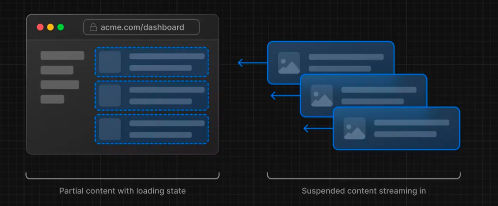

# 服务端组件的渲染策略

## 静态渲染Static Rendering

Next对于服务端组件，在构建时是直接做了缓存处理的，这也是默认的渲染方式。
但是这种静态渲染只适用于不需要个性化处理、且数据已知的情况，比如静态博客、产品介绍首页等。

```tsx
// app/server
export default async () => {
  const res = (await (await fetch('https://api.thecatapi.com/v1/images/search')).json())[0].url

  return 
}
```

以上代码就是一个服务端组件的静态渲染的实例，在**构建时就已经请求了数据并缓存了下来**，所以每次访问都是同一张图片。

## 动态渲染 Dynamic Rendering

有的时候静态渲染并不是我们想要的，比如我们需要根据用户的请求来动态渲染数据，那么我们就需要使用动态渲染。

如果使用了`动态函数或者未缓存的数据请求`，Next就会转为动态渲染。

### 动态函数Dynamic Functions

指的是获取那些只能在请求时得到的信息(cookie、header、请求参数)的函数。

- `cookies()`和`headers()`获取cookie信息和头部信息
- `searchParams`获取请求参数

上面的例子 添加动态函数之后，每次访问该路由(开发环境和生产环境) 都会重新发起请求。
```tsx{2,6,7}
// app/server
import { cookies } from 'next/headers'

export default async () => {

  const cookieStore = cookies()
  const aaa = cookies.get('aaa')

  const res = (await (await fetch('https://api.thecatapi.com/v1/images/search')).json())[0].url

  return 
}
```

关于`searchParams`，先看看下面的代码：
```tsx
export default async ({ searchParams }: {
  searchParams: any
}) => {

  const res = (await (await fetch('https://api.thecatapi.com/v1/images/search')).json())[0].url

  return (
    <>
      
      {Date.now()}
      <p>{JSON.stringify(searchParams)}</p>
    </>
  )
}
```

虽然使用了`searchParams`，但是在生产环境中，每次刷新页面，时间戳会变化，但是请求的数据还是被缓存了。

通过这个例子，可以得知，页面渲染和数据请求是两码事。

> [!NOTE]
> 上面的动态渲染，指的都是生产环境，经过构建之后的代码

所以`searchParams`虽然将页面转成了`动态渲染`，但是数据请求还是有缓存。

### 未缓存的数据请求

上面介绍了，`动态函数`会导致fetch请求退出缓存，但是`searchParams`并没有，这也是Next的一个自动转换。

使用未缓存的数据请求，会让路由进入动态渲染。即让请求退出缓存，会自动让页面渲染转为动态渲染。

```tsx{3,4}
export default async function Page () {

  const res = (await (await fetch('https://api.thecatapi.com/v1/images/search', {
    cache: 'no-store'
  })).json())[0].url

  return (
    <>
      
      {Date.now()}
    </>
  )
}
```
上述代码在构建打包之后预览，会发现每次刷新页面，请求会重新发起，时间戳也会变化。

让请求退出缓存的方法：
- `cache: 'no-store'`
- `revalidate: 0`
- 使用`POST`
- 使用`cookies`或者`headers`
- 配置路由段选项：`const dynamic = 'force-dynamic'`
- 配置路由段渲染：`fetchCache`
- `fetch`中使用`Authorization/Cookie`header字段，并且组件树父级中有一个未缓存的请求

> [!IMPORTANT]
> 页面渲染和数据请求是分开的，有的时候即使是动态渲染，数据还是会有缓存。但是请求退出缓存了之后，会自动进入动态渲染。

## Streaming流式渲染

在服务端渲染中，将页面的HTML拆分成多个chunks，然后通过`transfer-encoding: chunked`流式的这些chunks从服务端发送到客户端。

> 这个分块只在`http1.1`中用。http2采用了多路复用，本身就支持了流式渲染。



流式渲染可以更快的展示页面的某些部分，提前到达的部分就可以提前进行水合，能有效的改善用户体验。


并且，流式渲染可以有效的阻止长时间无响应的请求阻塞整个页面加载的情况。
