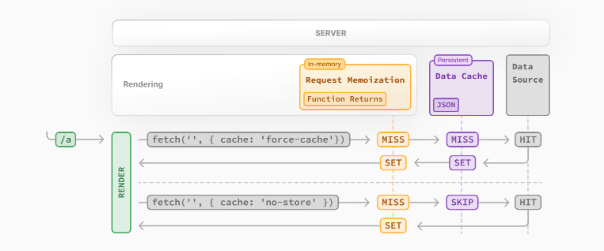
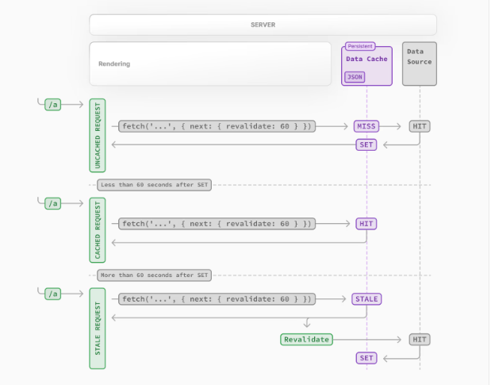
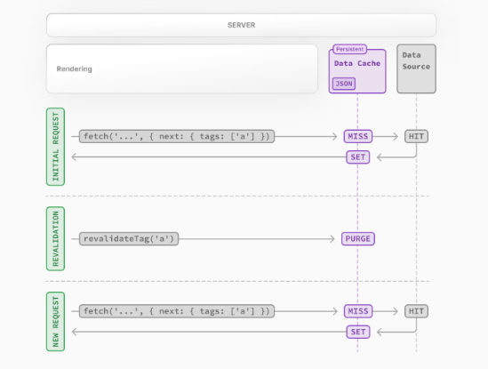
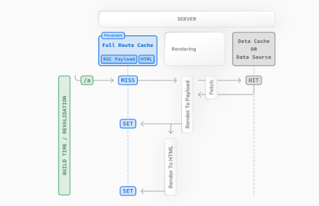

# Next中的缓存

Next中有一些默认的缓存处理，目的是为了提高应用程序的性能和降低成本。但是开发过程中这些缓存，可能会带来一些难以捉摸的问题。所以关于缓存还是很重要的。

> [!IMPORTANT]
> Next15已经取消的默认缓存，另外本篇抄的确实不咋样，完全理解不了啥意思。
>
> 取消的缓存：
> - fetch不再缓存
> - GET路由处理程序不再缓存
> - 客户端路由不再缓存

## 缓存机制介绍

> [!IMPORTANT]
> [官网关于这一节的介绍](https://nextjs.org/docs/app/building-your-application/caching)

Next中大概有这几种缓存：

| 机制                | 缓存内容          | 存储位置 | 目的                       | 持续时间             |
| ------------------- | ----------------- | -------- | -------------------------- | -------------------- |
| Request Memoization | 函数返回值        | Server   | 复用React组件树中的数据    | 每个请求的生命周期   |
| Data Cache          | 数据              | Server   | 跨用户请求和部署时复用数据 | 持久，可重新验证     |
| Full Route Cache    | HTML、RSC Payload | Server   | 降低渲染成本、提高性能     | 持久，可重新验证     |
| Router Cache        | RSC Payload       | Client   | 减少导航时的服务器请求     | 用户会话期或基于时间 |

默认情况下，Next会**尽可能**的使用缓存来提高性能和降低成本。也就是说除非手动退出缓存，否则**路由会被静态渲染、并且数据请求也会被缓存**。

当然缓存行为也会被很多其他东西影响，比如路由是静态渲染还是动态渲染、数据有没有缓存、请求是在初始化访问中还是后续导航中。

## Request Memoization

**React**扩展了`fetch`API，当相同的URL和参数时，会自动将**请求结果缓存下来**。这意味着可以在组件树的多个位置调用相同的数据获取函数时，只会执行一次。

这样做的好处就是，不用在顶层调用该数据获取函数，然后再将结果下发到子组件中。可以直接在子组件中调用获取数据的函数。

```ts
async function getItem() {
  // 会自动缓存返回值
  const res = await fetch('xxx')
  return res.json()
}
```
如上面这个函数，如果先在A组件中调用，再在B组件中调用，那么B组件中会直接从缓存中取，避免了多次请求的性能影响。

### 原理

原理也很简单，就是一个简单的带缓存的函数：
```js
function memoize(f) {
  const cache = {}
  return function() {
    const key = arguments.length + Array.prototype.join.call(arguments, ',')
    if(key in cache) {
      return cache[key]
    }else {
      return cache[key] = f.apply(this, arguments)
    }
  }
}
```

### 注意事项

1. 该缓存是React扩展的，而非Next
2. 仅适用于`GET`请求
3. 仅适用于React组件树中：
  - 适用于`generateMetadata`、`generateStaticParams`、`layout布局`、`page页面`和其他的服务端组件
  - 不适用于`路由处理程序`中的`fetch`，因为不是React中的一部分。

### 持续时间

该缓存会持续存在服务端请求的生命周期，直到React组件树完成渲染。

### 重新验证

由于该缓存只会在渲染期间使用，因此无需重新验证。

### 如何退出

该缓存认为是React的优化手段，不建议退出缓存。

## Data Cache

该缓存是**Next**中的数据缓存方案，可以跨服务端请求和构建部署时缓存数据。Next也对fetchApi进行了扩展，每个请求都可以设置自己的缓存方式。

> [!NOTE]
> 浏览器端的fetch缓存是属于HTTP的缓存。
> 
> 服务端的fetch缓存是和服务端数据交互的缓存。

### 原理

默认给fetch添加`cache: no-store`的配置。当然也可以使用`cache\next.revalidate`这两个选项来修改缓存行为。

```js
fetch('url', { cache: 'force-cache' | 'no-store' })

fetch('url', { next: { revalidate: 3600 } })
```



第一次请求时添加了`cache: force-cache`，所以Next会检查数据是否有缓存，有的话会返回并保存缓存；如果没有，会从数据源请求数据，然后将结果返回并保存缓存。

请求时携带了`cache: no-store`，由于参数不同，所以请求会跳过缓存 从数据源获取，然后直接返回。

需要注意的是：无**论数据是否被缓存，请求一定会被记忆**即上文的`Reqesut Memoization`

### 持续时间

数据缓存在请求和部署时都保持不变，除非重新验证或退出缓存。

### 重新验证

Next对该种缓存提供了两种方式来重新验证数据：

1. 基于时间的重新验证 Time-based revalidation
2. 按需重新验证 On-demand revalidation

#### 基于时间的重新验证

这种方法是过一段时间后有新请求产生，会重新验证数据，对于不经常更新并且新鲜度要求不高的数据很有用。

- fetch的`next.revalidate`选项

```js
fetch('xx', { next: { revalidate: 3600 } })
```

该选项的单位是`s`秒级的。

- Next提供的路由段配置项`revalidate`

```js
// 某个路由文件中
export const revalidate = 3600
```



在设置的时间内是有缓存的，设置的时间之外再去访问，会重新验证数据`Revalidate`，所以设置时间之外的第一次请求只是去重新验证，返回的还是之前的缓存数据，之后的再次请求才是新数据的缓存。

#### 按需重新验证

这种方式就比较灵活自由，在需要时手动重新验证数据。

- `revalidatePath`根据路径按需更新

用在路由处理程序或`ServerAction`中，用来手动清除特定路径中的缓存数据。
```js
revalidatePath('/')
```

- `revalidateTag`根据缓存标签按需更新

该方式依赖的是Next的缓存标签机制，在使用fetch请求时可以声明标签，然后需要更新时通过该标签来更新。



```js
// 请求时使用标签
fetch('xxx', { next: { tags: ['a', 'b', 'c'] } })
```

在路由处理程序或ServerAction中，重新验证**包含该标签**的请求数据。下一次再请求时就是新数据。
```js
revalidateTag('a')
```

### 如何退出

两种方式退出Data Cache:
- fetch的`cache: 'no-store'`
- 使用路由段配置项，`const dynamic = 'force-dynamic'`

## Full Route Cache

### 原理

Next在构建时**自动渲染和缓存路由**，该缓存的目的是访问路由时，可以直接使用缓存中的路由，提高页面加载速度。

**缓存路由**：在服务器上，Next会使用React相关的API来编排渲染。当渲染时，渲染工作会根据**路由和Suspence拆分成多个chunk**，每个chunk分两步来渲染：
1. React将服务端组件**渲染成RSC Payload**。
> RSC Payload是特殊的数据格式，该格式是一行一行的，所以流式渲染很方便，逐行发送给客户端，客户端逐行解析，渐进式渲染页面。
2. Next使用RSC Payload和客户端组件代码在服务端**渲染成HTML**。
可以看到渲染结果可能是RSC Payload，也可能是HTML。所以Full Route Cache缓存的就是这两个东西。



路由构建时是否被缓存取决于是静态渲染还是动态渲染。静态路由默认会被缓存，动态路由因为只能在请求时被渲染，所以不会缓存。

### 持续时间

Full Route Cache默认是持久的，可以跨用户请求复用。

### 如何退出

想要退出该缓存，只需要改为动态渲染即可：

- 使用动态函数：动态函数可以变为动态渲染，该缓存会失效。但是Data Cache还会存在
- 使用路由段配置项：`const dynamic = 'force-dynamic'`或`const revalidate = 0`。会跳过该缓存和DataCahce。每次请求时都会重新获取数据并渲染组件。
- 退出数据缓存：只需要退出数据缓存，也会退出Full Route Cache.

简单来说，该缓存只适用于静态渲染，在服务端缓存静态渲染的产物RSC Payload和HTML。

## Router Cache

### 原理

Next有一个存放在内存中的**客户端缓存**，会在**用户会话期间**按路由段存储RSC Payload。这就是路由缓存。

该缓存的目的是给用户提供更好的导航体验：
- 前进、后退，已访问过的路由被缓存了，并且会预获取新路由
- 导航不会导致页面重载，并且会保留React的状态和浏览器状态。

### 持续时间

该缓存是存放在浏览器的临时缓存中的，所以持续时间：
1. Session：页面刷新缓存会被清除。
2. 自动失效：静态渲染的路由5min后自动清除，动态渲染的路由30s后自动清除。

如果在动态渲染的路由中调用了`router.prefetch`或者是添加了`prefetch={true}`，会缓存5min。

### 如何退出

可以让路由缓存失效，但是无法退出路由缓存。

失效的方法：
- serverAction中
  - 通过`revalidatePath`或`revalidateTag`重新验证数据
  - 使用`cookies.set`或者`cookies.delete`让该缓存失效
- 调用`router.refresh`让路由缓存失效并发起一个重新获取当前路由的请求。

可以通过修改`Link`的`prefetch: false`来退出预获取，但是还是会被缓存30s。
