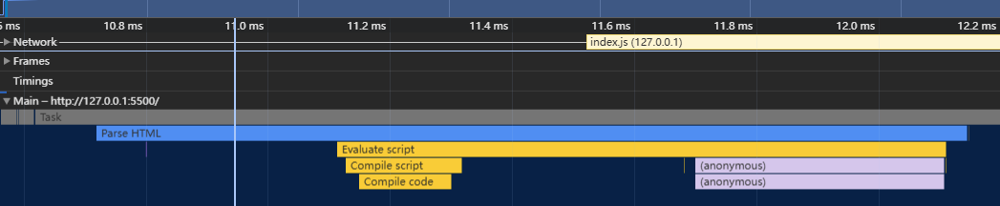
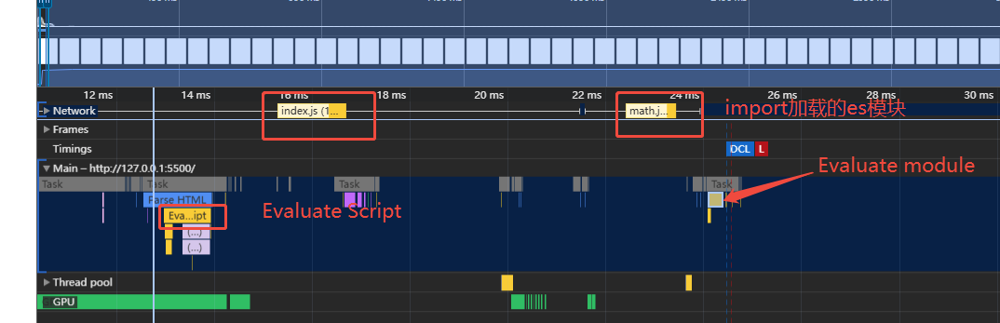

# 背景

详细介绍可以看[web.dev的介绍](https://web.dev/articles/script-evaluation-and-long-tasks?hl=zh-cn)

在使用Performance工具进行性能测量时，经常会看到`Script Evaluation`这个任务。

## 什么是Script Evaluation

`Script Evaluation`通常是导致长任务的主要原因，减少单次`Script Evaluation`时间，能有效提高<strong>INP(Interaction to Next Paint)</strong>以及<strong>TBT(Total Block Time)</strong>指标分数。通过了解其工作原理，能更好解决这一类性能问题，从而提高性能。

`Script Evaluation`是浏览器在解析`HTML`时，遇到`<script>`标签时，会执行其中的脚本。这个过程包括了解析和编译脚本，以及执行脚本。对应上图中的`Compile script`和`Compile code`。

该过程是浏览器执行JavaScript的必要部分，现代浏览器在执行JS前有一个即时编译(JIT)的过程，是浏览器的优化手段。在`Script Evaluation`过程中，会先解析脚本来检查是否有错误，没有错误的话会编译成字节码，然后继续执行。

## script脚本加载方式和script evaluation的关系

### script元素直接加载

直接通过`script元素`来加载脚本的话，每个`script元素`都会有一个`Script Evaluation`任务，以便对脚本进行解析、编译和执行。

所以这种情况应该避免一个大的`script`，将其拆分成多个小的`script`。这样可以避免`Script Evaluation`一直占用主线程，导致页面卡顿。

### script+type=module

`type:module`加载ES模块会有一个`Evaluate Module`任务，并且是等到该ES模块被实际使用时才会执行。这样做是为了拆分`Script Evaluation`的时间，避免占用主线程。虽然ES模块可以减少单个`Script Evaluation`的时间，但是带来了网络请求的开销以及后续的`Evaluate Module`任务。

> [!NOTE] Evaluate Module的时间
> Evaluate Module是在需要开始执行内部代码时才会执行的，如果内部有import，会等到import的模块加载完毕后才会执行。

### 动态import加载

动态import来加载脚本，是在需要时加载，所以`Script Evaluation`是在需要时才会执行。也起到了拆分`Script Evaluation`的作用。

当然这种方式会干扰主线程，所以使用时需要做一个取舍。

### web worker中的脚本

web worker中的脚本会在一个**独立的worker线程**中执行，不会干扰主线程。所以`Script Evaluation`也是在单独的worker线程中执行的，不会影响主线程。

## 总结

`Script Evaluation`是浏览器执行JS时的必要部分，通过拆分脚本可以有效的减少单次`Script Evaluation`的执行时间，从而避免主线程的阻塞。虽然拆分脚本可以起到性能优化的作用，但是会带来网络请求的开销。使用**打包工具的压缩功能、浏览器的缓存、http2的多路复用等可以有效减少网络请求的开销**，所以一般都是能拆则拆。当然实际情况需要根据具体情况来决定。
