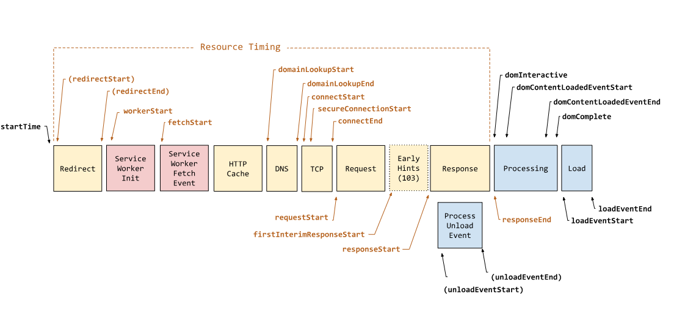
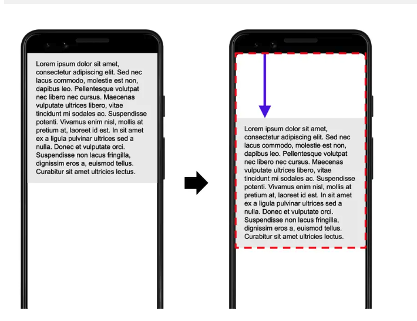

# 性能指标

网页的性能指标通常是根据 **核心网页指标(Core Web Vitals)** 来衡量的。

**核心网页指标(Core Web Vitals)** 只有三个指标：[`LCP`](#lcp)、[`INP`](#inp)、[`CLS`](#cls)



## 加载速度

网页的加载是一个很复杂的过程，没有单一指标能完全概括。

### TTFB

**Time To First Byte** 首字节时间

这里**特指**从用户开始进入页面，到浏览器接收到响应(通常是HTML文档)的第一个字节的时间。

该过程包括了重定向、DNS查找、TCP连接、SSL连接以及请求处理。所以减少连接以及服务器响应时间，都可以改善该指标。

在上图中从`startTime`到`requestStart`之间的时间，就是`TTFB`。

> [!WARNING]
> performance.timing已经被废弃

```js
new PerformanceObserver((entryList) => {
  if(entry.entryType === 'navigation') {
    console.log('TTFB:', entry.responseStart)
  }
}).observe({
  type: 'navigation',
  buffered: true
});
```

另外该指标还适用于所有请求，如果需要衡量**资源的TTFB**，使用`PerformanceObserver`的`resource`类型：

```js{6}
new PerformanceObserver((entryList) => {
  if(entry.entryType === 'resource') {
    console.log('TTFB:', entry.responseStart)
  }
}).observe({
  type: 'resource',
  buffered: true
});
```

### FCP

**First Contentful Paint** 首次内容绘制

该指标从用户进入页面到页面上 **第一个内容(文字或图片)** 绘制完成的时间。

该指标可以反映打开页面的响应速度，良好的FCP指标应该小于1.8s。

在上图中，从`startTime`到`loadStart`后的第一块内容被渲染出来为止。

> [!NOTE]
> 该指标衡量的内容是浏览器渲染该页面的第一段DOM，文字、图片、非白色Canvas、SVG等都包括。但是不包括iframe中的内容。

可以通过`PerformanceObserver`来监控该指标:

```js
const handler = (entries) => {
  for(const entry of entries.getEntries()) {
    if(entry.name === 'first-paint') {
      // FP，startTime就是白屏的时间
      console.log('FP:', entry.startTime);
    };
    if(entry.name === 'first-contentful-paint') {
      // FCP，startTime就是首次内容绘制的时间
      console.log('FCP:', entry.startTime);
    };
  };
}

const observer = new PerformanceObserver(handler);

// 监听FP FCP
observer.observe({ type: 'paint', buffered: true });
```

### LCP

**Largest Contentful Paint** 最大内容绘制

> [!IMPORTANT]
> 核心网页指标(Core Web Vitals) 之一
>
> [web.dev](https://web.dev/articles/lcp?hl=zh_cn)的描述

从用户首次进入页面到页面绘制结束，**最大内容**所花费的绘制时间。
这个最大内容，并不是一成不变的，而是在变化的，只有页面趋于稳定，才能确定这个最大内容。

一般来说，以下这些元素会影响到LCP指标：
- `元素`
- `svg中的<image>元素`
- `<video>`
- 带`url()`背景图的元素
- 块级元素带有文本节点

该指标从另一个角度衡量了页面的响应速度，良好的TCP指标应该小于2.5s。

该指标跨度很大，从**用户一开始进入页面到页面绘制结束**，中间经历了这些过程：

- 上一个页面的卸载时间
- `TTFB`时间
- 资源加载
- 元素渲染

可以通过`PerformanceObserver`来监控该指标:

```js
const handler = (entries) => {
  for(const entry of entries.getEntries()) {
    if(entry.entryType === 'largest-contentful-paint') {
      // LCP，startTime就是最大内容绘制的时间
      console.log('LCP:', entry.startTime);
    };
  };
}

const observer = new PerformanceObserver(handler)

// 监听FCP
observer.observe({ type: 'largest-contentful-paint', buffered: true })
```

#### 优化方向

因为LCP是在FCP之后，所以FCP的优化方式也会影响LCP。
此外还需要关注资源的优化：
- 优化和压缩资源大小
- 预加载(图片preload，资源prefetch)
- 压缩文本文件(Gzip)

### TTI

**Time To Interactive** 达到可稳定交互的时间

> [!IMPORTANT]
> 该指标对于离群值网络请求和耗时较长的任务过于敏感，导致该指标波动很大。所以已经不需要太关注。
>
> LCP、TBT、INP等都可以替代TTI

不做任何交互的打开页面，并且保持至少5s的静默状态(页面不再有变化)，这5s之前的一个长任务结束时间 就是TTI。

也就是说TTI从 FCP的起点，到保持5s静默状态的前最后一个长任务结束时间。

该指标衡量的是应用的稳定性。

### TBT

**Total Blocking Time** 总阻塞时间

> [!IMPORTANT]
> 是衡量响应能力的一个重要实验室指标。主要衡量网页可和用户交互的时间，阻塞时间越长，用户等待越久。

在`FCP`之后**主线程被阻塞的时间**，即长任务的执行时间(超出50ms的部分)总和。默认会在`TTI`后停止监听`TBT`。

该指标是一个统计意义的指标。

## 可交互性

网页的可交互性指的是用户和页面上的内容、功能、元素等进行交互然后页面响应的程度。

### INP

**Interaction to Next Paint** 下一次绘制后的可交互时间

> [!IMPORTANT]
> 该指标正式取代了FID，成为衡量交互性的重要指标，核心网页指标(Core Web Vitals)一部分

INP测量的是用户经历的所有交互的全部延迟，而FID只关注第一次交互的延迟。所以INP更能反映完整的用户体验。

该指标的计算是通过观察用户在会话期间与页面进行的所有交互，找出最长互动时间，该延迟就是INP。一次交互的延迟是从用户开始交互到浏览器下次能绘制帧的时刻，这中间所有**事件处理程序中最长的**就是本次交互的延迟。

这里的事件处理程序，就是常说的**任务task**，JS通过是任务的主要来源。**超过50毫秒，就被视为长任务**。长任务会造成用户交互响应延迟。

### FID

**First Input Delay** 首次输入延迟

> [!WARNING]
> 该指标不是**核心网页指标**的一部分，但还是需要关注

从用户开始和页面的首次交互，到页面响应用户的交互，这中间花费的时间。

比如页面还没有渲染完成，或者正在执行一段长任务，用户开始交互，浏览器执行完长任务到开始响应用户交互，这中间的时间就是FID。

该指标关注的是离散操作的输入事件，如单击、输入等。滚动和缩放这些连续的交互动作会被忽略。

## 视觉稳定性

网站的视觉稳定性指的是页面加载和用户交互过程中，视口元素的一致性和可预测性。视觉稳定的网站会确保内容不会意外地移动或更改布局，从而避免破坏用户体验。

不稳定通常是未指定资源(图片和视频)的尺寸、第三方广告、自定义字体等。

### CLS

**Cumulative Layout Shift** 累计布局偏移

> [!IMPORTANT]
> 核心网页指标(Core Web Vitals) 之一

在页面加载过程中，**可见元素发生偏移**，就会导致布局偏移。

通过以下公式来计算出CLS的值。

`CLS = 前后两帧的元素偏移之和占视口的比重 * 偏移量占视口的比重`



上图这个例子中，两帧间元素发生了偏移，该元素占视口的50%，向下偏移了视口的25%。所以前后两帧元素偏移之后占视口比重就是75%。偏移量占视口比重就是25%。
所以`CLS = 0.75 * 0.25 = 0.1875`

如果想要在JS中衡量该指标还是比较复杂的，可以参考[`web vitals`](https://github.com/GoogleChrome/web-vitals/blob/main/src/onCLS.ts)的源代码

简单使用`web vitals`来获取CLS:
```js
import { onCLS } from 'web-vitals'

onCLS(console.log)
```

## FPS

Frame Per Second 每秒帧数即帧率

每秒刷新的帧数。浏览器会根据应用的变化按照一定的刷新频率来刷新页面。
需要知道的是浏览器的帧率和显示器的帧率 是两个东西。

显示器的帧率是固定的。但是浏览器的帧率可能被长任务阻塞，造成掉帧。

前面的指标都是按照“首次原则”建立的，但是该指标是按照“持续性原则”建立的。
