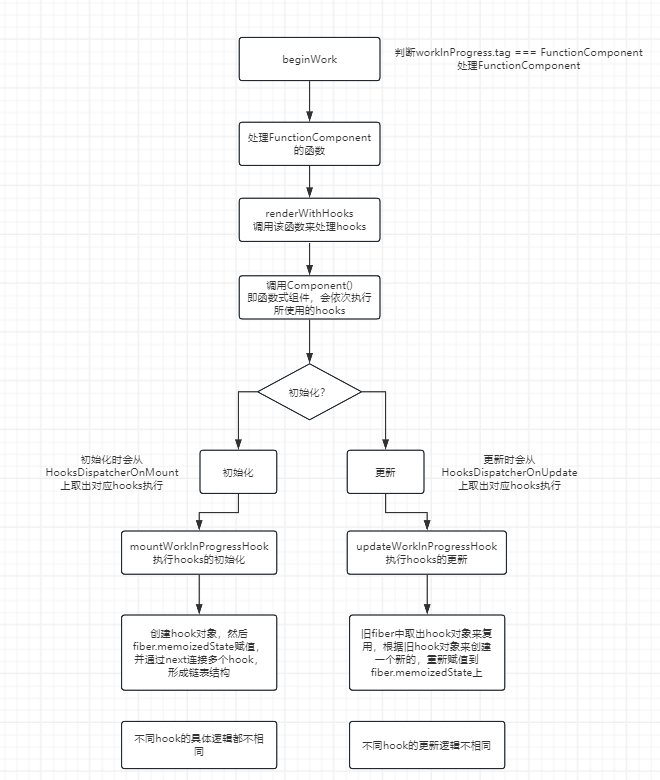
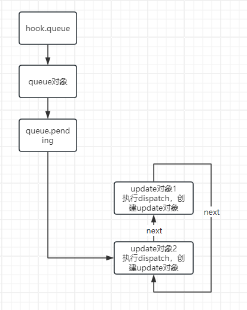
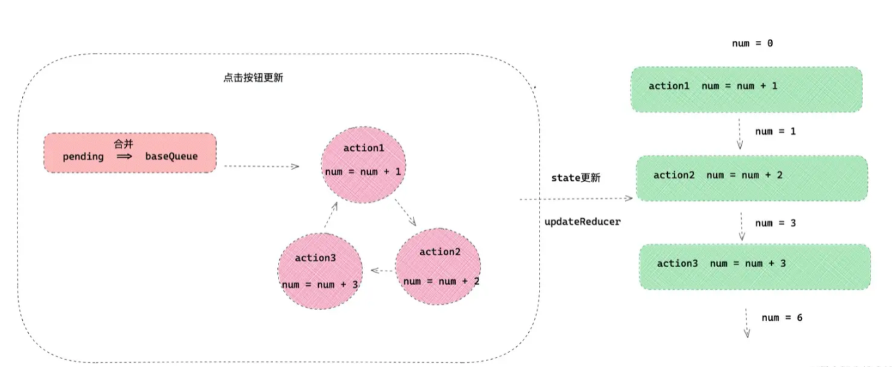
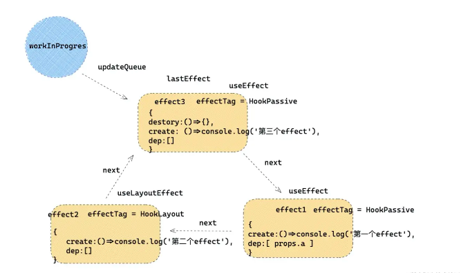

# React Hooks原理

## 背景介绍

如果没有Hooks，在函数式组件中，只能接受Props、渲染UI、触发事件等。状态无法保存、逻辑也无法复用。所以Hooks的作用就是复用逻辑和保存状态。

## 流程



在`beginWork`中，遇到`FunctionComponent`会触发`updateFunctionComponent`函数，在该函数内执行`renderWithHooks`，是处理`Hooks`的入口。

```js
// react-reconciler/src/ReactFiberHooks.js
function renderWithHooks(
	current: Fiber | null,
  workInProgress: Fiber,
  Component: (p: Props, arg: SecondArg) => any,
  props: Props,
  secondArg: SecondArg,
  nextRenderLanes: Lanes,
) {
  // workInProgress是当前正在reconciler的fiber节点，将这个节点放到currentlyRenderingFiber全局变量里面
  currentlyRenderingFiber = workInProgress;
  
  // 省略dev环境的处理
  
  // 存hooks链表
  workInProgress.memoizedState = null;
  // 存放effect list 在commit阶段遍历这个
  workInProgress.updateQueue = null;
  workInProgress.lanes = NoLanes;
  
  // 判断是初始化还是更新，选择不同的Hooks对象 HooksDispatcherOnMount HooksDispatcherOnUpdate
    ReactCurrentDispatcher.current =
      current === null || current.memoizedState === null
        ? HooksDispatcherOnMount
        : HooksDispatcherOnUpdate;
  
  // 执行Function Component，即我们写的函数组件。就会依次执行hooks
  let children = Component(props, secondArg);
  
  // 结束之后的一些处理
  finishRenderingHooks(current, workInProgress, Component);
}
```

可以看到，根据阶段的不同选择不同的`Hooks对象`：

- 初始化`HooksDispatcherOnMount`
- 更新`HooksDispatcherOnUpdate`

### 初始化

在初始化时将`ReactCurrentDispatcher.current`全局变量赋值为`HooksDispatcherOnMount对象`。

在执行`Component`时会依次执行hooks时，会从`ReactCurrentDispatcher.current`中取出对应的hook来执行。

```js
// HooksDispatcherOnMount
const HooksDispatcherOnMount: Dispatcher = {
  useEffect: mountEffect,
  useMemo: mountMemo,
  useRef: mountRef,
  useState: mountState,
  // ...
};
```

比如执行`useState`hook，就会从这个对象上找到`mountState`来执行。

hook的初始化逻辑如下：

```js
// react-reconciler/src/ReactFiberHooks.js
function mountWorkInProgressHook(): Hook {
  // Hook的结构
  const hook: Hook = {
    /*存hook的信息*/
    memoizedState: null,

    baseState: null,
    baseQueue: null,
    queue: null,

    /** 通过next形成链表结构 */
    next: null,
  };

  if (workInProgressHook === null) {
    // 之前没有hook 现在要新建一个hook
    // currentlyRenderingFiber是当前的fiber节点, 将hook挂载到fiber的memoizedState上
    // This is the first hook in the list
    currentlyRenderingFiber.memoizedState = workInProgressHook = hook;
  } else {
    // 有多个hook 通过next指针来连接
    // Append to the end of the list
    workInProgressHook = workInProgressHook.next = hook;
  }
  return workInProgressHook;
}
```

- 将hooks信息存到`fiber.memoizedState`上，通过`next`形成**单向链表**
- **通过`hook.memoizedState`来存储不同hook需要的信息**，比如`useRef`，存的就是`{current: initialState}` 

### 更新

函数式组件重渲染的时候，会将`ReactCurrentDispatcher.current`赋值为`HooksDispatcherOnUpdate`，和初始化一样的逻辑，会从该对象上取出对应的hook来执行。

复用逻辑如下：

```js
function updateWorkInProgressHook(): Hook {
  let nextCurrentHook: null | Hook;
  if (currentHook === null) {
    // alternate指向currentFiber中的节点 即旧的fiber节点
    const current = currentlyRenderingFiber.alternate;
    if (current !== null) {
      // hooks链表第一个 复用旧的
      nextCurrentHook = current.memoizedState;
    } else {
      nextCurrentHook = null;
    }
  } else {
    // hooks链表非一个 直接通过next遍历旧的
    nextCurrentHook = currentHook.next;
  }

  // 这个变量是当前fiber上的hook
  let nextWorkInProgressHook: null | Hook;
  if (workInProgressHook === null) {
    nextWorkInProgressHook = currentlyRenderingFiber.memoizedState;
  } else {
    nextWorkInProgressHook = workInProgressHook.next;
  }

  if (nextWorkInProgressHook !== null) {
    workInProgressHook = nextWorkInProgressHook;
    nextWorkInProgressHook = workInProgressHook.next;

    currentHook = nextCurrentHook;
  } else {
    // Clone from the current hook.

    currentHook = nextCurrentHook;

    const newHook: Hook = {
      memoizedState: currentHook.memoizedState,

      baseState: currentHook.baseState,
      baseQueue: currentHook.baseQueue,
      queue: currentHook.queue,

      next: null,
    };

    if (workInProgressHook === null) {
      // This is the first hook in the list.
      currentlyRenderingFiber.memoizedState = workInProgressHook = newHook;
    } else {
      // Append to the end of the list.
      workInProgressHook = workInProgressHook.next = newHook;
    }
  }
  return workInProgressHook;
}
```

可以看到每次重新渲染时，会从旧的fiber节点中取出对应的hooks信息`fiber.memoizedState`来复用，复用逻辑和初始化时是一样的。

>hook之所以不能写在判断语句中，因为**每次重渲染都会从上一次fiber中取出hooks信息(`fiber.memoizedState`)**，每次重渲染条件不会完全相同，**在dev环境下**，会判断两次渲染的hooks名称是否能对应，对应不上就会报错。
>
>源码中存有一个上一次hooks的名称数组`hookTypesDev`，以及当前执行的hook名称`currentHookNameInDev`以及idx索引`HookTypesUpdateIndexDev`，`hookTypesDev[hookTypesUpdateIndexDev] !== currentHookNameInDev`不相等就报错

**具体hooks的初始化\更新逻辑会根据hooks类型进行区分处理**

## 状态派发

通过`useState\useReducer`来实现函数式组件的状态

### 初始化

会从`HooksDispatcherOnMount`中取出对应的hook执行：

```js
function mountState(
  initialState,
) {
  const hook = mountStateImpl(initialState);
  const queue = hook.queue;
  const dispatch = (dispatchSetState.bind(
    null,
    currentlyRenderingFiber,
    queue,
  ));
  queue.dispatch = dispatch;
  return [hook.memoizedState, dispatch];
}
```

`mountStateImpl`的逻辑：

```js
function mountStateImpl(initialState) {
  const hook = mountWorkInProgressHook();
  if (typeof initialState === 'function') {
    // 兼容useState(() => data)的写法
  }
  hook.memoizedState = hook.baseState = initialState;
  const queue = {
    pending: null,
    lanes: NoLanes,
    dispatch: null,
    lastRenderedReducer: basicStateReducer,
    lastRenderedState: (initialState),
  };
  hook.queue = queue;
  return hook;
}
```

1. 执行了[`mountWorkInProgressHook`](#初始化)，在该函数中执行了hooks的初始化。

2. 然后更新hook对象
   - `hook.memoizedState`赋值为传入的`initialState`
   - 创建一个**queue对象**，挂载到`hook.queue`上。该属性是用来批处理的

`mountStateImpl`执行完成之后，`hook对象`就算是初始化完成了。

然后通过`dispatchSetState.bind`分发出一个`dispatch`更新函数，并且传入了`fiber`，这样就可以知道更新的`fiber`节点在哪里。

然后执行`dispatch`更新函数时：

```js
function dispatchSetState(fiber, queue, action) {
  const update: {
    lane, action, next: null, // ...其他一些属性 
  }
  if(isRenderPhaseUpdate(fiber)){
    // 判断当前fiber处于渲染更新阶段 说明已经在更新了 那么不需要更新
    const pending = queue.pending
    if(queue.pending === null) {
      update.next = update
    }else {
      update.next = pending.next
      pending.next = update
    }
    queue.pending = update
  }else {
    // 不在渲染更新阶段
    // ...
    // 当前不在更新阶段，所以渲染更新
    scheduleUpdateOnFiber()
  }
}
```

- `渲染更新阶段`

  ```jsx
  export default () => {
    const [count, setCount] = useState(1)
    const add = () => {
      setCount(d => d + 1)
    }
  }
  ```

- `非渲染更新阶段`

  ```jsx
  export default () => {
    const [count, setCount] = useState(1)
    const add = () => {
      setTimeout(() => {
        setCount(d => d + 1)
      }, 100)
    }
  }
  ```

**渲染更新阶段执行了dispath，会形成一个`环状链表`**

```jsx
export default () => {
  const [count, setCount] = useState(1)
  setCount(d => d + 1)
  setCount(d => d + 1)
}
```



**非渲染更新阶段执行了dispath，做了以下事情：**

- 判断当前state和上一次render时的state是否相等(浅比较)
- 不相等 执行`scheduleUpdateOnFiber`执行更新

最后将`更新函数dispatch`放到`queue.dispatch`上。

### 更新

函数组件重新渲染时，会从`HooksDispatcherOnUpdate`上取出对应hook来执行，如`updateState`，会进入[`updateWorkInProgressHook`](#更新)函数，处理hook，然后调用`updateReducerImpl`。更新时`useState、useReducer`逻辑是一样的：

```js
function updateReducerImpl(hook, current, reducer) {
  const queue = hook.queue
  
  const dispatch = queue.dispatch
  return [hook.memoizedState, dispatch]
}
```

如果`hook.queue.pending`有值的话，更新流程如下：



- 把待更新的`pending`合并到`baseQueue`，然后循环更新。

## useEffect 副作用

在render阶段，并没有操作DOM元素，而是将这些操作转成`effectTag`，等到`commit阶段`再同意处理这些副作用，这里的副作用包括`useEffect\useLayoutEffect`。

### 初始化

```js
function mountEffect() {
  const hook = mountWorkInProgressHook()
  const nextDeps = deps === undefined ? null : deps
  hook.memoizedState = pushEffect(
    HookHasEffect | hookFlags,
    create,
    createEffectInstance(),
    nextDeps,
  );
}
```

- 通过[`mountWorkInProgressHook`](#初始化)拿到hook
- 通过`pushEffect`创建一个effect，并保存到`hook.memoizedState`上
  - 在`pushEffect`中创建了effect对象，而且如果有多个effect 还会形成**链表**，挂到`fiber.updateQueue`上

```js
// effect对象结构
const effect = {
  tag, create, deps, next
}
```

- tag就是副作用的tag
- create是函数
- deps是依赖
- next是指针，形成链表

如果有以下代码：

```js
React.useEffect(()=>{
    console.log('第一个effect')
},[ props.a ])
React.useLayoutEffect(()=>{
    console.log('第二个effect')
},[])
React.useEffect(()=>{
    console.log('第三个effect')
    return () => {}
},[])
```



### 更新

更新的核心逻辑就是判断`deps`有没有变化，如果没有变化，更新副作用链表。如果变化了，在更新副作用链表的同时，还会添加副作用tag`currentlyRenderingFiber.effectTag = fiberEffectTag`。

在`commit阶段`根据这`effectTag`来执行副作用。

### effectTag

React中会使用不同的`EffectTag`来标记副作用，`useEffect UpdateEffect|PassiveEffect`，`useLayoutEffect HookLayout`。

然后在`commit阶段`根据不同的标识符来处理`useEffect\useLayoutEffect`的副作用。

## useRef 状态获取

这就比较简单了，首先初始化时：

```js
function mountRef() {
  const ref = { current: initialValue }
  hook.memoized = ref
  return ref
}
```

然后在更新时：

```js
function updateRef() {
  const hook = updateWorkInProgressHook()
  return hook.memoizedState
}
```

就是将ref数据挂到`hook.memoizedState`上，更新的时候返回最新的就可以。

## useMemo 缓存数据

初始化时：

```js
function mountMemo(nextCreate,deps) {
  const hook = mountWorkInProgressHook()
  const nextDeps = deps === undefined ? null : deps
  const nextValue = nextCreate()
  hook.memoziedState = [nextValue, nextDeps]
  return nextValue
}
```

在组件更新时：

```js
function updateMemo(nextCreate,deps) {
  const hook = updateWorkInProgressHook()
  const nextDeps = deps === undefined ? null : deps
  const prevState = hook.memoizedState
  if(nextDeps !== null) {
    const prevDeps = prevState[1]
    if(areHookInputsEqual(nextDeps, prevDeps)) {
      return prevState[0]
    }
  }
  const nextValue = nextCreate()
  hook.memoziedState = [nextValue, nextDeps]
  return nextValue
}
```

可以看到在组件更新时，会判断依赖是否发生了变化，没有变化直接返回上一次的缓存值。如果没有依赖或者是依赖变化了，会重新执行`useMemo`接受的函数生成一个新的值返回出去。

## 总结

reactHooks的核心原理就是闭包，将需要的信息放到`fiber.memoizedState`上保存，每次组件重新渲染，都会从旧的fiber节点中取出上一次的hooks信息重新创建。不同的hook实现的原理不同。

比较简单的`useRef\useMemo`等，就是闭包处理，初始化时创建对象，重渲染时取出对象。

比较复杂的`useState\useEffect`等，重渲染时除了需要拿到最新值，还需要处理一些其他的事情，比如effect副作用的处理。
