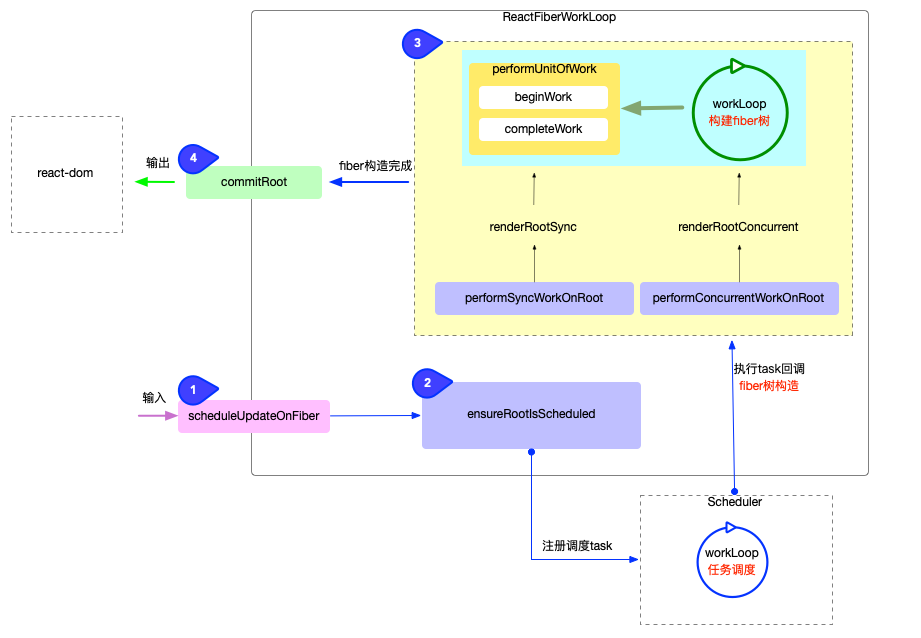

## Reconciler

> 进入具体的说明之前，先解释一下常说的`render阶段`、`commit阶段`都和源码有什么关系：
>
> - `render阶段`就是在`react-reconciler包`中的执行逻辑，具体一些就是包中封装的`fiber构造循环`，会将这个函数传给`scheduler`进行调度执行。
> - `commit阶段`就是将生成的fiber传给`render`进行渲染转为真实`dom`
> - render和commit统称为work
> - `scheduler`中只进行优先级的调度

`react-reconciler`包中有一个`fiber构造循环ReactFiberWorkLoop`，执行这个循环之后就可以生成fiber树，最后将生成好的fiber树给`render渲染器`进行渲染。



> 该图来自[这里](https://7km.top/main/reconciler-workflow)

### 进入react-reconciler流程

 `react-reconciler`包暴露出了`scheduleUpdateOnFiber`这个函数，外面通过执行该函数，来进入`reconciler`的流程。

该函数的主要作用就是来执行注册调度任务的函数`ensureRootIsScheduled`。当然也有其他的一些作用，比如`Suspence`的处理。

### 注册调度任务`ensureRootIsScheduled`

在`scheduleUpdateOnFiber`函数中执行`ensureRootIsScheduled`来注册调度任务。

该函数的主要作用就是用来给`fiber节点`注册调度任务的，会在每一次更新时以及退出任务时执行。

这里的主要逻辑有两部分：

1. 判断是否需要调度新的任务，没有新的话会直接return
2. 有新的任务会注册schedule task，准备进入`scheduler`逻辑中
   1. 将task封装到函数`performSyncWorkOnRoot`或者`performConcurrentWorkOnRoot`
   2. 然后将这个函数放到`scheduleCallback`或者`scheduleLegacySyncCallback`中作为参数，等待`scheduler`的调度
   3. `scheduler`调度会执行这个函数，最后将`函数返回值(生成的fiber树)`绑定到了`root.callbackNode`上

### render阶段

> `render`的定义并没有明确的官方说明，只是人为划分便于理解react的运行机制
>
> 一般从`performSyncWorkOnRoot`或者`performConcurrentWorkOnRoot`开始的

#### `performConcurrentWorkOnRoot`

该函数是每个并发任务的入口点。大致的任务如下：

1. 首先会清除等待状态的effects(`passive effects`)，因为可能会在effects中取消本次任务

   > passive effects是指那些不会阻塞主线程的副作用，如`useEffect`中执行的副作用。

2. 然后通过`getNextLanes`拿到本次任务的优先级

3. 通过`renderRootConcurrent`或`renderRootSync`来构造当前的`fiber树`

   1. 某些特殊情况(`CPU时间过长或默认同步更新模式`)禁用了时间切片就`renderRootSync`，否则`renderRootConcurrent`

4. 进行错误处理，防止构造fiber树的过程中有错误

5. 输出生成的fiber树，将`root.current.alternate`挂载到`root.finishedWork`

6. 然后再退出之前判断是否还有新任务，有的话继续执行`ensureRootIsScheduled`

7. `performConcurrentWorkOnRoot`中还会对`中断`进行处理，一旦`中断`，会将`performConcurrentWorkOnRoot.bind(null, root)`返回，等待下一次`scheduler`继续调用

#### `performSyncWorkOnRoot`

该函数是同步任务的入口点，是不需要经过`scheduler`的调度的。

该函数的任务和`performConcurrentWorkOnRoot`差不多，不过也有一些差别：

1. 直接通过`renderRootSync`来构造`fiber树`，之后进行错误处理，在之后也是输出生成的`fiber树`
2. 不过会直接`commitRoot`，开始`commit阶段`
3. 然后在退出之前判断是否有新任务

#### `performUnitOfWork`

上面的构造`fiber树`是通过`renderRootSync`或者`renderRootConcurrent`来的，在这两个函数中又是调用`workLoopSync`或者`workLoopConcurrent`，

这两个中又调用了`performUnitOfWork`，所以`performUnitOfWork`才是真正生成fiber树的逻辑。

> workLoopSync和workLoopConcurrent的唯一区别，就在是否会中断
>
> 通过`shouldYield函数`来判断是否会中断

```js
function workLoopSync() {
  // Already timed out, so perform work without checking if we need to yield.
  while (workInProgress !== null) {
    performUnitOfWork(workInProgress);
  }
}

function workLoopConcurrent() {
  // Perform work until Scheduler asks us to yield
  while (workInProgress !== null && !shouldYield()) {
    performUnitOfWork(workInProgress);
  }
}
```

在`performUnitOfWork`中的会执行`beginWork`和`completeUnitOfWork`

会对每一个节点都执行`beginWork`，遍历到叶子结点之后会执行`completeUnitOfWork`。

> 会从`rootFiber`(<App />)开始深度遍历，每一个`fiber节点`执行`beginWork`，根据传入的`fiber节点`创建`子fiber节点`，然后将这`两个fiber节点`连接起来，到遍历到`叶子节点`时，开始往回执行，即`completeUnitOfWork`。
>
> 遍历到`叶子节点`，会给当前`fiber节点`执行`completeUnitOfWork`，然后判断是否存在兄弟节点`sibling`，有的话进入其递阶段，如果没有的话进入`父节点return`的归阶段。
>
> 这两个交替执行，直到再次回到`rootFiber`，至此会生成一整颗`fiber树`。

在`performUnitOfWork`中会操作`workInProgress`，将生成的`子fiber节点`赋值给`workInProgress`，然后将已创建的`fiber节点`与`workInProgress`连接起来。

#### 构造fiber树的具体逻辑

**`fiber树`的构建是通过递归**来生成的，在`向下遍历`的时候为每个节点执行`beginWork`，遍历到叶子节点时`向上返回`执行`completeUnitOfWork`，经过这两个函数的不断递归处理，最终会生成一个`fiber树`。

##### `beginWork`的具体逻辑

根据fiber树上的child指针向下遍历，会执行**函数组件，实例化类组件，diff调和子节点，添加effectTag**。

```js
/**
  接受三个参数
  current：workInProgress.alternate，当前组件上一次更新时的fiber节点
  workInProgress：当前组件对应的fiber节点
  renderLanes: 优先级
*/
function beginWork(
  current,
  workInProgress,
  renderLanes
){
  // ...
}
```

根据是否有上一次的fiber来分为两个部分：

```js
// 因为current是上一次的fiber，第一次挂载的时候肯定是没有的，之后肯定是有的，所以可以通过这个来区分。
if(current !== null) {
  // update阶段
  // 经过diff来尝试复用current的fiber节点
}else {
  // mount阶段
  // 根据workInProgress.tag来创建不同的fiber节点
}
```

在创建fiber节点时(只分析几个常用的tag，如`FunctionComponent`)，会调用`reconcileChildren`函数

###### `reconcileChildren(diff)`

这个函数也根据`current`分为两个部分，分别调用了`mountChildFibers`和`reconcileChildFibers`函数

这两个函数其实是一个函数，只是传参不同，都是根据`tag`来创建`fiber`，不同的是`reconcileChildFibers`会为生成的`fiber`打上**`effectTag属性`**。

> 这个函数的大致逻辑就是常说的`diff过程`
>
> 可以看到在构建新树是就走了`diff`的流程(更新时，初始化不会)，`diff`只是对旧树的复用策略。


> `effectTag`是React的一种优化方式：
>
> 因为到目前为止都是在内存中进行的，**等到commit阶段，才会去执行DOM操作**。这些操作都保存在`effectTag`中，不同的操作对应不同的effectTag。
>
> mount时，是在根节点添加对应的插入tag，避免了每个子节点都执行一遍插入操作。

经过该函数处理之后，会将生成的`子fiber节点`挂载到`workInProgress.child`上

###### 小结

经过`beginWork`的处理，遍历到叶子节点，完成了`部分fiber树`的构造(完成了`child指针`的指向)，到目前为止的大致流程可以用下图来总结一下：


> 上图来自卡颂老师的[React技术揭秘](https://react.iamkasong.com/process/beginWork.html#effecttag)

##### `completeUnitOfWork`的具体逻辑

是向上归并的过程，会先判断sibling兄弟节点，没有的话返回return父级，直到返回`fiberRoot`。期间收集了effectList；如果是初始化还是创建DOM。

遍历到叶子节点之后会判断`是否有兄弟节点`，没有的话执行`completeUnitOfWork`函数，依次向上遍历，为`fiber树`添加`return`指针；有兄弟节点会进入其`beginWork`的过程，并给`fiber树`添加`sibling`指针。

函数的核心逻辑在`completeWork`中，也是根据传入的tag不同做不同的操作。特别介绍一下`HostComponent`对应的操作(原生DOM对应的Fiber节点)，大致做了这么几件事情：

update时：将需要更新的`update对象`保存到了`updateQueue中`，并给节点打上`更新的tag`

mount时：给`fiber节点`创建出对应的`真实DOM`(调用了`render渲染器`的方法)，然后调用`appendAllChildren`函数，将子节点插入到已生成的父级DOM节点上，通过这个操作可以在`commit阶段`只执行一次插入操作，就将整个DOM树插入到页面上。

简单来说，在`completeUnitOfWork`阶段，收集了将要执行的`DOM操作`即副作用。

##### 注意点

###### 在向上遍历的过程中是如何避免到上级节点再次进入`beginWork`的？

在`completeUnitOfWork`中有一个循环，在这个循环中判断的，如果有兄弟节点就直接返回这个兄弟节点，进入兄弟节点的`beginWork`；否则就一直循环，直到遍历结束。

```js
function completeUnitOfWork(unitOfWork: Fiber): Fiber | null {
  workInProgress = unitOfWork
  do {
    const siblingFiber = workInProgress.sibling;
    if(siblingFiber !== null) return siblingFiber
    const returnFiber = workInProgress.return
    workInProgress = siblingFiber;
  } while(workInProgress !== null)
  return null
}
```

###### 副作用的收集

上面构造`Fiber树`的过程会打上各种的tag标记，与其在遍历结束之后再遍历一遍拿到所有的副作用节点，不如直接在构造的遍历中收集副作用。

是在向上遍历的过程中将这些副作用收集在`effectList`中，`effectList`是一个环形链表，有一个`firstEffect`和`lastEffect`，中间的是有副作用的子节点

> 为什么是`向上遍历`的过程中，这样能收集到所有子节点的副作用

### commit阶段

经过`render阶段`的处理，已经有了更新后的`fiber树`，在`commit阶段`会将`fiber树`传给`renderer渲染器`渲染到页面上，具体就是执行`commitRoot(root)`。

> `render阶段`有两个入口，`performConcurrentWorkOnRoot`以及`performSyncWorkOnRoot`。
>
> 都是调用`commitRoot`进入`commit阶段`的

`commit阶段`大致分为三个部分：

1. 执行`DOM`操作之前`before mutation`：对应的执行了`commitBeforeMutationEffects`

   该阶段的主要做了：

   - 该阶段还没有操作真实DOM，会执行`getSnapshotBeforeUpdate`获取DOM快照
   - 还会`异步调用useEffect`。异步的原因是防止同步执行阻塞后面DOM的渲染

2. 执行`DOM`操作`mutation`：对应的执行了`commitMutationEffects`

   该阶段的工作：

   - 判断是否需要清空ref

   - 根据effectList来**操作真实DOM**

3. 执行`DOM`操作之后`layout`：对应的执行了`commitLayoutEffects`

   该阶段DOM已经更新完成，所以主要工作是一些后续的处理：

   - 对于类组件，会执行setState的callback函数；对于函数组件，会同步执行`useLayoutEffect`
   - 如果有ref，会**重新赋值ref**

可以看到，ref的赋值是在DOM更新之后的，所以需要格外注意ref的获取。

当然了，在执行`DOM`操作之前以及执行`DOM`操作之后还是有很多其他工作的。


> 图来自掘金小册

### 总结

`render`阶段的`beginWork/completeUnitOfWork`将需要`更新/创建`的节点转为了`fiber树`，期间进行了`diff`尝试复用旧`fiber节点`，并且给`fiber节点`添加了需要操作的`tag`。

之后进入`commit`阶段进行处理，`commit`阶段调度了`effect/layouteffect`，并且根据`fiber树`中的`tag`进行了对应的`DOM操作`，然后在`layout`前切换了缓存树。
