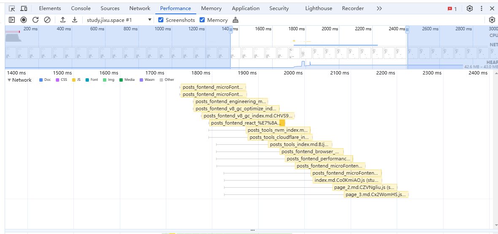

# 前端并发请求限制

并发请求是指同时发送很多个请求。这种并发请求一方面会造成浏览器资源的大量占用(端口、内存等)；另一方面也会导致服务器压力过大，处理不过来 导致响应变慢。

HTTP1.1之前没有长链接的时候，一次请求就要完成一次TCP连接(如果是HTTPS，SSL连接也需要重新建立)，这种请求下并发请求是很困难的，每次TCP连接会很耗时。

HTTP1.1长链接以及HTTP2的多路复用出现之后，可以复用TCP连接，减少了连接的耗时，但是过多的并发请求还是会迅速消耗大量端口，端口又是有限的；另外服务端的压力还是没有减少。

我们都知道，浏览器会限制**同一域名的TCP连接数**，HTTP1.1的时候一般是4-6个(数量是浏览器限制的，所以不同的浏览器可能不同)，超过的会进入排队状态等待前面的结束后发送；

HTTP2是多路复用，通过**流Stream**来控制请求发送和响应，所以可以同时发送多个请求，[RFC 7540](https://datatracker.ietf.org/doc/html/rfc7540#section-6.5.2)中通过**SETTINGS_MAX_CONCURRENT_STREAMS**来确定**对端的最大流**数量(如客户端设置该值来指定服务端可以发起的最大并发流数量)，协议中是没有一个规定值的(即无限制)。所以一般都是浏览器或服务器来自行设置最大数量。

一般浏览器会根据连接性能、资源使用情况、服务端的响应等来动态调整。超出最大并发流数量之后的处理单从该[网站](https://study.jixu.space/)来看是需要等待资源调度的，并发数过多还是会有等待时间的(即接口pending)，**但是由于目前并没有仔细探究过，所以具体尚未可知**。

另外一方面就是**请求的优先级问题**了，如果并发数量太多，可能会阻塞其他高优先级请求的发送，所以前端进行并发的限制，也是为了对请求优先级进行一个简单的控制。

> [!NOTE]
> 实际测试来看，50个并发对性能并没有太大影响，可能是考虑端口号的消耗
>
> 更重要的请求优先级的控制，可以让更高优先级的请求及时发出去，比如页面的搜索请求



所以出于对以上各种问题的考虑，一般需要由前端来控制一个最大并发数，当然**需要根据实际情况来考虑**，如HTTP2加上该限制可能会导致多路复用的优势丢失。

## 实现

> [!IMPORTANT]
> 实际工作中，除非有自定义的需求，一般都是用第三方库来实现的，这里只是作为学习。

```ts{20-22,33-35}
class RequestLimit {
  /** 请求限制数 */
  limit: number;
  /** 阻塞队列 */
  blockQueue: Function[];
  /** 当前执行数 */
  currentCount: number;
  constructor(limit?: number) {
    this.limit = limit || 4;
    this.blockQueue = [];
    this.currentCount = 0;
  }

  /** 
   * 接收的request函数，应该在request第一次执行就用run方法包裹，而不是包裹其返回结果
   */
  async run<RequestResponse>(request: () => Promise<RequestResponse>) {
    // 如果当前执行请求数大于限制数，就通过一个await阻止继续往下执行
    // 等到上一个队列中的请求被发送出去了，阻塞队列中的值才会被执行，才会继续发其他请求
    if(this.currentCount >= this.limit) {
      await new Promise((resolve) => this.blockQueue.push(resolve))
    }

    this.currentCount++
    try {
      // 执行请求
      return await request()
    }catch(err) {
      return Promise.reject(err)
    }finally {
      this.currentCount--
      // 请求结束，将阻塞队列中的值执行，往下继续发送其他请求
      if(this.blockQueue.length) {
        this.blockQueue.shift()!()
      }
    }
  }
}

export default RequestLimit
```

使用方法如下：
```ts
const pLimit = new RequestLimit()

// 将请求的函数作为参数传入
pLimit.run(() => get(xxxx))
```

还有一个版本的使用方式：

```js
function requestLimit(urls, max) {
  
  return new Promise(resolve => {
    /** 请求索引 */
    let curIdx = 0;
    /** 正在发送的请求数量 */
    let activeCount = 0
    const result = []

    function _request() {
      // 请求发到了最后一个 并且 当前没有发送的
      if(curIdx >= urls.length && activeCount === 0) {
        resolve(result)
        return
      }

      // 每次请求处理，都发送max个请求
      while(activeCount < max && curIdx < urls.length) {
        const i = curIdx++
        activeCount++

        fetch(urls[i])
          .then(res => res.json())
          .then(res => {
            result[i] = res
          })
          .catch(err => {
            result[i] = err
          })
          .finally(() => {
            // 请求结束之后，正在发送的数量减一；并且开启下一次的请求处理
            activeCount--
            _request()
          })
      }
    }

    _request()
  })
}

// 使用
requestLimit(urls, max).then(res => {
  console.log(res)
})
```

两种实现方式都大同小异，区别就是使用方式上有所不同。

第一种是封装了类，然后调用还是循环调用的；
第二种是直接将所有请求放进来，内部处理，等处理完之后再将结果抛出。

> [!NOTE]
> 代码可以看这个分支：https://github.com/Jippp/personal-study-note/tree/node/requestLimit

