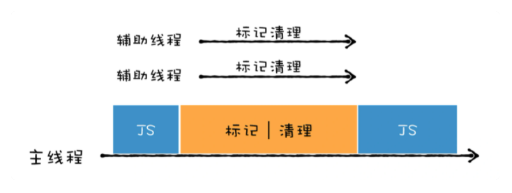
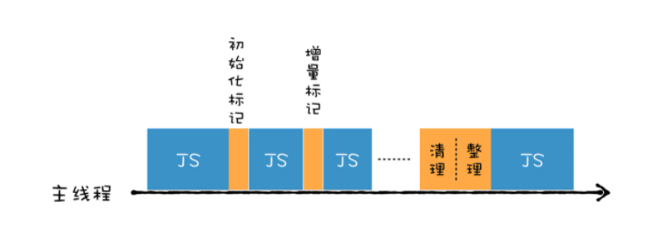
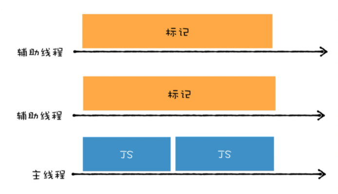
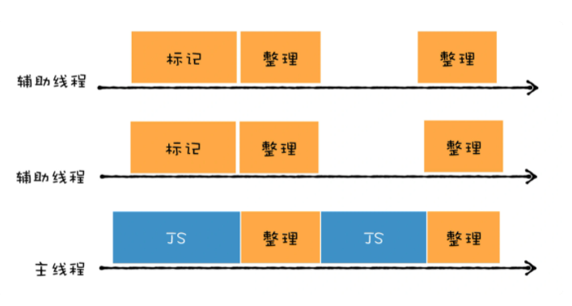

# V8垃圾回收优化策略

## 为什么要优化

V8的垃圾回收也是运行在主线程之上的，执行垃圾回收时会暂停当前JS的执行，这种行为也称为`全停顿(Stop-The-World)`。如果垃圾回收时间过久，就会阻塞JS的执行，导致页面出现卡顿的现象。

## 具体的优化策略

V8主要从两个方向实现优化的：
1. 将一个长的垃圾回收分解成一个个小的任务来执行。
2. 多线程执行垃圾回收算法：将标记、移动对象的任务放到后台线程来做。

## 并行回收

该技术是引入多个辅助线程来处理垃圾回收，主线程和辅助线程做同样的工作，可以减少主线程的占用时间：

V8的副垃圾回收器采用该策略，辅助线程中对新生代中对象区域的数据进行标记、并移动到空闲区域中，同时修改移动数据的指针。

## 增量回收

`并行回收`依然还是一种全停顿，而且对于主垃圾回收器中的大对象来说，`并行回收`还是会有效率问题。所以引入了`增量标记`的方式，这种垃圾回收的方式称为`增量式垃圾回收`。

`增量标记`具体来说就是：对于标记阶段并不一次性标记结束，而是将一个长的标记过程分解成多个小的标记过程，第一次标记称为`初始化标记`，之后的标记统称为`增量标记`。最后执行清理过程：

想要实现`增量标记`需要满足：
1. 垃圾回收过程可以随时开始或暂停，暂停时需要保存当前状态，重新开始之后从暂停位置恢复执行。
2. 暂停时，如果被标记对象又被JS修改了，那么需要能够正确的处理。

没有增量回收之前，V8采用黑白色来标记对象，可以遍历到的标记为黑色，否则为白色；但是增量标记中如果暂停了，是没有办法通过黑白色来判断再标记时从哪里开始继续。所以V8引入`三色标记法`：
+ 黑色表示该对象被遍历
+ 白色表示该对象没有被遍历
+ 灰色表示当前正在处理该对象

但是对于一些特殊情况，比如上一次已经标记为黑色的对象，在增量标记中，黑色对象又指向了一个新的对象，但是V8垃圾回收器并不会将该新对象标记为黑色， 因为该路径已经重复过。因此垃圾回收器添加了一个限制条件：**不能让黑色对象指向白色对象**。
通常会使用`写屏障`机制来实现该限制条件，即上述情况，写屏障机制会强行让新对象标记为灰色。这种方法也称为`强三色不变性`

## 并发回收机制

上述`增量回收`已经可以很好的解决主线程阻塞的问题了，但是在主线程繁忙时会增加主线程处理任务的`吞吐量`。

并发回收机制就是主线程在执行JS，后台辅助线程执行垃圾回收的操作：

虽然这种方式可以解决主线程被阻塞的问题，但是实现起来难度较大，这里不详细介绍，只做了解。

## V8实际执行

V8在实际执行中，**主垃圾回收器**采用了这三种混合在一起的方法：

1. 主垃圾回收器采用了并发回收机制，在后台辅助线程中进行标记操作
2. 然后清理阶段采用并行回收机制，主线程以及辅助线程同时进行清理操作
3. 同时还在采用了增量标记的方式，清理的任务被分解成一个个小任务

副垃圾回收器采用了并行回收的机制，主线程和辅助线程同时执行标记、清理的操作。

## 总结

V8的垃圾回收运行在主线程之上，如果执行时间太长就会阻塞JS的执行，造成卡顿现象，所以V8引入了一系列的优化措施。

- 并行回收机制：引入多个辅助线程，同时执行标记、清理的操作。
- 增量回收机制：将标记阶段分解成多个小的阶段穿插在主线程中执行，这样就不要一次执行完标记所有对象的操作，每次执行只会占用一小部分主线程。
- 并发回收机制：将垃圾回收运行在后台线程中，主线程不执行垃圾回收。

V8的实际运用中，主垃圾回收器采用了这三种混合的方法：并发回收在后台辅助线程中完成标记操作，然后采用并行回收，辅助线程和主线程同时执行清理工作，同时采用增量标记，将清理任务分解减轻主线程每次清理时的任务量。副垃圾回收器采用并行回收机制，主线程和辅助线程同时执行标记、清除的工作。
