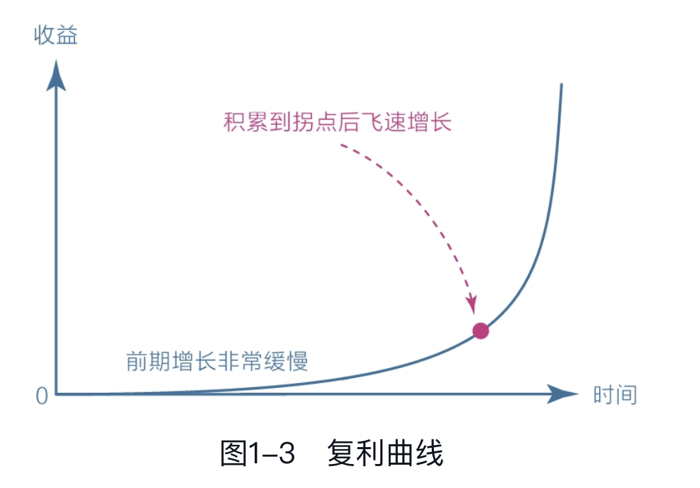
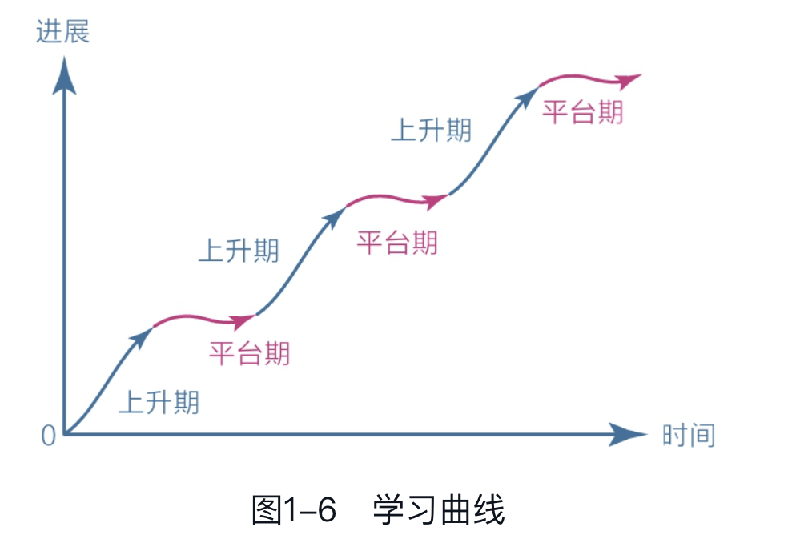
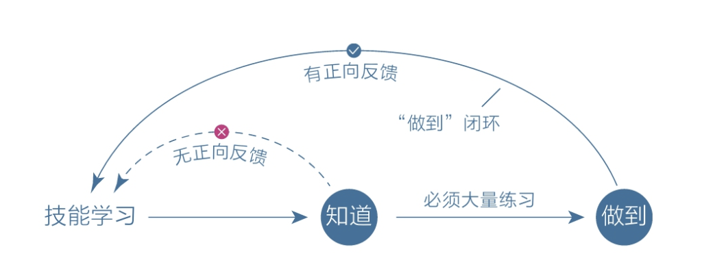

## 从大脑开始

### 大脑结构

进化的过程中，人脑的发育也是一个渐变的过程。
从最开始进化出来的本能脑，再到较早进化出来的情绪脑，近几十万年前才进化出来的理智脑。这三重大脑，让人类能占据生物链的主导地位。

本能脑
发展历程：结构简单，只有一个原始的反射模块。控制本能的，比如饿了就会去找食物、困了就会找地方睡觉。比如现代的蛇、蜥蜴等，所以也将本能脑称为原始脑、基础脑。

情绪脑
发展历程：约两亿年前，出现了哺乳动物。为了更好的适应环境，进化出了情绪。可以感受到各种情绪，比如饿了找的吃的会开心、亲族离世会痛苦。情绪的加持可以让哺乳动物在恶劣的环境中更好的生存，比如恐惧可以远离危险，兴奋可以更专注的捕猎，愉悦可以增加同伴的亲密度。

理智脑
发展历程：近几十万年，人类才从哺乳动物中脱颖而出，进化出了新皮层，是一个新的脑区，让人类产生了语言、艺术、文明，让人类善于权衡，能立足未来来获得延时满足。
- 能立足长远，主动走出舒适区
- 能为了潜在的风险克制自己的行为，为可能得收益延时满足
- 能保持耐心，坚持一些在短期内看不到效果的事情，但是长期有巨大的帮助
- 能抵制诱惑，面对舒适和娱乐能做出更好的选择
> 在前额，常说的灵台？

虽然理智脑提供了更加高级的认知、理智功能，但是进化时间太短，其力量在本能脑和情绪脑面前还是太弱，对大脑以及身体的控制能力很弱，所以日常生活所做的绝大部分决策还是源于本能和情绪。

不是说本能和情绪不好，而是在现代社会，即时满足、趋难避易、不善于思考的本能和情绪不能让我们更好的生活。

理智脑很少有主见，大多数时候以为在思考，实际是在对自身的行为和欲望进行合理化，所以人类被称为“自我解释的动物”。

但是现代社会，必须要克服一些趋难避易、即时满足的本能。所以成长就是克服天性的过程，就是让理智脑变得更强的过程。但要让理智脑变强并不是说取代本能脑和情绪脑，而是让这三个更好的合作。

### 焦虑

我们总是将未来想的很美好，所以一旦开始憧憬未来或者恐惧现在，理想中更好的未来和很差的现在就会产生落差，进而产生焦虑感，情绪低落。

**焦虑的本质原因**大概就是：**欲望大于能力，却又缺乏耐心**。想要做成某件事，却又能力不足，同时又急于求成想要短期内看到结果。

因为**人类天性就是避难趋易和急于求成**的，就是想在短期内看到结果，就是想不用太努力就能成功。这是人类的天性，只是进入信息时代后，节奏变快、人与人的竞争更加的激烈，这种天性就会被放大。

应对方法说起来也很简单，比如：
- 克制欲望，不要同时想着多件事情
- 面对现实，看清自己的能力水平到底在哪里

关键在于如何提升能力和保持耐心。

### 耐心

不用付出努力就能获取巨大的能力，这种快感让人沉迷其中。但是现实社会的普遍规则就是：想要有所成就，就必须要保持耐心、延迟满足。

耐心是什么呢，绝大多数人的理解都是忍受无趣、承受痛苦、咬牙坚持，都在用意志力来对抗本能。但是这有些过于肤浅，从人类成长过程来举例，刚生下来理智脑几乎没有发育，所以那段时间全是基于本能的，开心就会笑、痛苦就会哭；随着年龄以及学识的增长，耐心会变得越来越强；成年之后如果停止自我探索，可能就会停留在上一个阶段的水平。
所以耐心和理智脑是息息相关的，理智脑越强的人，保持耐心的能力就会越强。

很多时候，缺乏耐心是因为看不到全局、不知道自己身在何处，所以短期内看不到结果就会失去耐心。所以，如果我们能了解事物发展的基本规律，再遇到事情之后就可以用理性来衡量，就能极大的提升耐心。

> 耐心和对世界、事物的认知有关，缺乏耐心很可能是不知道当下会怎么发展，而且短期内看不到结果。所以对世界、事物的认知越深，遇到事情能知道大概的发展规律，耐心就会大大提升。

复利曲线是一种理性工具，熬过前期的积累之后，就会有所收获。

积累的过程是需要刻意练习的，需要在舒适区边缘一点点的扩展自己的能力边界。

能力是以“舒适区-拉伸区-困难区”分布的：
- 舒适区：完全在能力之内，得不到成长
- 拉伸区：舒适区的边缘，有成就也有挑战，成长最快
- 困难区：基本不会的，很容易因为畏惧而逃避

复利+舒适区边缘可以看做是宏观规律，落实到具体的就是学习成长。

**成长权重对比**揭示了“学习、思考、行动、改变”在成长过程中的分布。
从外到内依次是：学习、学习后的思考、思考后的行动、行动后的改变，重要性却是依次递增的。所以 改变量 > 行动量 > 思考量 > 学习量。

不能只盯着表面的学习量，那样即时再多，没有专注内在的思考、行动、改变，还是于事无补的。
本质还是避难趋易的天性，因为单纯的保持学习输入很简单，思考、行动和改变相对困难，所以会不自觉的沉浸在表层的学习中。

所以读书时不求记住所有内容，只要有一两个观点能让自己发生实际的改变就算是有所收获了，并且这种收获的意义比读很多书但只停留在表层的意思要大很多。以这样的标准来指导学习，收获就越来越多，焦虑自然就减少，耐心也会随之提升。

另外一个可以落实到行动的就是**学习的平台期**。

可以看到，学习的进展并不是简单的线性关系，而是波浪式上升的：刚开始学习进展很快，但是慢慢的就会进入平台期。在这期间可能付出很多努力，但是看起来毫无进步。不过大脑相关的神经元还是在发生连接并不停被巩固的，所以说经历过平台期之后又会进入下一个阶段。
> 一个切身经历的例子：高中的化学和物理我是很差的，但是到了高三之后突然就开窍了，就是突然就能看懂题目了。可能就是神经元一直在连接巩固，经历过平台期之后就到了下一阶段。

#### 耐心的提升

1. 面对天性能放下心理包袱，坦然面对，不要因为此而过度焦虑。
2. 面对诱惑，学会延迟满足，将对抗变为沟通。比如说学完这块内容再去享受，完成这个目标后再去放松。
3. 面对困难，改变视角，赋予行动意义。即找到做件事的意义，比如读完这本书可以让自己对自身以及世界认知更深，这就是意义。
4. 最后，让本能脑和情绪脑爱上困难的事情。

## 潜意识

人类活动每天都有海量的信息需要处理，所以进化过程中采用了意识分层的方式。让潜意识负责生理系统，让意识来负责社会系统。这种分工方式，让意识可以专注于高级的社会活动。

但是这种分工方式也带来了副作用：模糊。因为两层意识分开了，意识难以干预潜意识，但是潜意识却能轻易影响到意识。比如明明知道想做什么，但却忍不住去做另一件事情。

人类生来是有潜意识的，但是意识却需要从零积累，不断学习。所以需要不断的学习来强化自己的认知，提升自己的意识，才能更好的克服自己的潜意识，才能消除或减少自己的认知模糊。
> 面对认知模糊，需要不断学习，提升认知和意识。

同样人类在生活中会有各种各样的烦恼，相较于主动去解决烦恼，人类的本能更倾向于被动承受。因为解决烦恼需要动脑，但是被动承受却不需要。
回避烦恼和痛苦并不会让痛苦消失，反而会让他转入潜意识，变成模糊的感觉，而具体的事物一旦模糊，边界就会无限扩大，原来可能只是一件小事，也会在模糊的潜意识中变得无比庞大。
现在大多数的心理问题也是如此，经历过一些不幸的事情，虽然意识已经淡忘，但是潜意识却始终保留这些印记，并且隐蔽地影响着我们的行为。
任何痛苦的事情都不会自动消失，想要不受困扰，唯一的方法就是正视它、看清它、化解它，不能让其进入潜意识，不能让它变得模糊。
所以一旦感到难受时，需要向自己提问，找到问题并正视它：
- 是什么让自己烦躁不安？
- 是什么让自己恐惧担忧？为什么会恐惧担忧？
- 面对困境，我现在能做什么？如果做不到，最坏的结果是什么？
需要直面困难，接纳这些难以启齿的想法。虽然短期内可能加剧痛苦，但是能主导情绪，至少不会再被情绪所挟持。
> 面对情绪模糊，需要直面问题、拆解问题、化解问题。

有了清晰的认知、平和的情绪，做事最终还是要行动坚定。**行动力不足的根本原因就是选择模糊**。
在做事之前会面临很多欲望和选择，比如看手机还是看书、打游戏还是运动，当面临不确定性时就会本能的选择舒适的那一个。
解决办法就是在众多选择中加起独木桥，让自己“没得选”。

消除模糊需要主动反本能，面对认知模糊需要不断学习；面对情绪模糊需要正视并化解；面对选择模糊也需要反本能让自己没得选。

### 感性

感性和理性就想镜子的正反面，理性在意识中，感性就在潜意识中。
潜意识没有思维，只关心眼前的事物，这属于天性，同时处理信息的速度极快11000000次/秒，能敏锐的感知到很多不易察觉的信息，这属于感性的部分。
意识即理性思考，处理信息的速度非常慢，只有40次/秒。两者处理信息的速度可谓天壤之别。
这种处理速度，会导致认知错位。很多信息早已被潜意识察觉到，但意识却一无所知。

感性能力如此强大，需要学习怎么利用。比如学习时，仅凭理性就会找到最困难的，最后花了大量时间也没有很多收获，反而让自己疲惫不堪；仅凭本能又会不断重复那些自己会的东西。所以需要借助感性，找到自己的“拉伸区”。再比如读书，借助感性找到能触动自己的点，然后停下来思考为什么能触动，这个点和我的生活有什么关系，我可以学习到什么。
> 借助感性帮自己来选择，再用理性来帮助思考。

潜意识的感性能帮助我们发现什么是真正适合自己的，再加上适当的投入精力，就能快速提升自己。同样的，如果总是感觉痛苦和无趣，那要么是在困难区煎熬，要么是在舒适区打转。

## 元认知

从字面意思上来解释，就是最高级别的认知。通常的认知是通过思考过程来理解事物，而元认知是假想有“另一个自己”来对思考过程进行反思理解，可以观察到自己的思维活动然后对不合理的地方进行改进优化。再简单一些，就是反思的能力。

> 通过后面的阅读发现，元认知能力就是自我审视、主动控制，防止被潜意识左右的能力。

被动元认知就是遇到问题时才被迫启用的，比如被批评、指责时才会去反思总结。
而主动元认知则是能主动的开启第三视角持续的反思。

### 如何获取元认知能力

1. 从**过去**获取到提升元认知能力的工具，比如学习前人的智慧和反思自身的经历。
学习前人的智慧可以让我们拥有更广的全局视角、掌握更深的底层规律，可以帮我们从无知中解脱，从而做出更正确的选择。

2. 总结自身经历。

3. 学习和反思相对来说是静态的，处在当下的自己就是动态的。
日常生活中需要时刻提醒自己，去做更重要的而不是更有趣的事情。

4. 冥想：静坐在某处，放松身体，将注意力完全集中到呼吸和感受上。
冥想实际上就是监控自己的注意力，然后将其集中到自己需要关注的地方。

反馈是这个世界的进化机制，有了反馈并且形成回路，就能让任何系统开始自我进化。而元认知就是人类认知能力的反馈回路。

### 自控力

元认知是由前面说的**自我觉察**以及**自控力**的组合，**元认知能力即自我审视、主动控制，防止被潜意识左右的能力**

每当遇到需要选择的情况下，如果能先停留几秒来思考一下，就可能激活理智脑，启用元认知来审视当前的思维，然后或许能做出不一样的选择。

行动力弱时，对未来的具体行动肯定时模糊不清的，比如可以躺着玩手机、可以打游戏、也可以起床学习、下楼运动。这时候最好的方案就是将所有想做的事情列出来，进行排序，找出最重要的事就可以让脑子清醒。

面对不可控具体的方法如下：
- 针对当下的时间，保持觉知，审视第一反应是否正确。
- 针对全天的日程，保持清醒，时刻明确下一步要做的事情。
- 针对长远的目标，保持思考，想清楚长远意义和内在动机。

高尔基：每一次克制自己，都意味着比以前更强大。

## 专注力

注意力可以分为**集中在行动**上的以及**集中在感受**上的两部分，比如跑步时跑是行动，剩下的是感受。

注意力分散的原因：一是觉得当下太无聊，所以分心去追求更有意思的事情；二是觉得当下太痛苦，所以去追求更舒适的事情。

提高专注力可以让我们更加专心于当下，而生命就是由一个个的当下时刻组成的，专注于当下就能让我们更好的享受生命。

人类大脑使用背景关联记忆的方式，即借助事情的背景或线索等提示信息来让我们想起特定内容。这种背景关联记忆的方式可以极大地降低大脑能耗，弥补大脑神经元处理速度的不足。
但是有好就会有坏，背景关联记忆的副作用就是：我们感官所能接触的任何信息，都会引起一些其他记忆内容。感官又是被潜意识控制的，潜意识又是永不消失的，所以只要是清醒状态，分心走神就随时都会发生。
所以需要我们锻炼元认知，通过自察以及自控，来克服天性。

### 如何能提高专注力

因为注意力是由**行动**和**感受**两个部分组成的，所以想要提高专注力，只需要**让感受回归行动**即可。

身体感受是进入当下状态的最好媒介，感受事物消失的过程也是一种很好的专注力训练。

主动选择信息以及深度沉浸。

“所谓天才，即正确的方法加上大量的练习”

正确的方法具有以下四个特征：
1. 有定义明确的目标。比如练琴，一个明确的目标可以是“连续三次不犯任何错误，以适当的速度弹奏完曲子”，而不是“练琴半小时”这种宽泛的目标。因为目标确实明确和具体，注意力的感知精度就会越高，精力就越能集中。
2. 练习时需要极度专注。用一个简单的例子来说明专注和发散，手电筒发出的光，专注模式下光束紧密，穿透力强；发送模式下，光柱会散开，光的强度也会降低，但是能照亮的范围更广。所以可以先保持极度专注，想不出答案时再将注意力转移，来发散思维。
3. 能获得有效的反馈。反馈能及时了解在哪些方面存在不足以及为什么存在不足。如果没有有效的反馈，不仅容易出错还容易走神。
4. 在拉伸区练习。对当前活动感到厌倦时，说明处于舒适区，应该适当提升难度；如果当前活动感到焦虑，说明应该保持这个水平专注练习。如此反复就能进入心流状态，沉浸其中。所以每天都可以让自己做一些感到有些困难但是又可以通过努力完成的事情，就能锻炼自己进入心流的能力。

> 总结一下就是：清晰的目标+专注力+反馈+拉伸区练习

## 学习力

前面说了好多次，最佳的学习区域一定是在拉伸区内、舒适区边缘，这个区域内既有挑战又有成就。

就减肥而言，有氧运动前20分钟消耗的主要是糖，30分钟之后消耗脂肪的比例才会上升。所以每次到舒适区的边缘坚持一下，然后再回到舒适区停留，反复训练，就是上面说的舒适区边缘练习。

**匹配**很重要，距离太远的事物，通常是无法把握的。
前文所说的正确方法的四特征中，本质都是为了匹配。
比如前文所说的**明确的目标**：设定目标时需要将目标分解，将大目标拆分成小目标，从困难区转移到拉伸区或者舒适区边缘。 

时代不断飞速发展，但是人类的学习机制并没有随之快速进步，这样的落差给我们的深度学习能力带来了很大的损耗。以后的趋势极有可能是：小部分精英依旧能保持极高的深度学习能力，能生产内容；大部分受众始终享受轻度学习，只能被动消费内容。

### 深度学习

“学习金字塔”报告中指出：人的的学习分为被动学习和主动学习两个层次。

被动学习：如听讲、阅读、视听、演示等对学习内容的平均留存率为5%、10%、20%、30%。
主动学习：如通过讨论、实践、教授给他人，将被动学习的内容留存率提升到50%、75%、90%。
> 有较高学习效率的方式就是：书写所学的，或者将所学内容教给一个没有接触过这个内容的人。因为这样能将这部分知识纳入自己已有的知识体系中。

要记住让人觉得舒服和容易的事情往往得不到什么好结果，而感受到难受和困难的事才能产生真正的收获。

另外**生活经历**也可以被深度学习，比如一个很好的每日习惯就是**反思总结**。从生活中对经验进行总结、反思和升华，持续的反思会提高我们对生活的感知。

深度学习可以让我们沉下心来不再浮躁，能磨练理智，还有很多其他的好处。

在深度学习的过程中，找到关联点很重要。《这样读书就够了》中提到读书的三个步骤：
1. 用自己的话复述信息
2. 找到生活中这部分相关知识
3. 在实际中应用相关知识
对应着深度学习的三个层次：理解知识点、关联知识点、实际应用知识
> 意味着学习新知识时，首先要掌握具体的知识点，然后将这部分知识纳入自己的知识体系中，最后就是实际应用。
> 比如学习前端的微前端工具，在知识版图上应该是属于工程化那一侧。将知识纳入知识体系，就不会造成知识孤岛从而遗忘。

### 体系

从能触动自己的碎片开始建立体系，而不是全盘照抄别人的体系。因为别人的体系离我们太远，从学习角度来看属于困难区，即时能一时的复制下来，时间一长还是会忘记，所以就从能触动自己的碎片开始记录，逐步构建自己的体系。

另外，每日反思复盘也是同样的道理，每天记录一下当天的触动点，能很好地掌握时间的流逝，对自己的认识也会更加的明确。

### 打卡

书中对打卡现象进行了解释，比如很多人是为了打卡而打卡，不自觉中已经将任务重心从学习成长偏移到了完成任务。而且人类还有一种**任务闭合的机制**，比如某件事情没有完成之前会一直心心念念，一旦完成了立马就将其抛之脑后。这种机制也导致打卡失败，没有打卡前心里就想着快点完成快点完成，一旦打卡完就不会再做任何和这件事相关的事情。
> 从个人经历来看，作者的总结还是相当到位的，之前学习英语的打卡也是类似，当天有时间背单词就还好，如果没有时间背就会囫囵吞枣随便糊弄过去，发展到最后就是为了打卡而打卡的。

可以考虑用**记录替代打卡**，每次学习后只做记录，而不是打卡展示。这样既能看到自己的学习轨迹，也便于每周的复盘。

其次就是设下限而不是设上限，还是背单词，如果目标是一天200个，好不容易累死累活挨到背完心力交瘁不说，还可能带来很大的压力；如果将目标改为10个20个，这样完成目标后可能会有一定的学习惯性，既没有太大的压力也可以让身心放松。

### 反馈

对于学习或者说绝大部分的事情，及时的、持续的正向反馈都很重要。比如和一个人谈话时，如果句句都有回应甚至是反问，那么就会觉得相谈甚欢；相反如果半天都是一个人再说，就会觉得有些无聊。

怎么才能获得反馈？一个比较好的办法就是输出或者说是应用，通过输出来换取外界的反馈。

## 行动力

> 希望看完这一章节内容能稍微提高一些自己的行动力？

有一个**增强回路**的概念，概念很简单就是会不断的叠加增强。当然有负面的增强回路也有正面的增强回路。

还解释了一下为什么每天行动力很弱：比如早起时如果刷手机就可能会进入负面的增强回路，精力被不断消耗。
> 一个实际经历：上班时如果刚来到工位是玩手机或者看小说，那么这一上午的精力都不会太集中。相反如果一来工位就打开电脑开始写代码，那么就能很快的进入状态。

**所以要强迫自己先做重要的事情，只要进入了正向的增强回路，就能很容易保持学习状态。**

其次是需要有一个清晰的目标，如果只是想着早起看书、学习这种模糊的目标，那么大概率是完成不了的，因为对具体行动的细节并没有规划。但是如果想着明天早上八点半我要起床，洗漱之后坐在书桌前把昨晚规划好的书或者知识点学习完成，那么就有可能行动起来。

笔记规划大法：
1. 将一张纸分为上中下三个部分
2. 上面记录当前需要做的事情，可以挑比较重要的记录，按照优先级排
3. 中间分为两个部分，左边是预计计划内容，安排一下当前具体时间要做的事情；右边是实际计划内容，记录当前具体时间实际做的事情。
4. 最下面是备注部分，想写啥就写啥了。
这种方法一方面可以减轻大脑的负担，另一方面所有的想法都很清晰和确定，这样就进入了一种没得选的状态，再做选择时就不需要花脑力去思考或者选择。
> 当然了，任何事都是有好有坏的。这种规划可以让生活变得更加清晰，行动力也更加充足；但是生活中会缺少不确定，会缺少一些活力和惊喜。所以权衡之下，是可以在重要的时间进行规划；一些不重要的休息时间可以略过，留一些惊喜和不确定给自己。

### 如何解决“知而不做”的问题

出现这种现象时的心理一般都是：总认为自己还没有准备好，或者担心方法不是最优的，或者担心行动会走弯路等等，就是这种观望以及等待导致了行动难以落实。

从科学角度来看，学习任何一门知识或者技能，本质都是大脑中的神经细胞在建立连接。通过大量的重复动作，将大脑中原本不关联的神经元反复刺激就产生了强关联。

对于一门技能的学习，仅仅“知道”是无法形成闭环的，只有经过大量的练习，大脑中的神经元形成了强关联，才能形成闭环。比如自行车、走路等等技能都是如此。

认知同样也是一门技能，是需要经过大量实践和练习才能形成闭环的，才能真正的掌握认知能力。

## 早起、冥想、读书、写作和跑步

### 早起

睡眠的脑科学理论：人的眼球会在睡觉时来回运动，由此发现了“快速眼动睡眠”和“非快速眼动睡眠”规律。健康的成年人睡觉时基本是1.5小时快速眼动睡眠、1.5小时非快速眼动睡眠，两种模式不断切换，并在睡着后的前3小时，进行高质量的睡眠，之后则是浅层睡眠。
所以根据这个理论，在睡眠后的3小时、4.5小时、6小时、7.5小时这几个节点醒来会神清气爽、精力充沛。

另外人类从黎明开始分泌肾上腺素和肾上腺皮质类脂醇这两种让人保持精力充沛的荷尔蒙，分泌的高峰期就是早上7点左右，此时记忆力、理解力、专注力都在一个很高的水平，所以早起不管是学习还是工作都能保持一个很好的效果。

### 冥想

简而言之，冥想可以提高专注力。在冥想时会将意识集中到一件事上，这种刻意练习可以有效养成专注的习惯。

怎么冥想：闭眼静坐，专注于自己的呼吸，每天持续15分钟以上。

### 写作

属于费曼学习法，通过写作将知识用自己的话来复述出来，就可以很好的理解这部分知识。

另外写作也是有技巧的，和学习分区一样，如果一篇文章绝大多数都是自己难以理解的名词或概念，那么阅读的人大概率是读不完这篇文章的。所以在写作时，最好将概念简单化、有趣化，这样既能引起读者注意，又能让读者坚持阅读下去。

所以坚持写作或者说文字记录，能对知识的理解更加深刻。

另外每日反思也属于写作的范畴，反思到底要写什么。一个好的反思应该是记录了当天触动了自己的几件事情，难受的、欣喜的、念念不忘的点。
1. 首先要描述事情的经过
2. 其次要分析为什么会让自己触动，多问几个为什么
3. 最后就是改进措施，尽可能提炼出一个改进点或者行动点

### 运动

运动的好处就不多说了，“生命在于运动”。

一个好的模式是“运动+学习”。科学研究表明，运动可以让大脑长出更多新的神经元，但是新生神经元是一个空白的干细胞，需要发育出神经轴突和树突才算是真正的神经细胞，通常从生长到成熟需要28天。

所以运动之后的学习就很重要：运动后的1-2小时内进行高强度、高难度的脑力活动，可以让新的神经元受到刺激从而生长。

科学的运动是保持适当的心率，简单点来说就是保持做有氧运动时有些气喘的状态。比如跑步，保持足够快的速度直到有些气喘，气喘保持1-2分钟，然后改为快走，调整呼吸，呼吸平稳之后再快跑......重复以上步骤。

另外有氧运动可以长出更多神经细胞，复杂运动则可以让神级突触连接更紧密。所以好的运动方式一定是包含有氧运动和复杂运动。比如在有氧热身后练习体操、太极、八段锦等复杂活动。

总结一下一个好的实践方式是：二十分钟的有氧运动如跑步后进行八段锦等复杂运动。可以很好的促进“脑生长”。

