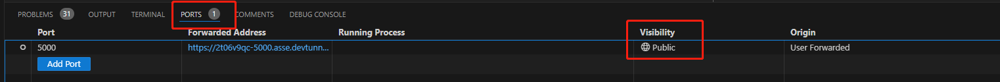

# 背景

在开发时，代码服务等都在本地，别的设备不在同一个局域网下是无法访问的。此时可以通过VSCode的端口转发，借助GitHub提供的反代服务器，让其他设备可以访问到本地的服务。

## 步骤

1. 首先在本地启动服务，比如端口是`5000`
2. 在`TERMINAL`工具栏找到`PORTS`栏，点击进入，输入需要转发的端口(这里是5000)
3. 之后会跳转到`GitHub`进行授权，如果成功会显示如下界面，然后再将`Visibility`设置为`Public`即可。

通过以上操作，就可以在其他设备上访问到本地的服务了。

### 注意事项

因为走了`GitHub`的反代服务器，所以速度会比较慢，但是对于某些应急情况，还是能应付过去的。

## 内网穿透

我们都知道，公网是无法直接访问到局域网内部的服务的，但是可以通过一个中间服务来访问到。比如家里的电脑本地服务是无法直接在公网访问到的，此时可以借助`内网穿透工具`提供的中间服务器，公网访问这个中间服务器，再由中间服务器转发到内网的服务。

`内网穿透`是一种允许从公网访问位于局域网的设备或技术，基本原理就是利用一个位于公网的中间设备或服务来转发请求和数据。

