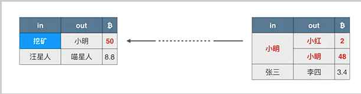
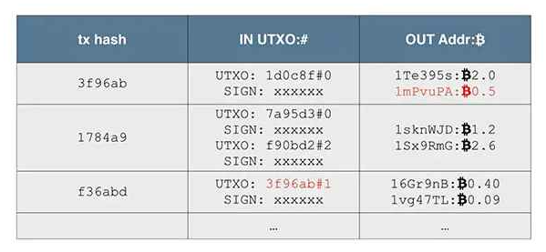
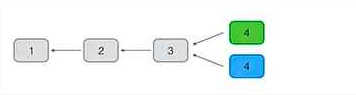
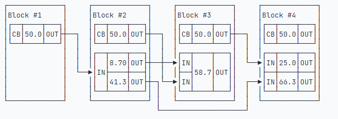

# 从比特币开始区块链

## 比特币

2008年10月，一个名叫中本聪的神秘人物在一个密码学朋克论坛上发表了一篇[《比特币：一种点对点的电子现金系统》](https://bitcoin.org/bitcoin.pdf)的文章，这篇文章被看成是比特币的白皮书。

随后在08年11月，中本聪发布了比特币的第一版代码。09年1月，中本聪挖出了比特币的第一个区块——创世区块，比特币网络正式开始运行。

自此比特币成为人类历史上第一种数字货币。

什么是数字货币？一句话概括，**数字货币是基于数学加密原理构建的不可伪造的货币系统**，而比特币是第一个基于数学加密原理构建的分布式数字货币系统。

比特币使用区块链技术实现了数字货币的可信支付。

### 数字货币和电子货币

**纸币的电子化就是电子货币**，但这需要中央信任机构作为担保。电子货币本质上仍然是法币，它仍然是由央行发行，只是以计算机技术把货币以实体纸币形式的流通变成了银行计算机系统的存款。和纸币相比，电子货币具有更高的流动性。我们每天使用的网上银行、支付宝、微信支付等，都是这种方式。

比特币作为数字货币，和电子货币不同的是，比特币不需要一个类似银行的中央信任机构，就可以通过全球P2P网络进行发行和流通，这一点听上去有点不可思议，但**比特币正是一种通过密码学理论建立的不可伪造的货币系统**。

### 为什么需要比特币？解决了什么问题？

比特币通过技术手段解决了现金电子化以后交易的清结算问题。

传统的基于银行等金融机构进行交易，本质上是通过中央数据库，确保两个交易用户的余额一增一减。这些交易高度依赖专业的开发和运维人员，以及完善的风控机制。

比特币则是通过区块链技术，把整个账本全部公开，人手一份，全网相同，因此，修改账本不会被其他人承认。

如果我们从现金和存款的角度看，现金是M0，而银行存款是M1和M2。银行存款本质上已经不是现金，而是用户的资产，对应着银行的负债。因为银行只记录用户在银行的资产余额，因此，用户A通过银行把100元转账给用户B的时候，用户A的资产减少100元，相应的，用户B的资产增加100元，银行对用户A和用户B的总负债不变。换句话说，存款是用户的“提款期权”。

而现金则是由用户自己负责保存的货币。如果用户A把100元现金给用户B，那么此交易并不需要通过银行，因为使用现金时，用户与银行之间没有资产和负债关系。

通过银行转移存款，对用户来说很方便，但永远绕不过中央信任机构，并且用户必须信任银行不会篡改余额。通过现金交易，用户并不需要金融中介，但是需要当面交易，以及会遇到现钞的防伪、防盗等问题。

**比特币解决的是现金电子化后无需中央信任机构的交易问题**，即M0如何通过网络进行价值传输。我们已经习惯了通过互联网对数字化的新闻、音乐、视频进行信息传输，因为信息传输的本质是复制，但现实世界的现金可不能复制。想象一下我们如何把100元现金通过网络发送给另一个人，同时确保交易前后两个人的现金总额保持不变。所以，中本聪的白皮书把比特币定义为“**点对点的电子现金系统**”。

## 区块链

区块链就是一个不断增长的全网总账本，每个完全节点都拥有完整的区块链，并且，节点**总是信任最长的区块链**，伪造区块链需要拥有超过51%的全网算力。

**区块链的一个重要特性就是不可篡改**。

### 区块链的结构

区块链是由一个一个区块构成的有序链表，每一个区块都记录了一系列交易，并且，每个区块都指向前一个区块，从而形成一个长链。

单独区块的结构：

- Block Hash：区块的哈希值，被称为区块哈希，用来指向该区块
- 区块头
  - Prev Hash: 上一个区块的哈希值，被称为前区块哈希，用来指向上一个区块
  - Merkle Hash: 用来确保该区块的所有交易记录无法被篡改。
  - Nonce: 和工作量证明有关
  - Timestamp: 时间戳
  - Bits：和工作量证明有关
- 区块体：交易记录，第一条交易通常是Coinbase交易，也就是矿工的挖矿奖励，后续交易都是用户的交易。

#### Merkle Hash

Merkle Hash是根据本区块的交易记录计算出来的一个hash值，实际是拼接出来的一个hash。

比如有该区块有四个交易，对每一个交易数据dhash，会得出四个hash，a b c d，然后将a和b作为值计算出一个hash1，c和d也计算出一个hash2，再将这两个hash1和hash2作为值计算出一个hash3，这样就得到了一个Merkle Hash。
如果是奇数，比如只有abc，那么就是ab得出hash1，将c复制一份，两个c计算出hash2。

可以看到**Merkle Hash和交易内容、以及交易顺序**都挂钩。所以**可以保证交易记录的不可篡改**。

#### Block Hash

是**当前区块的标识**，但是并不记录在区块头部，是**根据区块头部信息计算出来的hash**。

#### Prev Hash

是上一个区块的Block Hash，通过这个将区块连成链的。

那么对于第一个区块(创世区块)，是没有上一个区块的，所以创世区块的PrevHash是手动设置的，为`00000000...000`

### 区块链如何防止篡改的

如果一个恶意攻击修改了某个区块的交易记录，那么该区块的Merkle Hash就会发生变化，当前区块的Block Hash也会变化，从而导致后续区块的Prev Hash发生变化，后续的链就会断掉。这样交易就难以篡改，除非能掌握51%以上的链，才能让比较长的链来取代当前的链。

### P2P交易

比特币的交易是一种无需信任中介参与的P2P（Peer-to-peer）交易。

传统的电子交易，交易双方必须通过银行这样的信任机构作为中介，这样可以保证交易的安全性，因为银行记录了交易双方的账户资金，能保证在一笔交易中，要么保证成功，要么交易无效，不存在一方到账而另一方没有付款的情况。

但是在比特币这种去中心化的P2P网络中，并没有一个类似银行这样的信任机构存在，要想在两个节点之间达成交易，就必须实现一种在零信任的情况下安全交易的机制。

创建交易有两种方法：我们假设小明和小红希望达成一笔交易，一种创建交易的方法是小红声称小明给了他1万块钱，显然这是不可信的。

还有一种创建交易的方法是：小明声称他给了小红一万块钱，只要能验证这个声明确实是小明作出的，并且小明真的有1万块钱，那么这笔交易就被认为是有效的。

重点就在于如何验证？

#### 数字签名

在比特币交易中，付款方就是通过**数字签名来证明自己拥有某一笔比特币**，并且，要把这笔比特币转移给指定的收款方。使用签名是为了验证某个声明确实是由某个人做出的。例如，在付款合同中签名，可以通过验证笔迹的方式核对身份。

在计算机中，用密码学理论设计的数字签名算法比验证笔迹更加可信。使用数字签名时，每个人都可以自己生成一个**秘钥对**，这个秘钥对**包含一个私钥和一个公钥**：私钥被称为Secret Key或者Private Key，私钥必须严格保密，不能泄漏给其他人；公钥被称为Public Key，可以公开给任何人。

当私钥持有人，例如，小明希望对某个消息签名的时候，他可以用自己的私钥对消息进行签名，然后，把消息、签名和自己的公钥发送出去。其他任何人都可以通过小明的公钥对这个签名进行验证，如果验证通过，可以肯定，该消息是小明发出的。

> [!IMPORTANT]
> 数字签名的三个作用：防伪造，防篡改，防抵赖。

##### 数字签名算法

常用的数字签名算法有：RSA算法，DSA算法和ECDSA算法。比特币采用的签名算法是椭圆曲线签名算法：ECDSA

ECDSA这个算法需要一个公钥和一个私钥，私钥是一个非常大的随机数(1到2^256)，用私钥根据ECDSA算法推断出公钥来，这个过程是很简单的。但是想要从公钥推断出私钥很困难，只能暴力破解。

用现实的例子来比喻就是：公钥相当于银行卡号，私钥相当于密码。但是不同的是，比特币账户的私钥是用户事先确定好的，通过ECDSA算法计算出公钥。这个私钥"密码"是无法更改的，改私钥就相当于新建了一个账户。

> [!IMPORTANT]
> 比特币的地址是公钥哈希的编码，并不是公钥本身，通过公钥可推导出地址。通过地址不可推导出公钥，通过公钥不可推导出私钥。

> [!NOTE]
> 所以比特币账户的私钥丢失，是找不回来的。因为没有中央机构存储，只有你一个人有。

由于比特币账本是全网公开的，所以，任何人都可以根据公钥查询余额，但是，不知道持卡人是谁。这就是比特币的匿名特性。

比特币私钥的安全性在于如何生成一个安全的256位的随机数。不要试图自己想一个随机数，而是应当使用**编程语言提供的安全随机数算法，但绝对不能使用伪随机数**。

#### 比特币钱包

比特币钱包实际上就是**帮助用户管理私钥的软件**。因为比特币的钱包是给普通用户使用的，根据私钥存储的地方，它有几种分类：
- 本地钱包：是把私钥保存在本地计算机硬盘上的钱包软件，如Electrum；
- 手机钱包：和本地钱包类似，但可以直接在手机上运行，如Bitpay；
- 在线钱包：是把私钥委托给第三方在线服务商保存；
- 纸钱包：是指把私钥打印出来保存在纸上；
- 脑钱包：是指把私钥记在自己脑袋里。

对大多数普通用户来说，想要记住私钥非常困难，所以强烈不建议使用脑钱包。

和银行账户不同，比特币网络没有账户的概念，任何人都可以从区块链查询到任意公钥对应的比特币余额，但是，并不知道这些公钥是由谁持有的(匿名)，也就无法根据用户查询比特币余额。

作为用户，可以生成任意数量的私钥-公钥对，公钥是接收别人转账的地址，而**私钥是花费比特币的唯一手段**，钱包程序可以帮助用户管理私钥-公钥对。

#### 交易

上面说了区块中会记录交易，具体的交易是什么样子的？

每个区块都记录了至少一笔交易，一笔交易就是把**一定金额**的比特币从一个**输入**转移到一个**输出**。

如果小明有50个比特币，他要转给小红2个比特币，那么剩下的48个比特币应该记录在哪？**比特币协议规定一个输出必须一次性花完**，所以，小明给小红的2个比特币的交易必须表示成：

小明给小红2个比特币，同时小明又给自己48个比特币，这48个比特币就是找零。所以，**一个交易中，一个输入可以对应多个输出。**

当小红有两笔收入时，一笔2.0，一笔1.5，她想给小白转3.5比特币时，就不能单用一笔输出，她必须把两笔钱合起来再花掉，这种情况就是**一个交易对应多个输入和1个输出**。

如果存在找零，这笔交易就**既包含多个输入也包含多个输出**

输入比输出要稍微大一点点，这个差额就是隐含的**交易费用**，交易费用会算入当前区块的矿工收入中作为矿工奖励的一部分。

> [!NOTE]
> 交易费用 = 输入 - 输出 = (2.0 + 1.5) - (2.99 + 0.49) = 3.5 - 3.48 = 0.02

比特币实际的交易记录是由一系列交易构成，每一个交易都包含一个或多个输入，以及一个或多个输出。**未花费的输出被称为UTXO：Unspent Transaction Ouptut。**

当我们要简单验证某个交易的时候，例如，对于交易`f36abd`，它记录的输入是`3f96ab`，索引号是`1`（索引号从`0`开始，`0`表示第一个输出，`1`表示第二个输出，以此类推），我们就根据`3f96ab`找到前面已发生的交易，再根据索引号找到对应的输出是0.5个比特币，所以，这笔交易的输入总计是0.5个比特币，输出分别是0.4个比特币和0.09个比特币，隐含的交易费用是0.01个比特币：



### 挖矿原理

在比特币的P2P网络中，有一类节点，它们时刻不停地进行计算，试图把新的交易打包成新的区块并附加到区块链上，这类节点就是矿工。
因为每打包一个新的区块，打包该区块的矿工就可以获得一笔比特币作为奖励。所以，打包新区块就被称为挖矿。

比特币的挖矿原理就是一种**工作量证明机制**。

当小明成功地打包了一个区块后，除了用户的交易，小明会在第一笔交易记录里写上一笔“挖矿”奖励的交易，从而给自己的地址添加50个比特币。为什么比特币的P2P网络会承认小明打包的区块，并且认可小明得到的区块奖励呢？

因为比特币的挖矿使用了工作量证明机制，小明的区块被认可，是因为他在打包区块的时候，做了一定的工作，而P2P网络的其他节点可以验证小明的工作量。

#### 工作量证明

工作量证明是指，证明自己做了一定的工作量。

比特币的工作量证明需要归结为计算机计算，也就是数学问题。

一个有效的工作量证明在于：计算过程非常复杂，需要消耗一定的时间，但是，验证过程相对简单，几乎可以瞬间完成。

如何避免有人窃取别人的结果？每个人的数学问题都是不同的，并且会有特定的标志位来标识每个人的身份。这样就避免了窃取别人的工作结果。

在比特币网络中，矿工的挖矿也是一种工作量证明，但是，不能用解多项式方程来实现，因为解多项式方程对人来说很难计算，对计算机来说非常容易，可以在1秒钟以内完成。

要让计算机实现工作量证明，必须找到一种工作量算法，让计算机无法在短时间内算出来。这种算法就是哈希算法。

通过**改变区块头部的Nonce字段的值**，计算机可以计算出不同的区块哈希，直到计算出某个特定的哈希值的时候，计算结束。这个哈希和其他的哈希相比，它的特点是前面有好几个0：

```
hash256(block data, nonce=124709132) = 00000000fba7277ef31c8ecd1f3fef071cf993485fe5eab08e4f7647f47be95c
```

比特币挖矿的工作量证明原理就是，**不断尝试计算区块的哈希，直到计算出一个特定的哈希值，它比难度值要小**。

比特币使用的SHA-256算法可以看作对随机输入产生随机输出，例如，我们对字符串Hello再加上一个数字计算两次SHA-256，根据数字的不同，得到的哈希是完全无规律的256位随机数。

对于给定难度的SHA-256：假设我们用难度1表示必须算出首位1个0，难度2表示必须算出首位两个0，难度N表示必须算出首位N个0，那么，每增加一个难度，计算量将增加16倍。

对于比特币挖矿来说，就是先给定一个难度值，然后不断变换nonce，计算Block Hash，直到找到一个比给定难度值低的Block Hash，就算成功挖矿。

**难度值**是什么？，例如，必须计算出连续17个0开头的哈希值，矿工先确定Prev Hash，Merkle Hash，Timestamp，bits这些区块头信息，然后，不断变化`nonce`来计算哈希，直到找出连续17个0开头的哈希值。我们可以大致推算一下，17个十六进制的0相当于计算了1617次，大约需要计算2.9万亿亿次。

实际的难度值是根据bits由一个公式计算出来，比特币协议要求计算出的区块哈希值比难度值要小，这个区块才算有效。

> [!NOTE]
> 比如给的难度值是1xxx，因为BlockHash必须比难度值小，所以前面至少有一个0。
> 
> 注意，难度值的**数值**越小，说明哈希值前面的0越多，计算的难度越大

比特币网络的难度是不断变化的，它的难度保证大约每10分钟产生一个区块，而难度值在每2015个区块调整一次：如果区块平均生成时间小于10分钟，说明全网算力增加，难度也会增加，如果区块平均生成时间大于10分钟，说明全网算力减少，难度也会减少。因此，难度随着全网算力的增减会动态调整。

在同一时间，所有矿工都在努力计算下一个区块的哈希。而挖矿难度取决于全网总算力的百分比。

当某个矿工成功找到特定哈希的新区块后，他会立刻向全网广播该区块。其他矿工在收到新区块后，会对新区块进行验证，如果有效，就把它添加到区块链的尾部。同时说明，在本轮工作量证明的竞争中，这个矿工胜出，而其他矿工都失败了。失败的矿工会抛弃自己当前正在计算还没有算完的区块，转而开始计算下一个区块，进行下一轮工作量证明的竞争。

为什么区块可以安全广播？因为Merkle Hash锁定了该区块的所有交易，而该区块的第一个coinbase交易输出地址是该矿工地址。每个矿工在挖矿时产生的区块数据都是不同的，所以无法窃取别人的工作量。

#### 共识算法

如果两个矿工在同一时间各自找到了有效区块，注意，这两个区块是不同的，因为coinbase交易不同，所以Merkle Hash不同，区块哈希也不同。但它们只要符合难度值，就都是有效的。这个时候，网络上的其他矿工应该接收哪个区块并添加到区块链的末尾呢？答案是，都有可能。

通常，矿工接收先收到的有效区块，由于P2P网络广播的顺序是不确定的，不同的矿工先收到的区块是有可能的不同的。这个时候，我们说区块发生了分叉。

在分叉的情况下，有的矿工在绿色的分叉上继续挖矿，有的矿工在蓝色的分叉上继续挖矿。

但是最终，总有一个分叉首先挖到后续区块，这个时候，由于比特币网络采用**最长分叉的共识算法**，绿色分叉胜出，蓝色分叉被废弃，整个网络上的所有矿工又会继续在最长的链上继续挖矿。

由于区块链虽然最终会保持数据一致，但是，一个交易可能被打包到一个后续被孤立的区块中。所以，要确认一个交易被永久记录到区块链中，需要对交易进行确认。如果后续的区块被追加到区块链上，实际上就会对原有的交易进行确认，因为链越长，修改的难度越大。一般来说，经过6个区块确认的交易几乎是不可能被修改的。

### 可编程支付原理 (没看懂 这里简单记录)

比特币的所有交易的信息都被记录在比特币的区块链中，任何用户都可以通过公钥查询到某个交易的输入和输出金额。当某个用户希望花费一个输出时，例如，小明想要把某个公钥地址的输出支付给小红，他就需要使用自己的私钥对这笔交易进行签名，而矿工验证这笔交易的签名是有效的之后，就会把这笔交易打包到区块中，从而使得这笔交易被确认。

但比特币的支付实际上并不是直接支付到对方的地址，而是一个脚本，这个脚本的意思是：谁能够提供另外一个脚本，让这两个脚本能顺利执行通过，谁就能花掉这笔钱：
```
FROM: UTXO Hash#index
AMOUNT: 0.5 btc
TO: OP_DUP OP_HASH160 <address> OP_EQUALVERIFY OP_CHECKSIG
```
所以，比特币交易的输出是一个锁定脚本，而下一个交易的输入是一个解锁脚本。必须提供一个解锁脚本，让锁定脚本正确运行，那么该输入有效，就可以花费该输出。

#### 支付的本质

从比特币支付的脚本可以看出，**比特币支付的本质是由程序触发的数字资产转移**。这种支付方式无需信任中介的参与，可以在零信任的基础上完成数字资产的交易，这也是为什么数字货币又被称为可编程的货币。

由此催生出了**智能合约**：当一个预先编好的条件被触发时，智能合约可以自动执行相应的程序，自动完成数字资产的转移。保险、贷款等金融活动在将来都可以以智能合约的形式执行。智能合约以程序来替代传统的纸质文件条款，并由计算机强制执行，将具有更低的信任成本和运营成本。

#### 多重签名

由比特币的签名机制可知，如果丢失了私钥，没有任何办法可以花费对应地址的资金。

这样就使得因为丢失私钥导致资金丢失的风险会很高。为了避免一个私钥的丢失导致地址的资金丢失，比特币引入了多重签名机制，可以实现分散风险的功能。

具体来说，就是假设N个人分别持有N个私钥，只要其中M(M <= N)个人同意签名就可以动用某个“联合地址”的资金。

多重签名的类型：
- 1-2，两人只要有一人同意即可使用资金；
- 2-2，两人必须都同意才可使用资金；
- 2-3，3人必须至少两人同意才可使用资金；(常用)
- 4-7，7人中多数人同意才可使用资金。

### UTXO模型

比特币的区块链由一个个区块串联构成，而每个区块又包含一个或多个交易。

如果我们观察任何一个交易，它总是由若干个输入（Input）和若干个输出（Output）构成，一个Input指向的是前面区块的某个Output，只有Coinbase交易（矿工奖励的铸币交易）没有输入，只有凭空输出。所以，任何交易，总是可以由Input溯源到Coinbase交易。

这些交易的Input和Output总是可以串联起来：


还没有被下一个交易花费的Output被称为UTXO：Unspent TX Output，即**未花费交易输出**。给定任何一个区块，计算当前所有的UXTO金额之和，等同于自创世区块到给定区块的挖矿奖励之和(即余额)。

因此，比特币的交易模型和我们平时使用的银行账号有所不同，它并没有账户这个说法，只有UTXO。想要确定某个人拥有的比特币，并无法通过某个账户查到，必须知道此人控制的所有UTXO金额之和。

在钱包程序中，钱包管理的是一组私钥，对应的是一组公钥和地址。钱包程序必须从创世区块开始扫描每一笔交易，如果：

- 遇到某笔交易的某个Output是钱包管理的地址之一，则钱包余额增加；
- 遇到某笔交易的某个Input是钱包管理的地址之一，则钱包余额减少。

**钱包的当前余额总是钱包地址关联的所有UTXO金额之和**。

避免每次都需要从创世区块开始扫描所有的区块链数据，会建立一个地址-余额的映射表，存到数据库中。第一次扫描之后，数据库就有了区块链上所有地址的完整余额记录。查询的时候，从数据库中查询。

#### 小结

比特币区块链使用UTXO模型，它没有账户这个概念；

重建整个地址-余额数据库需要扫描整个区块链，并按每个交易依次更新记录，即可得到当前状态。

### HD钱包

在比特币的链上，实际上并没有账户的概念，某个用户持有的比特币，实际上是其控制的一组UTXO，而这些UTXO可能是相同的地址（对应相同的私钥），也可能是不同的地址（对应不同的私钥）。

出于保护隐私的目的，同一用户如果控制的UTXO其地址都是不同的，那么很难从地址获知某个用户的比特币持币总额。但是，管理一组成千上万的地址，意味着管理成千上万的私钥，管理起来非常麻烦。

能不能只用一个私钥管理成千上万个地址？实际上是可以的。虽然椭圆曲线算法决定了一个私钥只能对应一个公钥，但是，可以通过某种确定性算法，先确定一个私钥k1，然后计算出k2、k3、k4……等其他私钥，就相当于只需要管理一个私钥，剩下的私钥可以按需计算出来。

这种**根据某种确定性算法，只需要管理一个根私钥，即可实时计算所有“子私钥”的管理方式，称为HD钱包**。

HD是Hierarchical Deterministic的缩写，意思是分层确定性。先确定根私钥root，然后根据索引计算每一层的子私钥。

HD钱包给私钥管理带来了非常大的方便，因为只需要管理一个根扩展私钥，就可以管理所有层级的所有衍生私钥。

但是也有一定的安全问题。

**BIP-39规范通过使用助记词+口令来生成HD钱包的种子，用户只需记忆助记词和口令即可随时恢复HD钱包**。

丢失助记词或者丢失口令均会导致HD钱包丢失。
